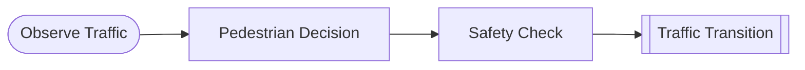

# Crosswalk Problem

**Mechanism design** — the canonical GDS example from BlockScience.

A pedestrian decides whether to cross a one-way street while traffic evolves as a discrete Markov chain. A governance body chooses crosswalk placement to minimize accident probability.

## GDS Decomposition

```
X = traffic_state ∈ {-1, 0, +1}
U = (luck, crossing_position)
g = pedestrian_decision
d = safety_check
f = traffic_transition
Θ = {crosswalk_location}
```

## Composition

```python
observe >> decide >> check >> transition
```



## What You'll Learn

- Discrete Markov state transitions as GDS
- **Mechanism design**: governance parameter (crosswalk location) constraining agent behavior
- ControlAction for admissibility enforcement (safety check)
- Complete 4-role taxonomy in a minimal model
- Design parameter Θ as a governance lever

## Files

- [model.py](https://github.com/BlockScience/gds-examples/blob/main/crosswalk/model.py)
- [test_model.py](https://github.com/BlockScience/gds-examples/blob/main/crosswalk/test_model.py)
- [VIEWS.md](https://github.com/BlockScience/gds-examples/blob/main/crosswalk/VIEWS.md)
- [README.md](https://github.com/BlockScience/gds-examples/blob/main/crosswalk/README.md)
