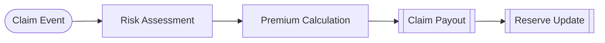

# Insurance Contract

**Completes the role taxonomy** — the only example using all 4 block roles.

## GDS Decomposition

```
X = (R, P, C, H)
U = claim_event
g = risk_assessment
d = premium_calculation
f = (claim_payout, reserve_update)
Θ = {base_premium_rate, deductible, coverage_limit}
```

## Composition

```python
claim >> risk >> premium >> payout >> reserve_update
```



## What You'll Learn

- **ControlAction** role — the 4th block role, for admissibility/control decisions
- Complete 4-role taxonomy: BoundaryAction → Policy → ControlAction → Mechanism
- ControlAction vs Policy: Policy is core decision logic (g), ControlAction constrains the action space (d)
- `params_used` on ControlAction — parameterized admissibility rules

!!! note "Key distinction"
    Premium Calculation is **ControlAction** because it enforces admissibility constraints — it decides what's *allowed*, not what to do.

## Files

- [model.py](https://github.com/BlockScience/gds-examples/blob/main/insurance/model.py)
- [test_model.py](https://github.com/BlockScience/gds-examples/blob/main/insurance/test_model.py)
- [VIEWS.md](https://github.com/BlockScience/gds-examples/blob/main/insurance/VIEWS.md)
