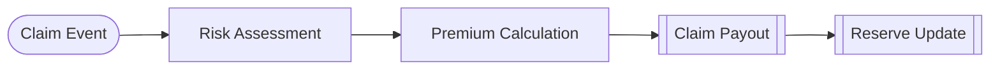

# Insurance Contract

**Completes the role taxonomy** — the only example using all 4 block roles.

## GDS Decomposition

```
X = (R, P, C, H)
U = claim_event
g = risk_assessment
d = premium_calculation
f = (claim_payout, reserve_update)
Θ = {base_premium_rate, deductible, coverage_limit}
```

## Composition

```python
claim >> risk >> premium >> payout >> reserve_update
```


```mermaid
flowchart LR
    Claim([Claim Event]) --> Risk[Risk Assessment]
    Risk --> Premium[Premium Calculation]
    Premium --> Payout[[Claim Payout]]
    Payout --> Reserve[[Reserve Update]]
```

## What You'll Learn

- **ControlAction** role — the 4th block role, for output observables
- Complete 4-role taxonomy: BoundaryAction → Policy → ControlAction → Mechanism
- ControlAction vs Policy: Policy is decision logic g(x, z) → d, ControlAction is the output observable y = C(x, d)
- `params_used` on ControlAction — parameterized output computation

!!! note "Key distinction"
    Premium Calculation is **ControlAction** because it computes an observable output signal — the premium rate that downstream mechanisms consume. It maps state and decisions to an output, rather than making the core risk assessment decision.

## Files

- [model.py](https://github.com/BlockScience/gds-examples/blob/main/insurance/model.py)
- [test_model.py](https://github.com/BlockScience/gds-examples/blob/main/insurance/test_model.py)
- [VIEWS.md](https://github.com/BlockScience/gds-examples/blob/main/insurance/VIEWS.md)
