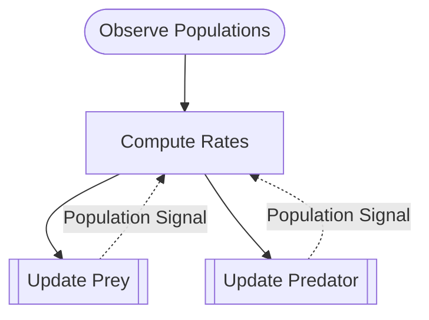

# Lotka-Volterra

**Adds temporal loops** — forward iteration across timesteps.

## GDS Decomposition

```
X = (x, y)
U = population_signal
g = compute_rates
f = (update_prey, update_predator)
Θ = {prey_birth_rate, predation_rate, predator_death_rate, predator_efficiency}
```

## Composition

```python
(observe >> compute >> (update_prey | update_pred)).loop([
    Population Signal -> Compute Rates COVARIANT
])
```



## What You'll Learn

- `.loop()` composition for cross-timestep temporal feedback
- **COVARIANT** flow direction — mandatory for `.loop()` (CONTRAVARIANT raises GDSTypeError)
- Mechanism with `forward_out` — emitting signals after state update
- `exit_condition` parameter for loop termination
- Contrast with `.feedback()`: within-timestep vs across-timestep

!!! note "Key distinction"
    Temporal wirings must be **COVARIANT** — `.loop()` enforces this at construction time.

## Files

- [model.py](https://github.com/BlockScience/gds-examples/blob/main/lotka_volterra/model.py)
- [test_model.py](https://github.com/BlockScience/gds-examples/blob/main/lotka_volterra/test_model.py)
- [VIEWS.md](https://github.com/BlockScience/gds-examples/blob/main/lotka_volterra/VIEWS.md)
