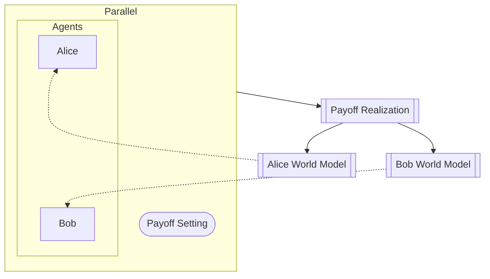

# Prisoner's Dilemma

**Most complex composition** — nested parallel + sequential + temporal loop.

## GDS Decomposition

```
X = (s_A, U_A, s_B, U_B, t)
U = game_config
g = (alice, bob)
f = (payoff, world_models)
Θ = {}
```

## Composition

```python
pipeline = (payoff_setting | (alice | bob)) >> payoff_realization >> (alice_world | bob_world)
system = pipeline.loop([world models -> decisions])
```



## What You'll Learn

- Nested parallel composition: `(A | B) | C` for logical grouping
- Multi-entity state space X with 3 entities (5 state variables total)
- Mechanism with `forward_out` for temporal feedback
- Complex composition tree combining all operators except `.feedback()`
- Design choice: parameter vs exogenous input (payoff matrix is U, not Θ)

## Files

- [model.py](https://github.com/BlockScience/gds-examples/blob/main/prisoners_dilemma/model.py)
- [test_model.py](https://github.com/BlockScience/gds-examples/blob/main/prisoners_dilemma/test_model.py)
- [VIEWS.md](https://github.com/BlockScience/gds-examples/blob/main/prisoners_dilemma/VIEWS.md)
