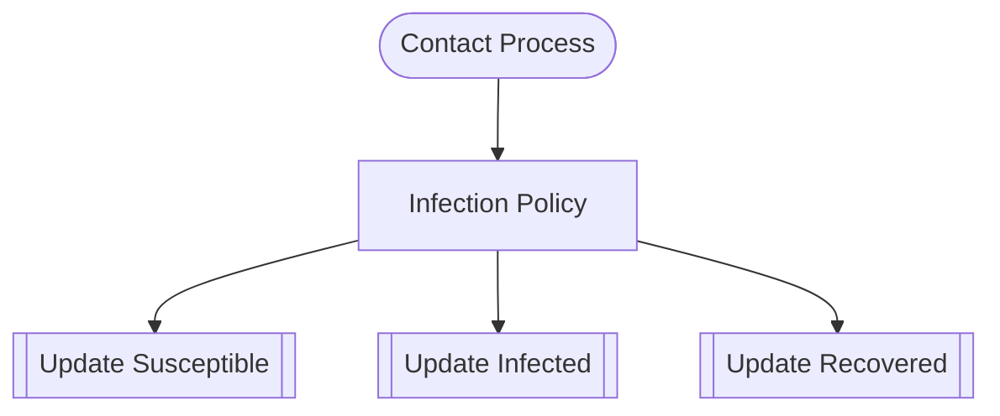

# SIR Epidemic

**Start here.** 3 compartments (Susceptible, Infected, Recovered) with contact-driven infection dynamics.

## GDS Decomposition

```
X = (S, I, R)
U = contact_rate
g = infection_policy
f = (update_s, update_i, update_r)
Θ = {beta, gamma, contact_rate}
```

## Composition

```python
contact >> infection_policy >> (update_s | update_i | update_r)
```



## What You'll Learn

- **TypeDef** with runtime constraints (non-negative counts, positive rates)
- **Entity** and **StateVariable** for defining state space X
- **Space** for typed inter-block communication channels
- **BoundaryAction** (exogenous input), **Policy** (decision logic), **Mechanism** (state update)
- `>>` sequential composition with token-based auto-wiring
- `|` parallel composition for independent mechanisms
- **GDSSpec** registration and SpecWiring
- `compile_system()` to produce SystemIR

## Key Concepts

### Three Block Roles

| Block | Role | Purpose |
|---|---|---|
| Contact Process | BoundaryAction | Exogenous observation — no forward inputs |
| Infection Policy | Policy | Decision logic — computes deltas |
| Update Susceptible/Infected/Recovered | Mechanism | State update — writes to entities |

### State Space

Three entities, each with a single count variable:

- `Susceptible.count` (S)
- `Infected.count` (I)
- `Recovered.count` (R)

### Parameters

- `beta` — infection rate
- `gamma` — recovery rate
- `contact_rate` — contact frequency

## Files

- [model.py](https://github.com/BlockScience/gds-examples/blob/main/sir_epidemic/model.py)
- [test_model.py](https://github.com/BlockScience/gds-examples/blob/main/sir_epidemic/test_model.py)
- [VIEWS.md](https://github.com/BlockScience/gds-examples/blob/main/sir_epidemic/VIEWS.md)
