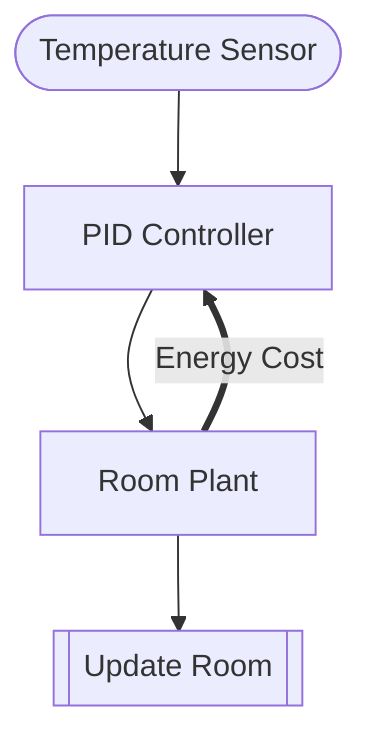

# Thermostat PID

**Adds feedback** — backward information flow within a single timestep.

## GDS Decomposition

```
X = (T, E)
U = measured_temp
g = pid_controller
f = update_room
Θ = {setpoint, Kp, Ki, Kd}
```

## Composition

```python
(sensor >> controller >> plant >> update).feedback([
    Energy Cost: plant -> controller CONTRAVARIANT
])
```



## What You'll Learn

- `.feedback()` composition for within-timestep backward flow
- **CONTRAVARIANT** flow direction (backward_out → backward_in)
- **ControlAction** role — reads state and emits control signals
- `backward_in` / `backward_out` ports on block interfaces
- Multi-variable Entity (Room has both temperature and energy_consumed)

!!! note "Key distinction"
    Room Plant is **ControlAction** (not Mechanism) because it has `backward_out`. Mechanisms cannot have backward ports.

## Files

- [model.py](https://github.com/BlockScience/gds-examples/blob/main/thermostat/model.py)
- [test_model.py](https://github.com/BlockScience/gds-examples/blob/main/thermostat/test_model.py)
- [VIEWS.md](https://github.com/BlockScience/gds-examples/blob/main/thermostat/VIEWS.md)
