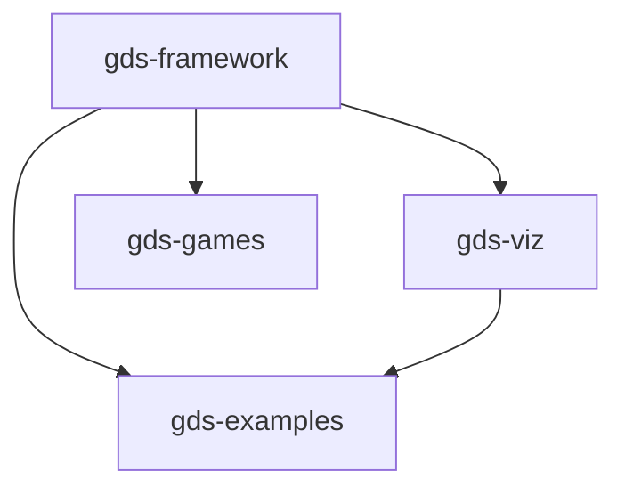

# GDS Ecosystem

The GDS ecosystem is a family of composable packages for specifying, visualizing, and analyzing complex systems.

## Packages

| Package | Description | Docs | PyPI |
|---|---|---|---|
| **gds-framework** | Foundation — typed compositional specifications | [Docs](https://blockscience.github.io/gds-framework) | [PyPI](https://pypi.org/project/gds-framework/) |
| **gds-viz** | Mermaid diagram renderers for GDS specifications | [Docs](https://blockscience.github.io/gds-viz) | [PyPI](https://pypi.org/project/gds-viz/) |
| **gds-games** | Typed DSL for compositional game theory | [Docs](https://blockscience.github.io/gds-games) | [PyPI](https://pypi.org/project/gds-games/) |
| **gds-examples** | Six tutorial models demonstrating every framework feature | [Docs](https://blockscience.github.io/gds-examples) | [PyPI](https://pypi.org/project/gds-examples/) |

## Dependency Graph



## Architecture

```
gds-framework (foundation)
│
│  Domain-neutral composition algebra, typed spaces,
│  state model, verification engine, flat IR compiler.
│
├── gds-viz (visualization)
│   └── 6 Mermaid diagram views of GDS specifications
│
├── gds-games (game theory DSL)
│   └── Open games, pattern composition, verification, reports, CLI
│
└── gds-examples (tutorials)
    └── 6 complete domain models with tests and visualizations
```

## Links

- [GitHub Organization](https://github.com/BlockScience)
- [GDS Theory Paper](https://doi.org/10.57938/e8d456ea-d975-4111-ac41-052ce73cb0cc) (Zargham & Shorish, 2022)
- [cadCAD Ecosystem](https://github.com/cadCAD-org/cadCAD)
- [BlockScience](https://block.science/)
