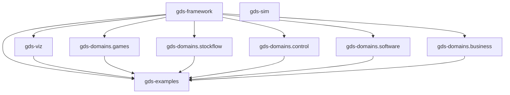

# GDS Ecosystem

The GDS ecosystem is a family of composable packages for specifying, visualizing, and analyzing complex systems.

## Packages

| Package | Import | Description |
|---|---|---|
| **gds-framework** | `gds` | Core engine — blocks, composition algebra, compiler, verification |
| **gds-viz** | `gds_viz` | Mermaid diagram renderers for GDS specifications |
| **gds-domains** | `gds_domains.stockflow` | Declarative stock-flow DSL over GDS semantics |
| | `gds_domains.control` | State-space control DSL over GDS semantics |
| | `gds_domains.games` | Typed DSL for compositional game theory (Open Games) |
| | `gds_domains.software` | Software architecture DSL (DFD, state machine, C4, ERD, etc.) |
| | `gds_domains.business` | Business dynamics DSL (CLD, supply chain, value stream map) |
| **gds-sim** | `gds_sim` | Simulation engine (standalone, Pydantic-only) |
| **gds-examples** | — | Tutorial models demonstrating framework features |

## Dependency Graph


```mermaid
graph TD
    F[gds-framework] --> V[gds-viz]
    F --> G[gds-domains.games]
    F --> SF[gds-domains.stockflow]
    F --> C[gds-domains.control]
    F --> SW[gds-domains.software]
    F --> B[gds-domains.business]
    F --> E[gds-examples]
    V --> E
    G --> E
    SF --> E
    C --> E
    SW --> E
    B --> E
    SIM[gds-sim]
```

## Architecture

```
gds-framework  ←  core engine (no GDS dependencies)
    ↑
gds-viz        ←  visualization (depends on gds-framework)
gds-domains.games      ←  game theory DSL (depends on gds-framework)
gds-domains.stockflow  ←  stock-flow DSL (depends on gds-framework)
gds-domains.control    ←  control systems DSL (depends on gds-framework)
gds-domains.software   ←  software architecture DSL (depends on gds-framework)
gds-domains.business   ←  business dynamics DSL (depends on gds-framework)
    ↑
gds-examples   ←  tutorials (depends on gds-framework + gds-viz + all DSLs)

gds-sim        ←  simulation engine (standalone — no gds-framework dep, only pydantic)
```

## Links

- [GitHub Organization](https://github.com/BlockScience)
- [GDS Theory Paper](https://doi.org/10.57938/e8d456ea-d975-4111-ac41-052ce73cb0cc) (Zargham & Shorish, 2022)
- [cadCAD Ecosystem](https://github.com/cadCAD-org/cadCAD)
- [BlockScience](https://block.science/)
