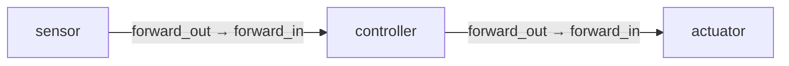
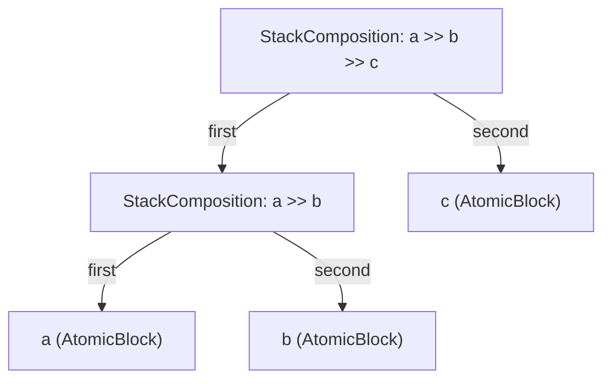
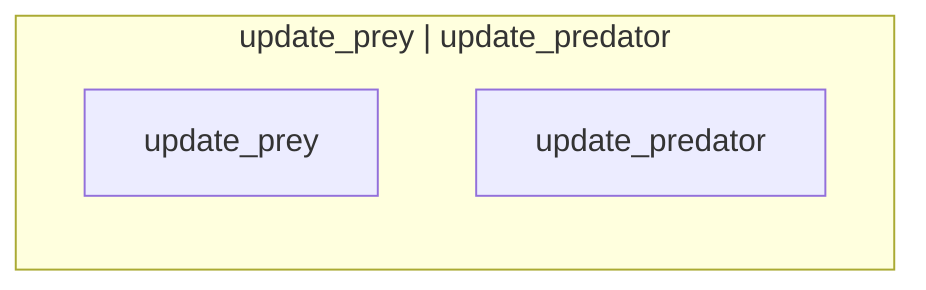
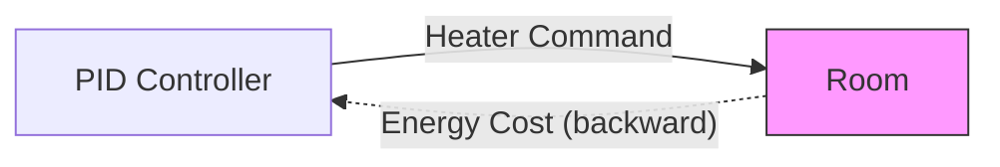
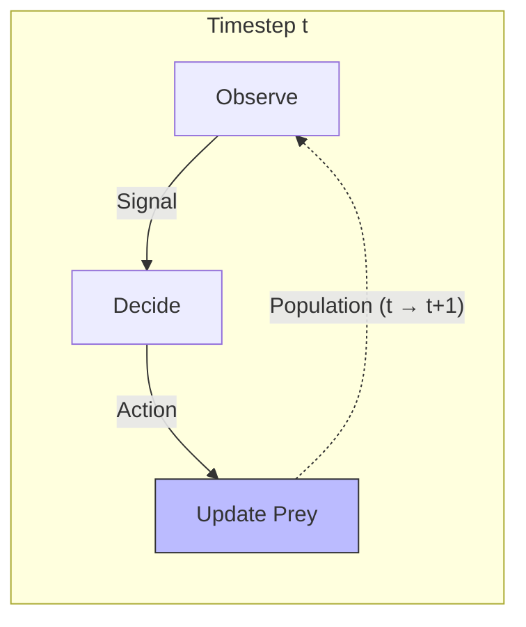
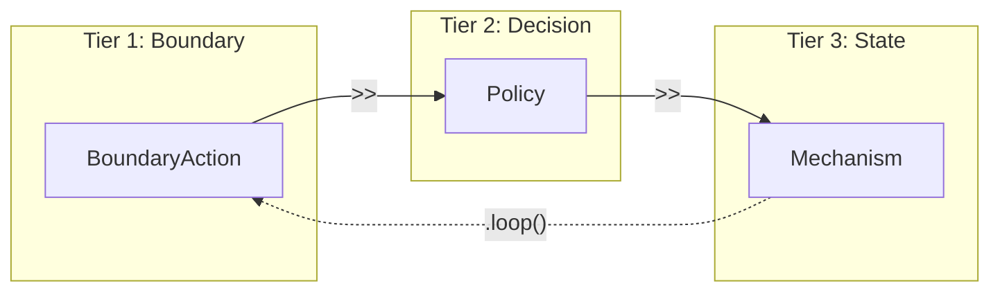
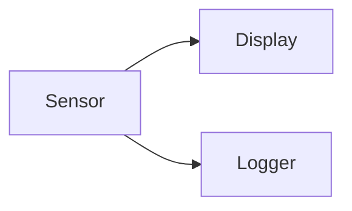
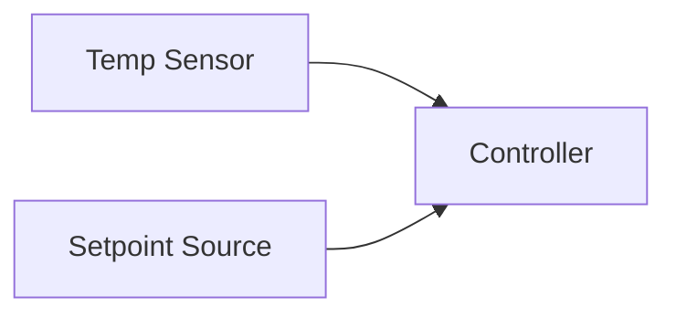
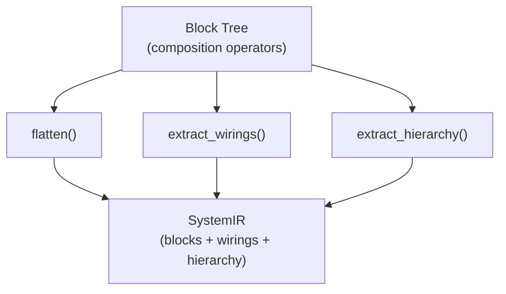

# Composition Algebra

The composition algebra is the core engine of GDS. Four operators combine blocks into larger systems, forming a composition tree that the compiler flattens into a flat intermediate representation (IR) of blocks + wirings + hierarchy.

These operators are domain-neutral — they work identically whether you're composing stock-flow models, control systems, or open games. Domain DSLs build their composition trees using these same four primitives.

## Operator Reference

| Operator | Python Syntax | Type | Constraint | Purpose |
|---|---|---|---|---|
| **Stack** | `a >> b` | `StackComposition` | Token overlap (auto) or explicit wiring | Sequential data flow |
| **Parallel** | `a \| b` | `ParallelComposition` | None | Independent side-by-side blocks |
| **Feedback** | `a.feedback(wiring)` | `FeedbackLoop` | Wiring must be CONTRAVARIANT | Backward signals within a timestep |
| **Temporal Loop** | `a.loop(wiring)` | `TemporalLoop` | Wiring must be COVARIANT | Forward signals across timesteps |

All four operators return a new `Block`, so they can be chained and nested freely. The result is always a tree of composition nodes with `AtomicBlock` leaves.

## Block Interfaces

Every block has an `Interface` with four directional port slots:

```
                    ┌─────────────────────┐
   forward_in  ───►│                     │───► forward_out
                    │       Block         │
  backward_out ◄───│                     │◄─── backward_in
                    └─────────────────────┘
```

- **forward_in / forward_out** — covariant data flow (domain inputs and outputs)
- **backward_in / backward_out** — contravariant feedback flow (backward signals)

Ports are created from human-readable names using the `port()` factory or the `interface()` helper:

```python
from gds import interface

iface = interface(
    forward_in=["Temperature", "Setpoint"],
    forward_out=["Heater Command"],
    backward_in=["Energy Cost"],
)
```

Each port name is automatically tokenized for structural type matching (see [Token-Based Matching](#token-based-matching) below).

---

## Sequential Composition (`>>`)

Sequential composition chains two blocks so that the first block's outputs can feed the second block's inputs. This is the most common operator and the backbone of any GDS system.

```python
pipeline = sensor >> controller >> actuator
```

### Data Flow



### Token-Based Matching

When you use `>>` without explicit wiring, the validator checks that the first block's `forward_out` tokens overlap with the second block's `forward_in` tokens. This is the **auto-wiring** mechanism.

Port names are tokenized by splitting on spaces, commas, and `+` signs, then lowercasing:

| Port Name | Tokens |
|---|---|
| `"Temperature"` | `{"temperature"}` |
| `"Heater Command"` | `{"heater", "command"}` |
| `"Temperature + Setpoint"` | `{"temperature", "setpoint"}` |
| `"Command Signal"` | `{"command", "signal"}` |

Two ports **match** when their token sets share at least one element. This means `"Heater Command"` auto-wires to `"Command Signal"` because they share the token `"command"`.

```python
from gds import AtomicBlock, interface

a = AtomicBlock(
    name="A",
    interface=interface(forward_out=["Temperature"]),
)
b = AtomicBlock(
    name="B",
    interface=interface(forward_in=["Temperature"]),
)

# Token overlap: {"temperature"} & {"temperature"} = {"temperature"} ✓
pipeline = a >> b
```

### Token Mismatch Error

If the tokens don't overlap at all, construction fails immediately with `GDSTypeError`:

```python
a = AtomicBlock(
    name="A",
    interface=interface(forward_out=["Temperature"]),
)
c = AtomicBlock(
    name="C",
    interface=interface(forward_in=["Pressure"]),
)

# Token overlap: {"temperature"} & {"pressure"} = {} — empty!
pipeline = a >> c  # Raises GDSTypeError
```

The error message will show exactly which token sets failed to overlap:

```
GDSTypeError: Stack composition 'A >> C': first.forward_out tokens
frozenset({'temperature'}) have no overlap with second.forward_in tokens
frozenset({'pressure'})
```

### Explicit Wiring Fallback

When tokens don't naturally overlap — or when you need precise control over connections — use `StackComposition` directly with explicit `Wiring` objects:

```python
from gds import Wiring
from gds.blocks.composition import StackComposition

comp = StackComposition(
    name="A >> C",
    first=a,
    second=c,
    wiring=[
        Wiring(
            source_block="A",
            source_port="Temperature",
            target_block="C",
            target_port="Pressure",
        )
    ],
)
```

When explicit wiring is provided, the token overlap check is bypassed entirely. This is how domain DSLs handle cross-tier connections where port names use different vocabularies.

### Interface Propagation

The composite block's interface is the **union** of both children's interfaces — all ports from both blocks are preserved:

```python
a = AtomicBlock(
    name="A",
    interface=interface(forward_out=["Temperature"]),
)
b = AtomicBlock(
    name="B",
    interface=interface(
        forward_in=["Temperature"],
        forward_out=["Command"],
    ),
)

comp = a >> b
# comp.interface.forward_out = (Port("Temperature"), Port("Command"))
# comp.interface.forward_in = (Port("Temperature"),)
```

This union propagation means that outer compositions can see all ports from inner blocks, enabling multi-level wiring.

### Chaining

`>>` is left-associative, so `a >> b >> c` creates:



The compiler flattens this binary tree into a flat list `[a, b, c]` in evaluation order.

---

## Parallel Composition (`|`)

Parallel composition places two blocks side-by-side with no shared wires. The blocks are completely independent — there is no type validation between them.

```python
updates = update_prey | update_predator
```

### Data Flow



### No Validation

Unlike `>>`, the `|` operator performs no token checks. Any two blocks can be composed in parallel:

```python
a = AtomicBlock(name="A", interface=interface(forward_out=["Temperature"]))
b = AtomicBlock(name="B", interface=interface(forward_in=["Pressure"]))

# No error — blocks are independent
parallel = a | b
```

### Interface Union

The composite interface is the concatenation of both children's port tuples:

```python
parallel = a | b
# parallel.interface.forward_out = (Port("Temperature"),)
# parallel.interface.forward_in = (Port("Pressure"),)
```

This is how you build "tiers" in the standard composition pattern — group related blocks in parallel, then wire tiers together sequentially.

### Building Tiers

A common helper pattern from the DSLs:

```python
def parallel_tier(blocks: list[Block]) -> Block:
    """Compose a list of blocks in parallel."""
    tier = blocks[0]
    for b in blocks[1:]:
        tier = tier | b
    return tier

# Three stock update mechanisms running in parallel
stock_tier = parallel_tier([update_s, update_i, update_r])
```

---

## Feedback Loop (`.feedback()`)

Feedback wraps a block (or composition) with backward signals that flow within a single timestep. This models intra-step feedback — information that propagates backward through the system before the timestep completes.

```python
from gds import Wiring
from gds.ir.models import FlowDirection

system = (controller >> plant).feedback([
    Wiring(
        source_block="Room",
        source_port="Energy Cost",
        target_block="PID Controller",
        target_port="Energy Cost",
        direction=FlowDirection.CONTRAVARIANT,
    )
])
```

### Data Flow



### Contravariant Direction

Feedback wirings carry signals **backward** — from outputs to inputs within the same timestep. The wiring direction should be `FlowDirection.CONTRAVARIANT` to reflect this backward flow.

Feedback uses the `backward_out` and `backward_in` port slots:

- The **source block** emits the feedback signal on its `backward_out` port
- The **target block** receives it on its `backward_in` port

### Interface Preservation

The feedback wrapper preserves the inner block's interface unchanged. Feedback is an internal routing concern — it doesn't alter the block's external boundary:

```python
inner = controller >> plant
fb = inner.feedback([...])

assert fb.interface == inner.interface  # True
```

### Use Cases

- **Cost/utility feedback** — a downstream block reports a cost that upstream blocks use for optimization
- **Constraint propagation** — feasibility constraints flow backward from mechanisms to policies
- **Equilibrium computation** — game-theoretic blocks exchange payoff signals within a step

---

## Temporal Loop (`.loop()`)

Temporal loops connect a block's outputs to its inputs across timesteps. This is how state persists — the output of timestep `t` becomes the input of timestep `t+1`.

```python
system = pipeline.loop(
    [
        Wiring(
            source_block="Update Prey",
            source_port="Population",
            target_block="Observe",
            target_port="Population",
            direction=FlowDirection.COVARIANT,
        )
    ],
    exit_condition="converged",
)
```

### Data Flow



### Covariant Only

Temporal wirings must be `FlowDirection.COVARIANT`. This is enforced at construction time — attempting to use `CONTRAVARIANT` raises `GDSTypeError`:

```python
# This raises GDSTypeError
pipeline.loop([
    Wiring(
        source_block="B",
        source_port="Command",
        target_block="A",
        target_port="Temperature",
        direction=FlowDirection.CONTRAVARIANT,  # Not allowed!
    )
])
```

The error message:

```
GDSTypeError: TemporalLoop 'A >> B [loop]': temporal wiring
B.Command → A.Temperature must be COVARIANT (got contravariant)
```

The rationale: temporal loops carry state forward in time. Backward-in-time information flow is not physically meaningful for state evolution. Use `.feedback()` instead for within-timestep backward signals.

### Exit Condition

The optional `exit_condition` parameter documents when iteration should terminate:

```python
system = pipeline.loop(wiring, exit_condition="max_steps reached or population stable")
```

This is structural metadata — GDS does not evaluate or enforce exit conditions. It exists for documentation and downstream tooling.

### Interface Preservation

Like feedback, the temporal loop preserves the inner block's interface:

```python
inner = observe >> decide >> update
looped = inner.loop([...])

assert looped.interface == inner.interface  # True
```

---

## Explicit Wiring

The `Wiring` model is the universal connection primitive used by feedback, temporal loops, and explicit stack compositions:

```python
from gds import Wiring
from gds.ir.models import FlowDirection

w = Wiring(
    source_block="Producer",      # Name of the source block
    source_port="Output Signal",  # Port name on the source
    target_block="Consumer",      # Name of the target block
    target_port="Input Signal",   # Port name on the target
    direction=FlowDirection.COVARIANT,  # Default
)
```

### When to Use Explicit Wiring

| Scenario | Operator | Wiring Required? |
|---|---|---|
| Ports share tokens | `a >> b` | No — auto-wired |
| Ports use different vocabularies | `StackComposition(wiring=[...])` | Yes |
| Backward feedback within timestep | `.feedback(wiring)` | Yes — always explicit |
| State carried across timesteps | `.loop(wiring)` | Yes — always explicit |

Auto-wiring only applies to `>>` (stack composition). All other operators require explicit `Wiring` objects.

### Direction

- `FlowDirection.COVARIANT` (default) — forward data flow. Used for temporal loops and most stack wirings.
- `FlowDirection.CONTRAVARIANT` — backward feedback flow. Used for feedback loops.

---

## Common Patterns

### The Standard Tiered Pattern

All three GDS domain DSLs (stock-flow, control, games) converge on the same tiered composition structure:

```
(exogenous inputs | observers) >> (decision logic) >> (state dynamics)
    .loop(state dynamics → observers)
```



In code:

```python
from gds import BoundaryAction, Policy, Mechanism, Wiring, interface
from gds.ir.models import FlowDirection

# Tier 1: Exogenous inputs
sensor = BoundaryAction(
    name="Temperature Sensor",
    interface=interface(forward_out=["Temperature"]),
)

# Tier 2: Decision logic
controller = Policy(
    name="PID Controller",
    interface=interface(
        forward_in=["Temperature"],
        forward_out=["Heater Command"],
    ),
)

# Tier 3: State update
actuator = Mechanism(
    name="Update Room",
    interface=interface(forward_in=["Heater Command"]),
    updates=[("Room", "temperature")],
)

# Compose: sequential across tiers, temporal loop for state feedback
system = (sensor >> controller >> actuator).loop([
    Wiring(
        source_block="Update Room",
        source_port="Heater Command",
        target_block="Temperature Sensor",
        target_port="Temperature",
        direction=FlowDirection.COVARIANT,
    )
])
```

### Fan-Out (One-to-Many)

A single block's output feeds multiple downstream blocks. Use parallel composition for the consumers, then sequence:

```python
# One producer, two consumers
producer = AtomicBlock(
    name="Sensor",
    interface=interface(forward_out=["Signal"]),
)
consumer_a = AtomicBlock(
    name="Display",
    interface=interface(forward_in=["Signal"]),
)
consumer_b = AtomicBlock(
    name="Logger",
    interface=interface(forward_in=["Signal"]),
)

system = producer >> (consumer_a | consumer_b)
```



Both consumers match on the `"signal"` token, so auto-wiring connects the producer to both.

### Fan-In (Many-to-One)

Multiple blocks feed into a single downstream block. Use parallel composition for the producers:

```python
sensor_a = AtomicBlock(
    name="Temp Sensor",
    interface=interface(forward_out=["Temperature"]),
)
sensor_b = AtomicBlock(
    name="Setpoint Source",
    interface=interface(forward_out=["Setpoint"]),
)
controller = AtomicBlock(
    name="Controller",
    interface=interface(forward_in=["Temperature", "Setpoint"]),
)

system = (sensor_a | sensor_b) >> controller
```



### Multi-Tier with Explicit Wiring

When tiers use different naming conventions, build explicit inter-tier wirings:

```python
from gds.blocks.composition import StackComposition

tier1 = producer_a | producer_b
tier2 = consumer_x | consumer_y

# Build explicit wirings by matching ports manually
wirings = [
    Wiring(
        source_block="producer_a",
        source_port="Output",
        target_block="consumer_x",
        target_port="Input",
    ),
    Wiring(
        source_block="producer_b",
        source_port="Result",
        target_block="consumer_y",
        target_port="Data",
    ),
]

system = StackComposition(
    name="tier1 >> tier2",
    first=tier1,
    second=tier2,
    wiring=wirings,
)
```

---

## Error Reference

### `GDSTypeError`

Raised at construction time when token-based type checking fails.

| Cause | Message Pattern |
|---|---|
| No token overlap in `>>` | `Stack composition 'X': first.forward_out tokens {...} have no overlap with second.forward_in tokens {...}` |
| Contravariant wiring in `.loop()` | `TemporalLoop 'X': temporal wiring A.port → B.port must be COVARIANT (got contravariant)` |

### `GDSCompositionError`

Raised at construction time when role-specific structural constraints are violated.

| Cause | Message Pattern |
|---|---|
| BoundaryAction has `forward_in` ports | `BoundaryAction 'X': forward_in must be empty (boundary actions receive no internal forward signals)` |
| Mechanism has backward ports | `Mechanism 'X': backward ports must be empty (mechanisms write state, they don't pass backward signals)` |

Both errors are subclasses of `GDSError` and are raised during Pydantic model validation — they occur the instant you construct the invalid block or composition, not at compile time.

---

## How It Compiles

The composition tree you build with these operators is not executed directly. Instead, the compiler walks the tree in three stages:

1. **Flatten** — recursively calls `flatten()` on the tree to extract all `AtomicBlock` leaves in evaluation order
2. **Wire** — walks the tree again to collect all wirings (auto-wired from `>>`, explicit from `StackComposition.wiring`, feedback from `.feedback()`, temporal from `.loop()`)
3. **Hierarchy** — captures the tree structure for visualization, flattening binary chains into n-ary groups

The result is a `SystemIR` — a flat list of `BlockIR` nodes + `WiringIR` edges + a `HierarchyNodeIR` tree. This IR is what verification checks operate on.



See the [Architecture](architecture.md) guide for more detail on the compilation pipeline and IR structure.
