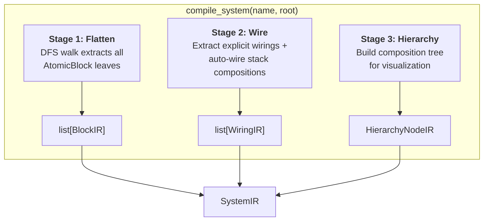
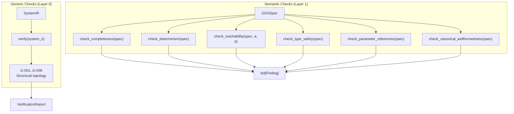

# Build, Compile, Verify Pipeline

This guide explains the end-to-end pipeline for building a GDS specification, compiling it into an intermediate representation, verifying its structural and semantic properties, and extracting the canonical mathematical decomposition.

## Overview

A GDS model moves through six stages from domain definitions to verified formal structure:

```mermaid
flowchart LR
    A["<b>Define</b><br/>types, spaces,<br/>entities"] --> B["<b>Build</b><br/>blocks with<br/>interfaces"]
    B --> C["<b>Compose</b><br/>operators:<br/>&gt;&gt; | .feedback()<br/>.loop()"]
    C --> D["<b>Register</b><br/>GDSSpec<br/>registry"]
    D --> E["<b>Compile</b><br/>SystemIR"]
    E --> F["<b>Verify</b><br/>generic +<br/>semantic checks"]
    D --> G["<b>Canonical</b><br/>h = f &#8728; g<br/>projection"]
```



There are two independent paths after registration:

- **Compile path**: `GDSSpec` (or raw Block tree) --> `compile_system()` --> `SystemIR` --> `verify()` -- validates structural topology
- **Semantic path**: `GDSSpec` --> semantic checks (SC-001..SC-007) + `project_canonical()` -- validates domain properties and extracts the formal decomposition

These paths are independent. You can compile without a `GDSSpec`, and you can run semantic checks without compiling. Most real workflows use both.

## Step 1: Define Your Domain

Every GDS model starts with domain definitions: what types of data exist, what communication channels carry them, and what stateful entities persist across timesteps.

```python
from gds import typedef, space, entity, state_var

# Types -- runtime-validated data types
Temperature = typedef("Temperature", float, units="K")
Command = typedef("Command", float)
Energy = typedef("Energy", float, constraint=lambda x: x >= 0)

# Spaces -- typed communication channels (transient within a timestep)
sensor_space = space("SensorSpace", measured_temp=Temperature)
command_space = space("CommandSpace", heater_command=Command)

# Entities -- stateful objects that persist across timesteps (the state space X)
room = entity("Room",
    temperature=state_var(Temperature, symbol="T"),
    energy_consumed=state_var(Energy, symbol="E"),
)
```

These objects are plain Pydantic models. They do not reference each other and have no behavior. They become meaningful only when registered into a `GDSSpec`.

### What `GDSSpec.collect()` does

`GDSSpec` is a mutable registry, not a validator. It stores objects by type and enforces name uniqueness. The `collect()` method type-dispatches each argument to the appropriate `register_*()` call:

```python
from gds import GDSSpec

spec = GDSSpec(name="Thermostat")
spec.collect(
    Temperature, Command, Energy,     # TypeDefs
    sensor_space, command_space,       # Spaces
    room,                              # Entities
)
```

This is equivalent to calling `register_type()`, `register_space()`, and `register_entity()` individually. `collect()` accepts `TypeDef`, `Space`, `Entity`, `Block`, and `ParameterDef` instances. `SpecWiring` must be registered explicitly via `register_wiring()`.

## Step 2: Build Blocks

Blocks are the computational units of a GDS model. Each block has a **role** (what kind of computation it represents) and an **interface** (what ports it exposes for composition).

```python
from gds import BoundaryAction, Policy, Mechanism, interface

# BoundaryAction -- exogenous input (no forward_in ports)
sensor = BoundaryAction(
    name="Temperature Sensor",
    interface=interface(forward_out=["Measured Temperature"]),
)

# Policy -- decision / observation logic
controller = Policy(
    name="PID Controller",
    interface=interface(
        forward_in=["Measured Temperature"],
        forward_out=["Heater Command"],
    ),
    params_used=["Kp", "Ki"],
)

# Mechanism -- state update (no backward ports)
heater = Mechanism(
    name="Heater",
    interface=interface(
        forward_in=["Heater Command"],
        forward_out=["Room Temperature"],
    ),
    updates=[("Room", "temperature"), ("Room", "energy_consumed")],
)
```

Four roles exist. Each enforces constraints at construction time:

| Role | Purpose | Constraint |
|------|---------|------------|
| `BoundaryAction` | Exogenous input | `forward_in` must be empty |
| `Policy` | Decision / observation logic | No special constraints |
| `Mechanism` | State update | `backward_in` and `backward_out` must be empty |
| `ControlAction` | Reserved | No special constraints |

Register blocks into the spec:

```python
spec.collect(sensor, controller, heater)
```

## Step 3: Compose

Compose blocks into a tree using four operators:

| Operator | Syntax | Meaning |
|----------|--------|---------|
| Sequential | `a >> b` | Output of `a` feeds input of `b` |
| Parallel | `a \| b` | Side-by-side, no shared wires |
| Feedback | `a.feedback(wiring)` | Backward flow within a timestep |
| Temporal | `a.loop(wiring)` | Forward flow across timesteps |

```python
# Build the composition tree
root = sensor >> controller >> heater
```

The `>>` operator auto-wires ports by **token overlap**: port names are tokenized (split on spaces, lowercased), and ports with overlapping tokens are connected automatically. For example, `"Measured Temperature"` auto-wires to `"Measured Temperature"` because the token sets are identical.

When auto-wiring is insufficient, use explicit `Wiring` declarations in a `StackComposition`. See the [Blocks & Roles](blocks.md) guide for details.

## Step 4: Compile to SystemIR

`compile_system()` transforms a Block composition tree into a flat `SystemIR` -- the intermediate representation used for verification and visualization. The compiler runs three stages:



```python
from gds import compile_system

system_ir = compile_system("Thermostat", root)
```

### What each stage does

**Stage 1 -- Flatten** (`flatten_blocks`): Walks the composition tree depth-first and extracts every `AtomicBlock` leaf. Each leaf is passed through a `block_compiler` callback that produces a `BlockIR` with the block's name and interface signature.

**Stage 2 -- Wire** (`extract_wirings`): Walks the tree again, collecting all connections between blocks. For `StackComposition` nodes, it emits either the explicit `Wiring` declarations or auto-wires by token overlap. For `FeedbackLoop` and `TemporalLoop` nodes, it emits the feedback/temporal wirings with appropriate flags. Each connection is tagged with its origin (`AUTO`, `EXPLICIT`, `FEEDBACK`, `TEMPORAL`).

**Stage 3 -- Hierarchy** (`extract_hierarchy`): Builds a `HierarchyNodeIR` tree that mirrors the composition structure. Binary sequential/parallel chains are flattened into n-ary groups for cleaner visualization.

### SystemIR structure

The output `SystemIR` is a flat, serializable model:

```python
class SystemIR(BaseModel):
    name: str
    blocks: list[BlockIR]        # All atomic blocks
    wirings: list[WiringIR]      # All connections
    inputs: list[InputIR]        # External inputs (domain-supplied)
    hierarchy: HierarchyNodeIR   # Composition tree for visualization
    composition_type: CompositionType
```

`SystemIR` has no knowledge of types, spaces, entities, or roles. It is a purely structural graph of blocks and wires. This is by design -- it separates the compilation concern (structural topology) from the specification concern (domain semantics).

### Domain-specific compilation

Domain DSL packages (stockflow, control, games) provide their own `block_compiler` and `wiring_emitter` callbacks to `compile_system()`. These produce `BlockIR` with domain-specific `block_type` and `metadata` fields. The three stages are also available as standalone functions (`flatten_blocks`, `extract_wirings`, `extract_hierarchy`) for custom compiler pipelines.

## Step 5: Verify

Verification is where GDS catches specification errors. There are **two independent verification paths** that operate on different objects and catch different classes of problems.



### Path A: Generic checks on SystemIR

Generic checks validate the **structural topology** of a compiled system. They know nothing about types, spaces, or domain semantics -- only blocks, wirings, and their signatures.

```python
from gds import verify

report = verify(system_ir)

print(f"{report.checks_passed}/{report.checks_total} checks passed")
print(f"Errors: {report.errors}, Warnings: {report.warnings}")

for finding in report.findings:
    if not finding.passed:
        print(f"  [{finding.severity}] {finding.check_id}: {finding.message}")
```

The six generic checks:

| Check | Name | What It Validates |
|-------|------|-------------------|
| G-001 | Domain/codomain matching | Covariant wiring labels are token-subsets of source output or target input |
| G-002 | Signature completeness | Every block has at least one input and one output slot |
| G-003 | Direction consistency | No COVARIANT+feedback or CONTRAVARIANT+temporal contradictions; contravariant port-slot matching |
| G-004 | Dangling wirings | All wiring endpoints reference blocks or inputs that exist in the system |
| G-005 | Sequential type compatibility | Stack wiring labels are token-subsets of BOTH source output AND target input |
| G-006 | Covariant acyclicity | The covariant (within-timestep) flow graph is a DAG |

You can also run a subset of checks:

```python
from gds.verification.generic_checks import (
    check_g001_domain_codomain_matching,
    check_g006_covariant_acyclicity,
)

report = verify(system_ir, checks=[
    check_g001_domain_codomain_matching,
    check_g006_covariant_acyclicity,
])
```

### Path B: Semantic checks on GDSSpec

Semantic checks validate **domain properties** at the specification level. They operate on `GDSSpec` (not `SystemIR`) because they need access to entities, types, spaces, parameters, and block roles -- information that is lost during compilation.

```python
from gds.verification.spec_checks import (
    check_completeness,
    check_determinism,
    check_type_safety,
    check_parameter_references,
    check_canonical_wellformedness,
)

# Each returns list[Finding]
findings = check_completeness(spec)
findings += check_determinism(spec)
findings += check_type_safety(spec)
findings += check_parameter_references(spec)
findings += check_canonical_wellformedness(spec)

for f in findings:
    if not f.passed:
        print(f"  [{f.severity}] {f.check_id}: {f.message}")
```

The semantic checks:

| Check | Name | What It Validates |
|-------|------|-------------------|
| SC-001 | Completeness | Every entity variable is updated by at least one Mechanism |
| SC-002 | Determinism | No entity variable is updated by multiple Mechanisms in the same wiring |
| SC-003 | Reachability | Signal can propagate from one block to another through wires |
| SC-004 | Type safety | Wire space references resolve to registered spaces |
| SC-005 | Parameter references | All `params_used` entries on blocks match registered parameter definitions |
| SC-006 | Canonical wellformedness | At least one Mechanism exists (f is non-empty) |
| SC-007 | Canonical wellformedness | State space X is non-empty (entities with variables exist) |

!!! important "Why two verification paths?"
    Generic checks and semantic checks answer fundamentally different questions:

    - **Generic checks** ask: "Is this composition graph structurally sound?" They work on any Block tree, with or without a `GDSSpec`.
    - **Semantic checks** ask: "Does this specification make sense as a dynamical system?" They require the full domain context that only `GDSSpec` provides.

    A model can pass all generic checks (structurally valid graph) but fail semantic checks (e.g., orphan state variables that no Mechanism updates). Conversely, a specification can pass all semantic checks but produce a `SystemIR` with structural problems.

### Findings and reports

Both paths produce `Finding` objects:

```python
class Finding(BaseModel):
    check_id: str              # e.g., "G-001" or "SC-002"
    severity: Severity         # ERROR, WARNING, or INFO
    message: str               # Human-readable description
    source_elements: list[str] # Block/variable names involved
    passed: bool               # True if the check passed
```

`verify()` aggregates findings into a `VerificationReport` with convenience properties:

```python
class VerificationReport(BaseModel):
    system_name: str
    findings: list[Finding]

    @property
    def errors(self) -> int: ...      # Failed findings with ERROR severity
    @property
    def warnings(self) -> int: ...    # Failed findings with WARNING severity
    @property
    def checks_passed(self) -> int: ...
    @property
    def checks_total(self) -> int: ...
```

### Custom checks

You can register custom verification checks with the `@gds_check` decorator:

```python
from gds import gds_check, all_checks, Finding, Severity
from gds.ir.models import SystemIR

@gds_check("CUSTOM-001", Severity.WARNING)
def check_no_orphan_blocks(system: SystemIR) -> list[Finding]:
    """Flag blocks with no wirings."""
    wired = {w.source for w in system.wirings} | {w.target for w in system.wirings}
    return [
        Finding(
            check_id="CUSTOM-001",
            severity=Severity.WARNING,
            message=f"Block '{b.name}' has no wirings",
            source_elements=[b.name],
            passed=False,
        )
        for b in system.blocks if b.name not in wired
    ]

# Run built-in + custom checks together
report = verify(system_ir, checks=all_checks())
```

## Step 6: Canonical Projection

`project_canonical()` is a pure function that derives the formal GDS mathematical decomposition from a `GDSSpec`:

$$h_\theta : X \to X \quad \text{where} \quad h = f \circ g, \quad \theta \in \Theta$$

```python
from gds import project_canonical

canonical = project_canonical(spec)

print(canonical.formula())
# "h_theta : X -> X  (h = f_theta . g_theta, theta in Theta)"

# State space X: entity variables
print(f"|X| = {len(canonical.state_variables)}")
for entity_name, var_name in canonical.state_variables:
    print(f"  {entity_name}.{var_name}")

# Decomposition
print(f"|f| = {len(canonical.mechanism_blocks)} mechanisms")
print(f"|g| = {len(canonical.policy_blocks)} policies")
print(f"|U| = {len(canonical.input_ports)} input ports")
print(f"|D| = {len(canonical.decision_ports)} decision ports")
```

The canonical projection classifies every registered block by its role:

| Role | Maps to | Canonical component |
|------|---------|---------------------|
| `BoundaryAction` | Input space U | Exogenous inputs |
| `Policy` | Decision space D | g: X x U --> D |
| `Mechanism` | State transition | f: X x D --> X |
| `ControlAction` | (unused) | -- |

`project_canonical()` operates on `GDSSpec`, not `SystemIR`, because it needs role information and entity definitions. It is deterministic, stateless, and never mutates the spec. The `CanonicalGDS` result is frozen (immutable).

!!! note "When to use canonical projection vs verification"
    - Use **verification** to check if a model is well-formed (catches errors).
    - Use **canonical projection** to understand what a model *means* mathematically (extracts structure).
    - SC-006 and SC-007 bridge both: they run `project_canonical()` internally to check that the canonical form is well-formed.

## Two Type Systems

GDS has two coexisting type systems that serve different purposes at different stages of the pipeline:

### Token-based types (compile-time)

Used during **composition and wiring**. Port names are automatically tokenized -- split on spaces, lowercased into a `frozenset`. The `>>` operator and auto-wiring use token overlap to match ports.

```python
# These ports auto-wire because they share the token "temperature"
#   "Measured Temperature" -> {"measured", "temperature"}
#   "Room Temperature"     -> {"room", "temperature"}
#   Overlap: {"temperature"} -- match!
```

Token matching is used by the compiler (Stage 2) and by generic checks G-001 and G-005.

### TypeDef-based types (runtime)

Used for **data validation** at the value level. `TypeDef` wraps a Python type with an optional constraint predicate. Used by `Space` and `Entity` to validate actual data values.

```python
Temperature = typedef("Temperature", float, units="K")
Energy = typedef("Energy", float, constraint=lambda x: x >= 0)
```

TypeDefs are never invoked during compilation. They exist for runtime validation when actual data flows through the system (e.g., during simulation, which is outside the current scope of GDS).

!!! info "These type systems do not interact"
    Token-based matching operates on port name strings. TypeDef validation operates on Python values. A port named `"Temperature"` will auto-wire to any port whose name contains the token `"temperature"`, regardless of what `TypeDef` (if any) is associated with the data flowing through it.

## Complete Example

Putting it all together:

```python
from gds import (
    GDSSpec, BoundaryAction, Policy, Mechanism,
    compile_system, verify, project_canonical,
    typedef, space, entity, state_var, interface,
)
from gds.verification.spec_checks import (
    check_completeness, check_determinism,
    check_canonical_wellformedness,
)

# --- Step 1: Define domain ---
Temperature = typedef("Temperature", float, units="K")
Command = typedef("Command", float)

room = entity("Room", temperature=state_var(Temperature, symbol="T"))

# --- Step 2: Build blocks ---
sensor = BoundaryAction(
    name="Sensor",
    interface=interface(forward_out=["Temperature"]),
)
controller = Policy(
    name="Controller",
    interface=interface(
        forward_in=["Temperature"],
        forward_out=["Command"],
    ),
)
heater = Mechanism(
    name="Heater",
    interface=interface(
        forward_in=["Command"],
        forward_out=["Temperature"],
    ),
    updates=[("Room", "temperature")],
)

# --- Step 3: Compose ---
root = sensor >> controller >> heater

# --- Step 4: Register ---
spec = GDSSpec(name="Thermostat")
spec.collect(Temperature, Command, room, sensor, controller, heater)

# --- Step 5a: Compile + generic verification ---
system_ir = compile_system("Thermostat", root)
report = verify(system_ir)
print(f"Generic: {report.checks_passed}/{report.checks_total} passed")

# --- Step 5b: Semantic verification ---
findings = check_completeness(spec)
findings += check_determinism(spec)
findings += check_canonical_wellformedness(spec)
for f in findings:
    status = "PASS" if f.passed else "FAIL"
    print(f"  [{status}] {f.check_id}: {f.message}")

# --- Step 6: Canonical projection ---
canonical = project_canonical(spec)
print(f"\n{canonical.formula()}")
print(f"|X| = {len(canonical.state_variables)}, |f| = {len(canonical.mechanism_blocks)}")
```
