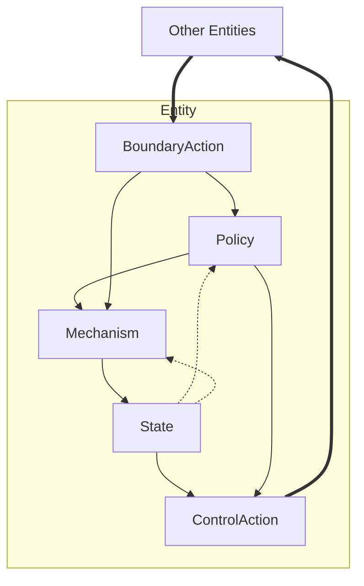
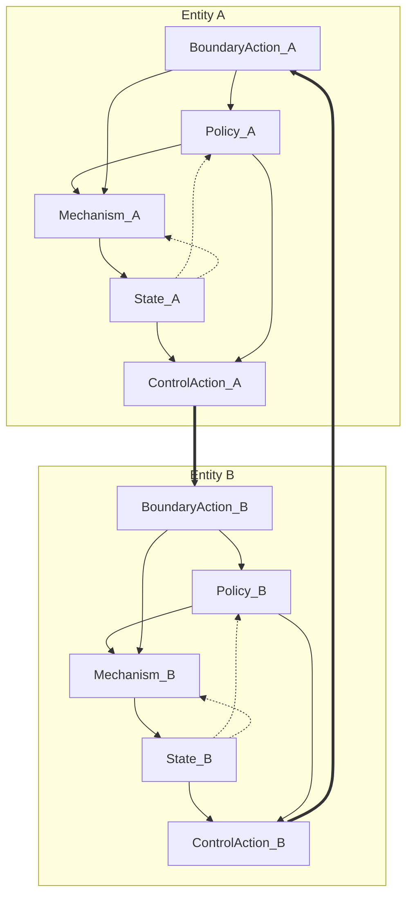
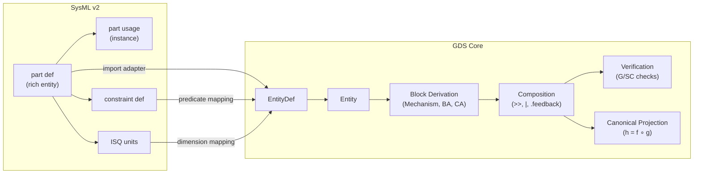

# Proposal: Entity Redesign + Expression Language

**Status:** Draft — for discussion
**Authors:** [core team]
**Date:** 2026-02-16

---

## Summary

This proposal introduces four interlocking changes to the GDS framework:

1. **Space unification** — Space becomes the typed product concept underlying both transient signals and persistent state
2. **Definition/Usage pattern** — EntityDef (reusable blueprint) + Entity (named instance), aligned with SysML v2's `part def` / `part usage`
3. **Expression language** — Fully serializable arithmetic + comparison + boolean algebra, replacing lambda-based constraints
4. **Dimensional analysis** — Structured unit representation replacing string labels, enabling dimensional consistency checking at composition time

These changes make Entity a complete mathematical specification of a system component, improve structural reuse, enable dimensional safety, and position GDS as interoperable with SysML v2 without depending on it.

---

## Motivation

### Current Limitations

**Parallel type structures.** Space (`spaces.py`) and Entity + StateVariable (`state.py`) are structurally identical — both map field names to TypeDefs. The difference is only semantic (transient vs persistent), but the framework treats them as unrelated concepts.

**Thin Entity model.** Entity currently holds only `name`, `variables: dict[str, StateVariable]`, and `description`. It has no knowledge of what signals it receives or emits, what parameters configure it, or what invariants must hold. This information is scattered across blocks, parameters, and verification checks.

**No structural reuse.** In the SIR model, three entities (Susceptible, Infected, Recovered) have identical structure (single `count: Count` variable) but must be defined independently. In Prisoner's Dilemma, Alice and Bob share the same structure but are copy-pasted.

**Non-serializable constraints.** TypeDef constraints are Python lambdas — opaque, not introspectable, and cannot be serialized to JSON. This limits interchange, tooling, and formal analysis.

**SysML v2 gap.** SysML v2 (adopted by OMG June 2025) is becoming the standard systems modeling language. GDS currently has no clear mapping to SysML concepts, limiting interoperability with the broader MBSE ecosystem.

### Design Principles

- **Space is the atom.** Both signals and state are characterized by the same mathematical concept: a typed product space.
- **Entity is the specification.** An Entity fully describes a system component: what state it maintains, what it receives and emits, how it's configured, and what constraints apply.
- **Definitions separate from usages.** Reusable blueprints (EntityDef) are distinct from named instances (Entity) in a specification.
- **Constraints are data, not code.** Predicates are structured, serializable objects — not lambdas — enabling JSON interchange, automated analysis, and SysML v2 export.
- **GDS core is the composition engine.** GDS focuses on deriving and declaring block diagrams — the composition algebra, role taxonomy, and formal verification. Entity definition is a minimal scaffold sufficient for GDS's own concerns (state spaces, block derivation, canonical projection).
- **SysML v2 is the rich entity language.** Complex multi-entity models with detailed port definitions, rich constraints, and standard unit libraries are SysML v2's strength. GDS delegates detailed entity specification to SysML v2 rather than reinventing it.
- **Clear boundaries, no mandatory coupling.** GDS core works standalone. SysML v2 integration enriches entity definitions and enables interoperability, but is never required.

---

## Proposed Changes

### 1. Expression Language

A new module (`gds/expressions.py`) provides a fully serializable expression tree.

#### Expression Nodes

All nodes are frozen Pydantic `BaseModel` with a `kind` discriminator field for JSON round-tripping.

**Numeric expressions** (evaluate to a value):
| Node | Description | Example |
|------|-------------|---------|
| `FieldRef(space, field_name)` | Reference to a field in a named space | `FieldRef("state", "temperature")` |
| `Lit(value)` | Constant value | `Lit(42.0)` |
| `BinOp(op, left, right)` | Binary arithmetic: add, sub, mul, div, pow, mod | `BinOp("mul", left, right)` |
| `UnaryOp(op, operand)` | Unary: neg, abs | `UnaryOp("neg", operand)` |

**Boolean expressions** (evaluate to true/false):
| Node | Description | Example |
|------|-------------|---------|
| `Comparison(op, left, right)` | gt, ge, lt, le, eq, ne | `Comparison("ge", left, right)` |
| `Between(expr, low, high)` | Range: `low <= expr <= high` | `Between(expr, 0.0, 1.0)` |
| `InSet(expr, values)` | Membership: `expr in {v1, v2, ...}` | `InSet(expr, (-1, 0, 1))` |
| `And(operands)` | Logical conjunction | `And([p1, p2])` |
| `Or(operands)` | Logical disjunction | `Or([p1, p2])` |
| `Not(operand)` | Logical negation | `Not(p)` |

**SpaceRef** is an enum: `state`, `input`, `output`, `parameter`, `value`.

The `value` variant is used exclusively by TypeDef predicates, where the expression evaluates against a single value rather than a named space (see § Relationship to Existing TypeDef Constraints).

**Predicate** is the type alias for the union of all boolean expression nodes: `Comparison | Between | InSet | And | Or | Not`. **Expr** is the type alias for all numeric expression nodes: `FieldRef | Lit | BinOp | UnaryOp`. Predicates evaluate to `bool`; Exprs evaluate to a numeric value. Expr nodes support builder methods (`.between()`, `.in_set()`, comparison operators) that return Predicates.

#### Builder API

Expr nodes support Python operator overloading for ergonomic construction:

```python
from gds.expressions import field, lit, s, p

# Shorthand: s("x") = field("state", "x"), p("x") = field("parameter", "x")

# Simple bound
pred = s("count") >= lit(0)

# Cross-space arithmetic (cf. SysML: toSize >= toFit * minimumScale)
pred = s("to_size") >= p("to_fit") * p("min_scale")

# Field equality (cf. SysML: tank.fuelLevel == tank.maxFuelLevel)
# Note: .eq() instead of == because Pydantic reserves __eq__
pred = s("fuel_level").eq(p("max_fuel_level"))

# Compound boolean (& for AND, | for OR, ~ for NOT)
pred = (s("temp") >= p("setpoint") - lit(5)) & (s("temp") <= p("setpoint") + lit(5))

# Range and set membership
pred = p("rate").between(0.0, 1.0)
pred = s("traffic_state").in_set(-1, 0, 1)
```

#### Evaluation and Introspection

```python
from gds.expressions import eval_expr, eval_predicate, extract_field_refs

context = {
    "state": {"temperature": 68.0, "energy": 120.5},
    "parameter": {"setpoint": 70.0, "Kp": 1.5},
}

# Evaluate
result = eval_predicate(pred, context)  # → True or False

# Analyze dependencies
refs = extract_field_refs(pred)  # → {("state", "temperature"), ("parameter", "setpoint")}
```

#### JSON Serialization

All expression nodes are Pydantic models with discriminated unions. The `kind` discriminator uses the full snake_case name (e.g., `Lit` → `"literal"`, `FieldRef` → `"field_ref"`, `BinOp` → `"bin_op"`). Full round-trip:

```json
{
  "kind": "comparison",
  "op": "ge",
  "left": {"kind": "field_ref", "space": "state", "field_name": "temperature"},
  "right": {
    "kind": "bin_op",
    "op": "sub",
    "left": {"kind": "field_ref", "space": "parameter", "field_name": "setpoint"},
    "right": {"kind": "literal", "value": 5.0}
  }
}
```

#### Relationship to Existing TypeDef Constraints

TypeDef gains an optional `predicate` field alongside the existing `constraint: Callable`. The callable remains for backward compatibility; the predicate provides a serializable alternative. Over time, new code uses predicates; existing lambdas continue to work.

```python
# Before (non-serializable):
Probability = TypeDef(name="Probability", python_type=float, constraint=lambda x: 0 <= x <= 1)

# After (serializable, coexists with above):
Probability = TypeDef(name="Probability", python_type=float,
    predicate=field("value", "x").between(0.0, 1.0))
```

Convention: TypeDef predicates reference `field("value", "x")` for the value being checked.

---

### 2. EntityDef + Entity (Definition/Usage Pattern)

#### The Insight

An Entity is a complete mathematical specification of a system component:

```
Entity = (name, X, U, Y, Θ, θ, P, annotations)
```

Where:
- **X** = state space — persistent across timesteps
- **U** = input space — signals the entity receives
- **Y** = output space — signals the entity emits
- **Θ** = parameter space — configuration dimensions, fixed per trajectory
- **θ ∈ Θ** = parameterization — concrete parameter values
- **P** = predicates — constraints over X, U, Y, Θ

All of X, U, Y, Θ are **Spaces** — the same typed product concept used for transient signals between blocks.

#### EntityDef — Reusable Blueprint

EntityDef carries the structural specification. It is the reusable "type" — analogous to SysML v2's `part def`.

```python
class EntityDef(BaseModel, frozen=True):
    name: str
    description: str = ""
    state_space: Space = EMPTY        # X
    input_space: Space = EMPTY        # U
    output_space: Space = EMPTY       # Y
    parameter_space: Space = EMPTY    # Θ
    predicates: list[Predicate] = Field(default_factory=list)  # P
```

EntityDef methods:
- `create_entity(name, *, symbols, parameterization, ...) → Entity` — instantiate a named usage
- `derive_mechanism(name) → Mechanism` — auto-create a Mechanism block from state_space
- `derive_boundary(name) → BoundaryAction` — auto-create a BoundaryAction from input_space
- `derive_control(name) → ControlAction` — auto-create a ControlAction block from output_space

#### Entity — Named Instance

Entity is a thin usage referencing its definition. It carries instance-specific identity and metadata — analogous to SysML v2's `part` usage.

```python
class Entity(Tagged, frozen=True):
    name: str
    description: str = ""
    entity_def: EntityDef               # the blueprint
    parameterization: dict[str, Any] = Field(default_factory=dict)  # θ ∈ Θ
    symbols: dict[str, str] = Field(default_factory=dict)  # state field → math notation
```

Entity delegates structural queries to its def:
- `entity.state_space` → `entity.entity_def.state_space`
- `entity.input_space` → `entity.entity_def.input_space`
- etc.

Entity provides backward-compatible access:
- `entity.variables` → derives `dict[str, StateVariable]` from state_space + symbols

#### Convenience: Standalone Entities

For unique entities that don't need reuse, a helper creates both def and usage inline:

```python
# No explicit EntityDef needed
room = entity("Room",
    state=space("RoomState", temperature=Temperature, energy=EnergyCost),
    input=space("RoomInput", heater_power=HeaterPower),
    symbols={"temperature": "T", "energy": "E"})
```

#### StateVariable

`StateVariable` remains as a class (it's returned by the backward-compatible `variables` property) but is no longer stored directly on Entity. Entity state is characterized by a Space, not a dict of StateVariables.

---

### 3. Parameter Redesign

Parameter space becomes a Space on EntityDef — the same typed product concept as state, input, and output.

- **Entity-level:** `entity_def.parameter_space` defines the shape of Θ. `entity.parameterization` holds concrete values θ, validated against the space.
- **Spec-level:** `GDSSpec.parameter_schema` remains for system-wide parameters not owned by any entity.
- **Bounds:** Express as predicates instead of `ParameterDef.bounds`: `p("rate").between(0.0, 1.0)`.
- **Backward compat:** `ParameterDef` and `ParameterSchema` continue to work alongside entity-level parameters.

---

### 4. GDSSpec Changes

- **New field:** `entity_defs: dict[str, EntityDef]`
- **New method:** `register_entity_def(ed)`
- **Updated `register_entity()`:** Auto-registers entity's def and its non-empty spaces
- **Updated validations:** Mechanism updates check `entity.state_space.fields`. New checks: SC-008 (mechanism interfaces consistent with entity state spaces — see § Block Derivation), SC-009 (predicate field references resolve to declared space fields), SC-010 (expression dimensional consistency — see § Dimensional Analysis). Additionally, new validations for entity space types registered and no parameter name conflicts across entities.
- **Updated `collect()`:** Dispatches EntityDef instances

---

### 5. Block Derivation

EntityDef provides methods to derive blocks mechanically:

```python
# derive_mechanism: creates Mechanism with forward_in from state_space, updates for all fields
update_room = RoomDef.derive_mechanism("Update Room")
# → Mechanism(name="Update Room",
#     forward_in=(port("temperature"), port("energy_consumed")),
#     updates=[("Room", "temperature"), ("Room", "energy_consumed")])

# derive_boundary: creates BoundaryAction with forward_out from input_space
room_input = RoomDef.derive_boundary("Room Input")
# → BoundaryAction(name="Room Input", forward_out=(port("heater_power"),))
```

Block derivation is a convenience, not a requirement. Manually constructed blocks remain fully supported.

Two new verification checks support block derivation and entity predicates:

- **SC-008 — Block-entity consistency:** Mechanism interfaces are consistent with the entity state spaces they update. If a Mechanism declares `updates` for an entity, its forward ports must align with that entity's `state_space.fields`.
- **SC-009 — Predicate reference validation:** Every `FieldRef` in an entity's predicates resolves to a declared field in the referenced space (`state_space`, `input_space`, `output_space`, or `parameter_space`). A predicate referencing `s("temperature")` on an entity whose `state_space` has no `temperature` field is an error.

---

### 6. Dimensional Analysis

#### Current State

TypeDef has an inert `units: str | None` field — a freeform label with no structural meaning:

```python
Temperature = TypeDef(name="Temperature", python_type=float, units="°F")
HeaterPower = TypeDef(name="HeaterPower", python_type=float, units="kW")
```

These strings are carried through to serialization but never checked. Nothing prevents wiring a temperature output to an energy input, or adding quantities with incompatible dimensions.

#### Proposed: Structured Dimensions

Replace the freeform `units` string with a structured `Dimension` object that encodes the dimensional exponents. Dimensions are the *kind* of quantity (length, mass, time, …) — distinct from *units* (meters, kilograms, seconds), which are a specific scale within a dimension.

```python
class Dimension(BaseModel, frozen=True):
    """Dimensional signature as a map of base dimension → exponent.

    Example: velocity = {"length": 1, "time": -1}
    Only non-zero exponents are stored.
    """
    exponents: dict[str, int] = Field(default_factory=dict)
```

In dimensional analysis, every quantity is expressible as a product of base dimensions raised to integer powers. The "exponent" is the power each base dimension is raised to:

```text
velocity     = length¹ · time⁻¹         → {"length": 1, "time": -1}
acceleration = length¹ · time⁻²         → {"length": 1, "time": -2}
force        = mass¹ · length¹ · time⁻² → {"mass": 1, "length": 1, "time": -2}
energy       = mass¹ · length² · time⁻² → {"mass": 1, "length": 2, "time": -2}
```

The algebra follows from the laws of exponents:

- **Multiply** quantities → add exponents: `force × length` = `(M¹L¹T⁻²)(L¹)` = `M¹L²T⁻²` = energy
- **Divide** quantities → subtract exponents: `energy / time` = `M¹L²T⁻²` / `T¹` = `M¹L²T⁻³` = power
- **Raise to power** → scale exponents: `time²` = `(T¹)²` = `T²`
- **Dimensionless** → all exponents zero (empty dict `{}`)
- **Compatible** → identical exponents (you can add meters to meters, not meters to seconds)

```python
class Dimension(BaseModel, frozen=True):
    exponents: dict[str, int] = Field(default_factory=dict)

    def __mul__(self, other: Dimension) -> Dimension: ...   # add exponents
    def __truediv__(self, other: Dimension) -> Dimension: ... # subtract exponents
    def __pow__(self, n: int) -> Dimension: ...              # scale exponents
    def is_dimensionless(self) -> bool: ...                  # all exponents zero
    def is_compatible(self, other: Dimension) -> bool: ...   # equal exponents
```

#### Built-in Dimensions

SI base dimensions as constants:

```python
DIMENSIONLESS = Dimension()
LENGTH   = Dimension(exponents={"length": 1})
MASS     = Dimension(exponents={"mass": 1})
TIME     = Dimension(exponents={"time": 1})
TEMPERATURE = Dimension(exponents={"temperature": 1})
AMOUNT   = Dimension(exponents={"amount": 1})
CURRENT  = Dimension(exponents={"current": 1})
LUMINOSITY = Dimension(exponents={"luminosity": 1})

# Derived
VELOCITY = LENGTH / TIME                              # {"length": 1, "time": -1}
ACCELERATION = LENGTH / TIME**2                       # {"length": 1, "time": -2}
FORCE    = MASS * ACCELERATION                        # {"mass": 1, "length": 1, "time": -2}
ENERGY   = FORCE * LENGTH                             # {"mass": 1, "length": 2, "time": -2}
POWER    = ENERGY / TIME                              # {"mass": 1, "length": 2, "time": -3}
```

#### Domain-Specific Dimensions

GDS models often involve non-physical quantities. The exponent-dict approach naturally accommodates these:

```python
POPULATION = Dimension(exponents={"population": 1})  # SIR compartment counts
CURRENCY   = Dimension(exponents={"currency": 1})     # economic models
CREDITS    = Dimension(exponents={"credits": 1})      # platform economies
AGENTS     = Dimension(exponents={"agents": 1})       # agent-based models
ROUNDS     = Dimension(exponents={"rounds": 1})       # game theory
PROBABILITY = DIMENSIONLESS                            # probabilities are dimensionless

# Rates mix domains with time
INFECTION_RATE = POPULATION / (POPULATION * TIME)     # → {"time": -1} (simplifies!)
CREDIT_FLOW_RATE = CREDITS / TIME                     # {"credits": 1, "time": -1}
```

#### Integration with TypeDef

TypeDef gains a `dimension` field alongside the existing `units` string:

```python
class TypeDef(BaseModel, frozen=True):
    name: str
    python_type: type
    constraint: Callable[[Any], bool] | None = None
    predicate: Predicate | None = None         # from expression language
    description: str = ""
    units: str | None = None                   # human-readable label (preserved)
    dimension: Dimension = DIMENSIONLESS       # NEW: structural dimension
```

The `units` string remains for human-readable display (e.g., "°F", "kW"). The `dimension` field carries the structural information for consistency checking.

```python
Temperature = TypeDef(name="Temperature", python_type=float,
    units="°F", dimension=TEMPERATURE)
HeaterPower = TypeDef(name="HeaterPower", python_type=float,
    units="kW", dimension=POWER)
EnergyCost = TypeDef(name="EnergyCost", python_type=float,
    units="kWh", dimension=ENERGY)
Count = TypeDef(name="Count", python_type=int,
    dimension=POPULATION)
Rate = TypeDef(name="Rate", python_type=float,
    units="1/timestep", dimension=Dimension(exponents={"time": -1}))
```

#### Dimensional Consistency Checks

Two new verification checks:

**G-007 — Wire dimensional consistency:** When two ports are wired and both reference TypeDefs with non-dimensionless dimensions, the dimensions must be compatible (equal exponents).

```python
def check_wire_dimensions(system: SystemIR) -> list[Finding]:
    """Wired ports carry compatible dimensions."""
    # For each wire, resolve source/target TypeDefs via space fields
    # Check dimension.is_compatible(other_dimension)
```

**SC-010 — Expression dimensional consistency:** In predicates involving arithmetic, operands combined via `+` or `-` must have compatible dimensions. Comparisons (`>=`, `<=`, etc.) must compare quantities of the same dimension. Multiplication and division produce new dimensions following the algebra.

```python
# Valid: temperature >= temperature (same dimension)
s("temperature") >= p("setpoint") - lit(5)  # assuming lit carries dimension context

# Invalid: temperature >= energy (dimension mismatch — caught by SC-010)
```

#### Interaction with Expression Language

Expression nodes gain optional dimension tracking for static analysis:

- `FieldRef` inherits dimension from the referenced TypeDef
- `Lit` has `DIMENSIONLESS` by default; can be annotated
- `BinOp("add", ...)` requires compatible dimensions on both sides
- `BinOp("mul", ...)` produces the product of dimensions
- `Comparison(...)` requires compatible dimensions on both sides

This is **optional static analysis**, not a runtime requirement. Expressions without dimension annotations evaluate normally. Dimensions enable a "dimensional lint" pass.

#### Impact on Spaces

Space already maps field names to TypeDefs. If TypeDefs carry dimensions, Spaces automatically gain dimensional information with no structural changes. Space compatibility checks (`is_compatible()`) can optionally include dimensional consistency.

#### SysML v2 Alignment

SysML v2 uses the International System of Quantities (ISQ) library for units. GDS's dimension system is structurally compatible:

| GDS | SysML v2 / ISQ |
|-----|----------------|
| `Dimension` | `QuantityKind` (from ISQ) |
| `Dimension.exponents` | ISQ dimensional signature |
| `TypeDef.units` (string) | `MeasurementUnit` (library) |
| `TypeDef.dimension` | `QuantityKind` attribute |
| Domain-specific dimensions | User-defined `QuantityKind` |

GDS intentionally does not model the full ISQ unit hierarchy or unit conversion — that's the job of a units library. GDS models the dimensional *kind*, which is sufficient for consistency checking. A future SysML v2 export bridge would map GDS dimensions to ISQ quantity kinds.

#### Optional Import from SysML v2 Unit Libraries

GDS's native `Dimension` type handles dimensional *kind* (length, mass, time, …) but not *scale* (meters vs feet, Celsius vs Fahrenheit). For many GDS use cases — especially sociotechnical and mechanism design models — this is sufficient. But for physical systems engineering, unit conversion and standard unit definitions matter.

Rather than reinventing unit infrastructure, GDS can optionally consume unit definitions from SysML v2-aligned libraries. The design follows GDS's interoperability principle: **useful without SysML, richer with it**.

**Architecture:**

```text
┌─────────────────────────────────────┐
│  GDS core (always available)        │
│  ─ Dimension (exponent dict)        │
│  ─ SI base dimensions               │
│  ─ Domain-specific dimensions       │
│  ─ Dimensional consistency checks   │
└──────────────┬──────────────────────┘
               │ optional adapter
┌──────────────▼──────────────────────┐
│  gds.units (optional integration)   │
│  ─ UnitDef: dimension + scale       │
│  ─ Import from SysML v2 / ISQ libs  │
│  ─ Unit conversion between scales   │
│  ─ Populate TypeDef from UnitDef    │
└──────────────┬──────────────────────┘
               │ bridges to
┌──────────────▼──────────────────────┐
│  External SysML v2 unit libraries   │
│  ─ ISQ (SI Quantities)              │
│  ─ QUDV (Quantities, Units,        │
│     Dimensions, Values)             │
│  ─ SysML v2 model libraries         │
└─────────────────────────────────────┘
```

**UnitDef — bridging Dimension to a concrete unit:**

```python
class UnitDef(BaseModel, frozen=True):
    """A concrete measurement unit within a dimensional kind.

    GDS core only requires Dimension. UnitDef adds scale information
    for libraries that need unit conversion.
    """
    name: str                          # e.g., "meter", "kilowatt_hour"
    symbol: str                        # e.g., "m", "kWh"
    dimension: Dimension               # the dimensional kind
    scale_factor: float = 1.0          # relative to the dimension's reference unit
    offset: float = 0.0               # for affine units (°C, °F)
```

**Importing from a SysML v2-based library:**

```python
# A SysML v2 unit library provides standard definitions
# GDS adapts them into its own type system

from sysml_units import ISQ  # hypothetical SysML v2-aligned package

# The adapter converts ISQ definitions into GDS UnitDefs
meter = UnitDef.from_isq(ISQ.meter)        # dimension=LENGTH, scale=1.0
kilometer = UnitDef.from_isq(ISQ.kilometer) # dimension=LENGTH, scale=1000.0
fahrenheit = UnitDef.from_isq(ISQ.fahrenheit) # dimension=TEMPERATURE, offset=...

# TypeDef can be constructed from a UnitDef
Temperature = TypeDef.from_unit(fahrenheit, name="Temperature", python_type=float)
# → TypeDef(name="Temperature", python_type=float,
#           units="°F", dimension=TEMPERATURE)

# Conversion between units of the same dimension
km_val = meter.convert_to(kilometer, 5000.0)  # → 5.0
```

**What the adapter provides (not GDS core):**

- Standard SI unit definitions (meter, kilogram, second, ampere, kelvin, mole, candela) and their derived units (newton, joule, watt, pascal, etc.)
- Unit prefixes (kilo-, mega-, milli-, micro-, etc.)
- Conversion functions between units sharing the same `Dimension`
- A `TypeDef.from_unit()` factory that populates both `units` (display string) and `dimension` (structural kind)
- Import/export bridges to SysML v2 QUDV (Quantities, Units, Dimensions, Values) model

**What remains in GDS core:**

- `Dimension` class with exponent algebra — no external dependency
- Built-in SI base dimensions and domain-specific dimensions — no external dependency
- Dimensional consistency checks (G-007, SC-010) — operate on `Dimension` only
- `TypeDef.units` string and `TypeDef.dimension` — always available

**Why this separation matters:**

1. **No mandatory SysML dependency.** A game theory model using `ROUNDS` and `AGENTS` never needs ISQ units. The core dimensional system works standalone.
2. **Standards when you need them.** A thermal engineering model can import ISQ units and get standard conversion factors, SI prefixes, and QUDV-compatible export — all through the same `Dimension` infrastructure.
3. **Library ecosystem.** Multiple SysML v2 unit libraries may emerge (open-source ISQ implementations, vendor-specific QUDV packages). GDS adapts to any of them through a thin adapter layer, not a hard dependency.
4. **Progressive enrichment.** A model can start with bare `Dimension` annotations and later upgrade to full `UnitDef`s when precision or interoperability demands it. The dimensional consistency checks work identically either way.

---

## Role Taxonomy Revisited: Entity-Centric Interpretation

### The Core Insight: Separating Agency from Physics

The role taxonomy exists to force a critical modeling decision: **where does agency live?**

Every entity is reducible to a black box with inputs and outputs. But when we *specify* an entity, we are declaring its internal structure — its laws of motion (mechanisms) and its decision rules (policies). Computationally, a mechanism and a policy are indistinguishable: both are functions from inputs to outputs. The difference is purely semantic, and that semantics is the whole point.

Let Situation be an entity's internal state and any external signal incident on it (boundary actions):
- **Policies** answer the question "given this situation, what action *should* be taken".
- **Mechanisms** answer the question "what *would* happen in this situation".

Consider the thermostat:

- The **PID controller** is a Policy. A different control strategy could be substituted — faster response vs energy efficiency, bang-bang vs MPC. The choice of control law is a design decision. There is agency here.
- The **way power converts to temperature change** is a Mechanism. You cannot choose a different "heating physics." Applying X watts to the room produces Y temperature change according to thermodynamics. There is no agency — only natural law.

An important nuance: a mechanism's behavior *can* change, but only through its **parameters** — which represent physical or structural properties of the entity. The room's thermal response depends on its thermal mass, insulation, and surface area. Changing those means physically altering the room itself. These are reified structural properties, not decision variables. The mechanism function remains "physics," but its parameters make explicit *where one would need to modify the physical system* in order to change the mechanism's behavior.

This is fundamentally different from how a policy changes. A policy changes by substituting a different decision rule — PID for bang-bang, aggressive for conservative. No physical alteration is required. The distinction:

- **Mechanism parameters** = physical/structural properties (thermal mass, infection rate, transaction fee). Changing them means changing the world.
- **Policy alternatives** = decision rules (control law, bidding strategy, governance rule). Changing them means changing the agent's behavior within the same world.

GDS forces the modeler to factor apart policies from mechanisms to make this boundary explicit. This is the framework's core value proposition: **clarifying where choice exists vs where the world simply responds**, and within the world's response, **clarifying which structural properties govern the dynamics.**

### Entity as Block Diagram

An entity does not map to a single atomic block. An entity is itself a **block diagram** — an internal composition of mechanisms, policies, and control actions. From outside, the entity is a black box with typed input and output spaces. From inside, the specification reveals:

- **Mechanisms** — the entity's laws of motion. Given signals and current state, how does the state evolve? This is physics, biology, accounting rules, protocol logic — whatever governs the entity's dynamics *necessarily*.
- **Policies** — the entity's decision rules. Given signals and current state, what actions does the entity choose? This is where agency, optimization, strategy, and behavioral alternatives live.
- **ControlActions** — the entity's outbound influence. How does the entity produce signals that affect other entities? This is the entity's interface to the rest of the system.

Mechanisms may depend on external signals *without passing through a policy*. This is not a deficiency — it models situations where the entity has no choice. Physics happens to a room whether or not the room "decides" anything.



The diagram shows the allowed dependency tree within an entity. Edge semantics: **solid** = forward signal flow, **dotted** = state feedback, **thick** = inter-entity signal. The main forward chain is BoundaryAction → Policy → Mechanism → State → ControlAction, but two shortcuts are permitted: BoundaryAction → Mechanism (signals reach physics directly, no agency involved) and Policy → ControlAction (decisions produce outbound signals without a state update). Dotted edges represent state feedback: State feeds back to both Policy and Mechanism, since both may read current state when computing their outputs. Thick edges cross the entity boundary. An entity with no agency simply has no Policy block — signals flow from BoundaryAction directly to Mechanism and ControlAction.

### Entity-Centric Role Definitions

**BoundaryAction — a signal incident on an entity.**
Exogenous input arriving at the entity's boundary. Corresponds to U reaching the entity's input space from outside the system.

**Mechanism — the entity's laws of motion.**
How the entity's state evolves given inputs. A mechanism is not a choice — it is the necessary consequence of signals acting on state. Applying a force produces acceleration; exposing a susceptible population to infection produces new cases; executing a transaction updates a ledger. The modeler cannot substitute a "different mechanism" without changing the domain physics.

Critically, mechanisms can consume external signals directly, without policy intermediation. When an entity receives a signal and has no choice about how to respond, the signal flows straight to the mechanism.

**ControlAction — how the entity influences other entities.**
The entity's outbound signal production. Where a Mechanism maps `(signals, state) → state'`, a ControlAction maps `(signals, state) → output_signal`. It is the entity's interface to the world beyond itself.

**Policy — the entity's decision rule.**
The locus of agency. A policy computes over the entity's incident signals and internal state to produce actions. These actions may flow to:

- **Mechanisms** — causing the entity to update its own state
- **ControlActions** — causing the entity to emit signals that influence other entities

A policy is the entity's capacity to *choose*. Different policies represent different behavioral strategies, optimization objectives, or governance rules. The existence of alternatives is what makes something a policy rather than a mechanism.

### Mapping to EntityDef Spaces

The entity-centric roles connect directly to the EntityDef space decomposition:

| Entity Space | Role | Semantic |
|---|---|---|
| `input_space` (U) | BoundaryAction | Signals arriving at the entity |
| `state_space` (X) | Mechanism | What evolves according to laws of motion |
| `output_space` (Y) | ControlAction | Signals the entity emits to influence others |
| `parameter_space` (Θ) | Any role | Configuration available to the entity's blocks |

And to the `derive_*` methods on EntityDef:

```python
# derive_mechanism: creates Mechanism from state_space (the entity's laws of motion)
update_room = RoomDef.derive_mechanism("Update Room")

# derive_boundary: creates BoundaryAction from input_space (signals arriving at entity)
room_input = RoomDef.derive_boundary("Room Input")

# derive_control: creates ControlAction from output_space (entity's outbound influence)
room_output = RoomDef.derive_control("Room Output")
```

### Signal Flow Between Entities

Entities communicate through signals. A **ControlAction** lives *inside* an entity — it reads the entity's state and incident signals, and produces an outbound signal on the entity's **output_space** (Y). That outbound signal then arrives at another entity's **input_space** (U), where it may flow directly to a Mechanism (no agency) or through a Policy (agency).

The ControlAction is the entity's interface to the rest of the system. It is how one entity's internal dynamics become observable and consequential to other entities.



Each entity has the same internal dependency tree. Same edge semantics: **solid** = forward flow, **dotted** = state feedback, **thick** = inter-entity signal. Thick edges show the coupling: Entity A's ControlAction produces a signal that arrives at Entity B's BoundaryAction, and vice versa. The coupling is symmetric — each entity sees the other's outbound signal as an inbound boundary event. A passive entity (no agency) drops the Policy node; signals flow from BoundaryAction directly to Mechanism and ControlAction.

In the thermostat: the Room's ControlAction (Room Plant) reads the heater command and room state, computes the resulting temperature and energy cost, and emits both forward (to the Update Room mechanism) and backward (energy cost feedback to the PID Controller). The Room Plant is inside the Room entity — it is how the Room's physics becomes observable to the Controller entity.

**Passive entities** (no policy) have signals flow directly from input to mechanism and control action. There is no decision step — the entity simply responds according to its laws of motion:

- SIR compartments: The infection mechanism computes deltas from the contact signal. Compartments passively receive state changes. There is no agency — epidemic dynamics are physics.
- Thermostat Room: Power input flows through the room's physics (mechanism) to produce a temperature change. The room doesn't "decide" to change temperature — thermodynamics happens to it. The Room Plant (ControlAction) makes the resulting state observable.
- Crosswalk Street: The safety signal flows directly to the Traffic Transition mechanism. Traffic flow is a Markov process, not a decision.

**Active entities** (with policy) interpose a decision rule between input and action. The policy reads incident signals and state, then selects actions that flow to mechanisms (self-update) or control actions (outbound signal):

- Prisoner's Dilemma: Alice and Bob each have a Policy that reads game state and selects a strategy. The policy's output flows to the Payoff Mechanism (state update) and to a ControlAction that reveals the chosen strategy to the opponent.
- Crosswalk Pedestrian: The Pedestrian Policy decides whether and where to cross. This decision flows to the Safety Check (ControlAction) which produces the signal consumed by the Street entity's Traffic Transition mechanism.
- Thermostat Controller: The PID Policy reads measured temperature and energy cost, selects a heater command (agency — could be PID, bang-bang, or MPC), and outputs that command via a ControlAction to the Room entity.

### Remaining Design Questions

**Policy ownership in multi-entity systems.** In the basic SIR model, the Infection Policy reads the contact signal and computes deltas for three compartments simultaneously. Which entity "owns" this block? The answer is that this is a **modeling question, not a framework question.** The basic SIR model treats infection as pure physics — no entity has agency over it. But when the model is extended to include interventions (vaccination, quarantine, social distancing), the entities with agency become explicit: a Public Health Authority that allocates vaccines, a Government that closes transportation routes, individual Agents that choose whether to comply with guidelines. These are real entities with policies — their power over the compartment entities is expressed through ControlAction→BoundaryAction coupling, not through a special "interaction block" concept. The framework doesn't need new abstractions; the modeler needs to identify which entities have which power over which other entities via which coupling variables (BoundaryActions, Policies, Mechanisms, ControlActions) which affect other entities' states.

**ControlAction vs Mechanism boundary.** In the thermostat, `Room Plant` is a ControlAction that computes both a forward signal (room state → Update Room mechanism) and a backward signal (energy cost → PID Controller). Under the entity-centric view, Room Plant mixes two concerns: computing the Room entity's physics AND emitting an observable output. The agency/physics lens suggests it should be factored: the temperature response to power is a mechanism (physics), while the energy cost emission is a control action (how the Room entity's state becomes observable to the controller).

**Entities without agency vs entities with agency.** Should EntityDef explicitly declare whether the entity has agency? An `active: bool` flag would let the framework know whether to expect a Policy. Or is this better left implicit — if no Policy references the entity, it's passive?

### Recommendation

1. **Reframe role docstrings** around agency vs physics, not just data flow. Mechanism = laws of motion, Policy = decision rule, the distinction is about where alternatives exist.
2. **Add optional `entity` field to Block roles** — a string reference to the entity this block acts on behalf of. Not enforced, but enables visualization, SysML export, and enriched canonical projection.
3. **Validate Mechanism.updates against entity** — when a Mechanism declares an `entity` field, verify that its `updates` only reference that entity's state_space.
4. **Enrich CanonicalGDS** — include entity-to-block ownership, distinguish active entities (with policy) from passive entities (mechanism-only), and capture the coupling graph between entities.
5. **Do not make Policy mandatory.** The agency/physics separation clarifies that some entities are passive (no policy, signals flow directly to mechanisms). Do not enforce a pipeline assumption.
6. **Multi-entity dynamics are a modeling concern, not a framework concern.** When a block appears to span multiple entities (like the SIR Infection Policy), the right response is to identify the entity with agency — not to introduce new framework abstractions. The existing entity + coupling structure is sufficient.

---

## The Epidemic as Resource Allocation: A Case Study

The agency/physics separation becomes especially clear when the same system is studied from both a dynamical and an optimization perspective. The SIR (or SIS) epidemic model illustrates this.

**As pure dynamics (mechanism-only):** The basic SIR model has no agency. Infection spreads according to contact rates (β) and individuals recover at rate (γ). These are the laws of motion — epidemiological physics. Given a contact network and initial conditions, the trajectory is determined. The compartment entities (S, I, R) are passive: they receive state changes from the infection mechanism without exercising any choice.

**As a resource allocation problem (mechanism + policy):** Preciado, Zargham et al. formalize epidemic control as an optimization problem: given a budget, how should preventive resources (vaccines, awareness campaigns) and corrective resources (antidotes, treatment) be allocated across the network to minimize disease spread? Two complementary problems arise:

1. **Fixed budget → optimal allocation:** Given a budget constraint, distribute resources to maximize containment.
2. **Target outcome → minimum budget:** Find the minimum spend needed to drive the epidemic below a threshold.

In GDS terms, this decomposition is:

- **f (mechanism):** The SIS/SIR spreading dynamics on the network. Given current infection rates and recovery rates at each node, how does the epidemic evolve? This is physics — the mechanism governs the state transition.
- **g (policy):** The resource allocation rule. Given the current epidemic state, budget, and network structure, where should vaccines and antidotes be deployed? This is agency — the policy selects an intervention strategy from a space of alternatives.
- **Mechanism parameters** (β, γ at each node) are the physical properties that the policy *acts upon*. Deploying vaccines at node i reduces β_i; deploying antidotes increases γ_i. The policy doesn't change the physics — it allocates resources that shift the parameters of the mechanism.

This framing shows that the basic SIR model (no interventions) is a mechanism-only system: the compartments are passive entities with no policy. Adding interventions introduces a policy layer — and now the system has agency. The same infection dynamics serve as the mechanism in both cases; the optimization layer adds a policy on top.

The key insight: **separating the infection physics from the intervention policy is not just a modeling convenience — it is the structural prerequisite for posing the optimization problem.** You cannot optimize resource allocation without first specifying what the "physics" (mechanism) does in response to those resources. The GDS decomposition h = f ∘ g provides exactly this factoring.

---

## Canonical Projection Under Entity Composition

The current canonical projection (`project_canonical`) takes a flat GDSSpec and extracts the global h = f ∘ g decomposition: X (state), U (inputs), D (decisions), Θ (parameters), f (mechanisms), g (policies). Under the entity-centric model, the projection becomes richer — it can derive how entity-level dynamics compose into a global dynamical system.

### Per-Entity Canonical Form

Each entity has its own internal dynamical system, derivable from its block diagram:

**Passive entity** (no policy — mechanism-only):

```text
x_i' = f_i(x_i, u_i; θ_i)
y_i  = c_i(x_i, u_i)
```

State evolves according to the entity's mechanisms (f_i), parameterized by θ_i. The ControlAction (c_i) projects internal state into an outbound signal. There is no choice — the entity responds deterministically to its inputs.

**Active entity** (with policy):

```text
a_i  = g_i(x_i, u_i; θ_i)         — policy: situation → action
x_i' = f_i(x_i, a_i, u_i; θ_i)   — mechanism: state update given action
y_i  = c_i(x_i, a_i)              — control action: outbound signal
```

The policy (g_i) reads the entity's situation (state + incident signals) and selects an action. That action flows to the mechanism (f_i) for state update and/or to the ControlAction (c_i) for outbound signaling. The policy is the locus of agency — substituting a different g_i changes the entity's behavior without changing its physics.

### Coupling: How Entities Compose

Entities don't exist in isolation. The inter-entity wiring — ControlAction outputs arriving as BoundaryAction inputs — defines the **coupling topology**:

```text
u_i = boundary_i(y_j, y_k, ..., e)
```

Entity i's input (u_i) is assembled from the outbound signals (y_j, y_k, ...) of other entities plus any truly exogenous input (e) from outside the system. The BoundaryAction captures this assembly.

The coupling topology is a directed graph: an edge from entity j to entity i means j's ControlAction output feeds i's BoundaryAction input. This graph is derivable from the composition algebra — `>>` creates sequential coupling, `|` creates independent entities, `.feedback()` creates bidirectional coupling within a timestep, `.loop()` creates temporal coupling across timesteps.

### The Global Dynamical System

Composing per-entity dynamics through the coupling topology yields the global system:

```text
X = X_1 × X_2 × ... × X_n                    — product of entity state spaces
Θ = Θ_1 × Θ_2 × ... × Θ_n × Θ_system         — entity + system-level parameters
e = exogenous inputs                            — truly external signals

h_Θ : X → X                                    — global one-step map
```

The global map h decomposes as:

1. **Coupling resolution:** For each entity, resolve u_i from other entities' previous outputs and exogenous inputs
2. **Policy evaluation (active entities only):** a_i = g_i(x_i, u_i; θ_i) for each active entity
3. **Mechanism evaluation (all entities):** x_i' = f_i(x_i, ...; θ_i) for each entity
4. **Signal emission:** y_i = c_i(x_i', ...) for each entity with a ControlAction

This is still h = f ∘ g in the formal sense, but the enriched projection reveals the *structure inside h*: which entities contribute to f (all of them), which contribute to g (only active entities), and how they couple through signals.

### What the Enriched Projection Captures

The current `CanonicalGDS` has flat lists: boundary_blocks, policy_blocks, mechanism_blocks, update_map. Under the entity-centric model, it should additionally capture:

| Projection Field | Description |
|---|---|
| `entity_dynamics: dict[str, EntityCanonical]` | Per-entity canonical form (f_i, g_i if active, c_i) |
| `coupling_graph: list[(str, str)]` | Directed edges: (source_entity, target_entity) |
| `active_entities: list[str]` | Entities with policies (agency) |
| `passive_entities: list[str]` | Entities without policies (physics-only) |
| `exogenous_inputs: list[(str, str)]` | Truly external boundary actions (not from another entity) |
| `composed_predicates: list[Predicate]` | Constraints that reference fields across entity boundaries |

This enrichment enables:

- **Dynamical analysis:** Given the coupling graph and per-entity forms, derive global stability conditions, reachability, controllability
- **Design space exploration:** Identify which entities have policies (design levers) vs which are fixed physics. The space of alternative policies defines the design space
- **Parameter sensitivity:** Which entity parameters affect which mechanisms, and how the coupling topology propagates parameter changes across entities
- **Modular verification:** Verify per-entity invariants independently, then verify composed-system predicates against the coupling structure
- **SysML v2 export:** The coupling graph maps directly to SysML v2 connections between parts

### Worked Example: Thermostat

The thermostat has two entities (Controller, Room) coupled bidirectionally:

```text
Controller (active):
  g_ctrl(x_ctrl, u_ctrl; θ_ctrl) → heater_command     — PID policy
  c_ctrl(heater_command) → y_ctrl                       — emit command to Room

Room (passive):
  f_room(x_room, u_room; θ_room) → x_room'             — thermodynamics
  c_room(x_room') → y_room                              — emit temperature + energy cost

Coupling:
  u_room = y_ctrl          — Controller's command arrives at Room
  u_ctrl = y_room          — Room's temperature arrives at Controller

Global:
  h(x_ctrl, x_room) = (x_ctrl', x_room')
  where x_room' = f_room(x_room, g_ctrl(x_ctrl, c_room(x_room)); θ_room, θ_ctrl)
```

The coupling is bidirectional (`.feedback()`): Controller → Room (heater command) and Room → Controller (temperature reading + energy cost). The canonical projection makes this structure explicit — you can see that the Controller's policy (g_ctrl) is the only design lever, the Room's dynamics (f_room) are fixed physics, and the coupling defines how they interact.

---

## Examples Under the New Design

### SIR Epidemic — Definition/Usage + Predicates

```python
Count = typedef("Count", int, constraint=lambda x: x >= 0,
    predicate=field("value", "x") >= lit(0))

# One definition, three usages
CompartmentDef = entity_def("Compartment",
    state=space("CompartmentState", count=Count),
    predicates=[s("count") >= lit(0)])

susceptible = CompartmentDef.create_entity("Susceptible", symbols={"count": "S"})
infected = CompartmentDef.create_entity("Infected", symbols={"count": "I"})
recovered = CompartmentDef.create_entity("Recovered", symbols={"count": "R"})

# Blocks reference usage names
update_s = Mechanism(name="Update Susceptible", ..., updates=[("Susceptible", "count")])
```

### Thermostat — Full Spaces + Arithmetic Predicates

```python
RoomDef = entity_def("Room",
    state=space("RoomState", temperature=Temperature, energy_consumed=EnergyCost),
    input=space("RoomInput", heater_power=HeaterPower),
    output=space("RoomOutput", temperature=Temperature),
    parameters=space("RoomParams", setpoint=Temperature, Kp=GainParam, Ki=GainParam, Kd=GainParam),
    predicates=[
        s("energy_consumed") >= lit(0),
        s("temperature") >= p("setpoint") - lit(10),  # arithmetic cross-space
    ])

room = RoomDef.create_entity("Room",
    symbols={"temperature": "T", "energy_consumed": "E"},
    parameterization={"setpoint": 72.0, "Kp": 1.0, "Ki": 0.1, "Kd": 0.05})

update_room = RoomDef.derive_mechanism("Update Room")
```

### Prisoner's Dilemma — Shared Def + Unique Entity

```python
PlayerDef = entity_def("Player",
    state=space("PlayerState", strategy_state=Strategy, score=Score))

alice = PlayerDef.create_entity("Alice", symbols={"strategy_state": "s_A", "score": "U_A"})
bob = PlayerDef.create_entity("Bob", symbols={"strategy_state": "s_B", "score": "U_B"})

# Game is unique — standalone helper
game = entity("Game",
    state=space("GameState", round_number=RoundNumber),
    symbols={"round_number": "t"})
```

---

## GDS Core and SysML v2: Boundary Definition

### What Each Library Owns

GDS core and SysML v2 have complementary strengths. The boundary between them should be drawn at the point where GDS's concerns (composition, roles, verification) end and SysML v2's concerns (rich entity modeling, standard libraries, interchange) begin.

**GDS core owns:**

- **Composition algebra** (`>>`, `|`, `.feedback()`, `.loop()`) — deriving and declaring block diagrams from atomic blocks
- **Role taxonomy** (BoundaryAction, Policy, Mechanism, ControlAction) — the agency/physics separation that SysML v2 has no equivalent for
- **Formal verification** (G-001..G-007, SC-001..SC-010) — pluggable structural and semantic checks on composed systems
- **Canonical projection** (h = f ∘ g) — the mathematical formalism connecting block diagrams to dynamical systems theory
- **Minimal entity scaffold** — EntityDef/Entity with state, input, output, parameter spaces sufficient for block derivation, canonical projection, and verification

**SysML v2 owns (when integrated):**

- **Rich entity definitions** — detailed port typing, nested part hierarchies, allocation, requirements traceability
- **Standard unit libraries** — ISQ/QUDV for dimensional analysis with concrete unit conversion
- **Constraint language** — KerML expressions, which GDS's expression language is designed to align with
- **Interchange format** — SysML v2 API and textual notation for tool interoperability across the MBSE ecosystem
- **Multi-view modeling** — viewpoints, views, and stakeholder concerns that GDS does not model

### The Boundary in Practice

GDS's EntityDef provides a minimal scaffold: four Spaces (state, input, output, parameter) and a list of Predicates. This is sufficient for everything GDS core needs — block derivation, wiring validation, canonical projection, verification. It is intentionally *not* a full entity modeling language.

For simple models (SIR, thermostat, game theory), the GDS scaffold is all you need. Entity definitions are lightweight, the block diagram is the focus, and SysML v2 adds no value.

For complex multi-entity systems (systems of systems, physical-cyber-social models, enterprise architectures), SysML v2 brings rich entity specification that GDS should consume rather than replicate. The integration path:



1. **SysML v2 → GDS import:** A SysML v2 `part def` maps to a GDS EntityDef. Ports become input/output spaces. Attributes become state/parameter spaces. Constraint defs become Predicates. ISQ units become Dimensions on TypeDefs.
2. **GDS composition:** Once entities are in GDS, the composition algebra takes over. Blocks are derived from entities, composed into pipelines, and verified.
3. **GDS → SysML v2 export:** The composed system can be exported back — block diagram structure, wiring, role annotations (as stereotypes), and verification results.
4. **Predicates for composed systems:** GDS's expression language enables predicates that span entity boundaries — constraints over the *composed* system that cannot be expressed on any single entity. These are GDS-native and have no SysML v2 prerequisite.

### Concept Mapping

| GDS Concept | SysML v2 Equivalent | Notes |
|-------------|---------------------|-------|
| EntityDef | `part def` | GDS: minimal scaffold. SysML: full specification |
| Entity | `part` usage | Named instance, optionally with redefinitions |
| Space | `item def` | Shape of what flows |
| EntityDef.state_space | Part attributes | Persistent state |
| EntityDef.input_space | Port with `in` features | What the component receives |
| EntityDef.output_space | Port with `out` features | What the component emits |
| EntityDef.parameter_space | Attributes + constraint defs | Configuration space |
| Entity.parameterization | Attribute redefinition (`:>>`) | Concrete values |
| Predicate | `constraint def` | GDS aligns with KerML expression semantics |
| Expr (arithmetic) | KerML expression language | Arithmetic over attributes |
| Block roles | No equivalent (stereotypes needed) | GDS-specific: agency/physics separation |
| Composition operators | Connections/flows | GDS has algebraic operators; SysML has graphical wiring |
| Verification checks | `requirement def` + `satisfy` | GDS has pluggable formal checks |
| Composed-system predicates | No direct equivalent | GDS can constrain the composed whole |

### Why This Boundary

The boundary is drawn here because the two libraries optimize for different things:

- **GDS optimizes for composition and verification.** Given entities (however defined), GDS composes them into systems, verifies structural properties, and derives the canonical h = f ∘ g decomposition. The entity scaffold is the minimum needed to support these operations.
- **SysML v2 optimizes for entity specification and interchange.** Given a complex component, SysML v2 provides the richest possible description — nested parts, requirements, allocations, multiple viewpoints, standard units. But SysML v2 has no composition algebra, no role taxonomy, and no formal verification engine.

Neither library replaces the other. GDS core works without SysML v2 — the minimal entity scaffold is sufficient for models where the block diagram is the interesting part. SysML v2 integration enriches the entity definitions for models where the components themselves are complex enough to warrant full MBSE treatment.

The key capability that emerges from integration is **predicates over composed systems**: constraints that reference fields across multiple entities, validated against the composed block diagram. This is something neither library provides alone — GDS provides the composition structure, SysML v2 (optionally) provides the rich entity semantics, and the expression language bridges them.

---

## Impact Assessment

### Breaking Changes

| Change | Impact | Migration Path |
|--------|--------|----------------|
| Entity constructor no longer accepts `variables=` | All entity creation sites | Use `entity()` helper or `EntityDef.create_entity()` |
| `entity.variables` returns computed property | Code reading `entity.variables` | Works transparently (backward compat property) |
| Entity serialization format changes | Code consuming `spec_to_json()` output | Add version field to JSON output |

### New Public API Surface

- `gds/expressions.py` — ~15 new types + ~10 builder/eval functions
- `gds/dimensions.py` — `Dimension` class + SI constants + domain helpers
- `EntityDef` class + `entity_def()` helper
- Reworked `Entity` class
- Optional `predicate` field on TypeDef
- `dimension` field on TypeDef (default `DIMENSIONLESS`)
- `entity_defs` registry on GDSSpec
- SC-008, SC-009, SC-010 verification checks
- G-007 wire dimensional consistency check
- `derive_mechanism()`, `derive_boundary()`, `derive_control()` on EntityDef

### Files Modified

| File | Nature of Change |
|------|-----------------|
| `gds/expressions.py` | **New file** — expression tree, builders, evaluation |
| `gds/dimensions.py` | **New file** — Dimension class, SI constants, algebra |
| `gds/state.py` | **Major** — EntityDef class, reworked Entity |
| `gds/types/typedef.py` | **Minor** — add `predicate` and `dimension` fields |
| `gds/spec.py` | **Moderate** — entity_defs registry, new validations |
| `gds/helpers.py` | **Moderate** — new `entity_def()`, updated `entity()` |
| `gds/canonical.py` | **Minor** — use state_space.fields |
| `gds/query.py` | **Minor** — use state_space.fields, new query methods |
| `gds/serialize.py` | **Moderate** — serialize richer Entity + expressions |
| `gds/verification/spec_checks.py` | **Minor** — updated checks, new SC-008/009/010 |
| `gds/verification/engine.py` | **Minor** — add G-007 dimensional check |
| `gds/__init__.py` | **Minor** — new exports |
| `gds_viz/architecture.py` | **Minor** — use state_space.fields + symbols |
| `gds_viz/traceability.py` | **Minor** — same |
| All 6 examples | **Moderate** — migrate entity definitions |
| All test files | **Moderate** — update entity construction |
| `CLAUDE.md` | **Minor** — update architecture docs |

### Test Coverage

- New: `tests/test_expressions.py` — expression construction, evaluation, serialization, introspection
- New: `tests/test_entity_def.py` — definition/usage, create_entity, derive_mechanism
- New: `tests/test_dimensions.py` — dimension algebra, SI constants, compatibility checks
- Updated: `tests/test_state.py`, `test_spec.py`, `test_helpers.py`, `test_serialize.py`, `test_query.py`, `test_spec_checks.py`, `test_types.py`, `test_v02_features.py`, `conftest.py`
- Updated: all example test files

---

## Open Questions

1. **Should `derive_mechanism()` inject the usage name into `updates`?** When creating a Mechanism from EntityDef, the `updates` field needs `(entity_name, field_name)` pairs. But Entity names come from usages, not defs. Options: (a) derive_mechanism takes an entity name parameter, (b) Entity (not EntityDef) has the derive method.

2. **How should entity-level and spec-level parameters merge?** When a block references `params_used=["beta"]`, should validation check both `GDSSpec.parameter_schema` and all `entity.parameter_space` registries? What if the same parameter name appears in both?

3. **Should predicates support function calls?** The current proposal supports arithmetic and comparisons. SysML v2 supports arbitrary expressions. Should we add `FunctionCall(name, args)` for min, max, sqrt, etc.?

4. **Should the definition/usage pattern extend to Block?** Currently only Entity gets def/usage. Blocks could benefit from the same pattern (e.g., reusable PolicyDef instantiated in multiple contexts). Is this in scope?

5. **Phasing.** Should this be one large PR or multiple incremental PRs? The expression language is independent and could ship first. EntityDef depends on expressions (for predicates). Dimensions are independent and could also ship first.

6. **Should dimensional checking be opt-in or always-on?** TypeDefs default to `DIMENSIONLESS`, so existing code is unaffected. But when dimensions are specified, should G-007 be a warning or an error? Strict enforcement catches real bugs but may feel heavy during prototyping.

7. **Should dimensions track rational exponents?** Integer exponents cover most physics (velocity = length¹·time⁻¹) but some quantities use fractional exponents (e.g., √Hz in noise spectral density). Using `Fraction` or `float` instead of `int` adds complexity. Is this needed for GDS's target domains?

8. **How far should the optional unit adapter go?** The proposal (§ Optional Import from SysML v2 Unit Libraries) sketches a `UnitDef` with scale/offset and a `convert_to()` method in an optional adapter layer. Should this adapter live in `gds.units` as a first-party optional package, or should GDS only define the `Dimension` type and leave unit conversion entirely to external libraries (Pint, astropy.units, a SysML v2 QUDV package)?

9. **How should `Lit` nodes interact with dimensions?** In `s("temperature") >= p("setpoint") - lit(5)`, the `lit(5)` is dimensionless but contextually represents a temperature delta. Options: (a) `lit` is always dimensionless and dimension checking is relaxed for mixed expressions, (b) `lit` can carry an explicit dimension annotation: `lit(5, dimension=TEMPERATURE)`, (c) dimension is inferred from context.

10. **Should blocks declare entity ownership?** The entity-centric role interpretation suggests blocks act on behalf of entities. Should Block gain an optional `entity: str` field? This would enable richer canonical projections, SysML export, and visualization. For blocks that govern coupling between entities (like the SIR Infection Policy), the modeler must decide which entity has agency — the block belongs to that entity's ControlAction or Policy, not to some abstract "interaction."

11. **How should multi-entity coupling be documented?** When an entity's ControlAction affects another entity's BoundaryAction, the coupling is already explicit in the composition algebra (`>>` wiring). But the *intent* — which entity has power over which — is a modeling concern. Should GDS provide conventions or metadata (e.g., tags, annotations) to help modelers document these power relationships, or is the composition topology sufficient?

---

## Future Directions

### SysML v2 as Composed-Model Specification Language

The current boundary (§ GDS Core and SysML v2) describes SysML v2 as an import source for rich entity definitions. But the more powerful workflow runs in the opposite direction: modelers declare *composed* models in SysML v2 — entity instances, their connections, and system-level constraints — then GDS core checks whether those constraints are satisfiable given the composition topology and block semantics.

Concretely, a SysML v2 model might declare:

- Two entity usages (`room : Room`, `controller : Controller`) with their port connections
- A system-level `constraint` asserting `room.temperature` stays within `controller.setpoint ± 2°C`
- An `assert constraint` binding it to the composed system

GDS core would then:

1. **Import** the composed structure — entity defs, instances, port connections → EntityDefs, Entities, block derivation, composition wiring
2. **Import constraints** — SysML v2 constraint expressions → GDS Predicates (via the expression language's alignment with KerML)
3. **Verify** — Run SC checks on the composed SystemIR, evaluate predicates against the canonical projection, and report which constraints are satisfied, violated, or underdetermined

This positions SysML v2 as the *specification language* (what the system should look like and what properties it must have) and GDS core as the *verification engine* (whether the composed block structure can satisfy those properties). Open design questions:

- **Constraint scope:** SysML v2 constraints can reference fields across entity boundaries (`room.temperature`, `controller.setpoint`). GDS predicates already support cross-entity field references via SpaceRef. What adapter logic is needed to map SysML v2's dotted-path notation to GDS FieldRefs?
- **Composition import:** SysML v2 `connection` usages define how ports are wired. These should map to GDS composition operators (`>>` for forward connections, `.feedback()` for loops). Can this mapping be automated, or does it require modeler annotation (e.g., to distinguish forward from feedback connections)?
- **Verification feedback loop:** When GDS finds a constraint violation, what information flows back to SysML v2? Ideally, GDS produces structured findings (check ID, severity, affected entities, violated predicate) that can be rendered in SysML v2 tooling as requirement satisfaction results.
- **Incremental workflow:** Modelers may iterate between SysML v2 (adjusting the composed model) and GDS (re-checking constraints). What caching or incremental compilation strategies would make this round-trip efficient?

### The Specification–Verification–Validation Triad

The three concerns form a clear pipeline with distinct ownership:

| Concern | Tool | Question Answered | Audience |
|---------|------|-------------------|----------|
| **Specification** | SysML v2 | *What should the system look like?* | Systems engineer |
| **Verification** | GDS core | *Is the model internally consistent?* | Automated checks |
| **Validation** | Simulation engine | *Does the model behave as expected?* | Domain expert |

Verification (GDS core) is *structural* — it checks that composition is well-typed, predicates are satisfiable, canonical projections are well-formed, and role constraints hold. These are properties of the model itself, answerable without executing it. Validation is *behavioral* — it requires running the model forward in time and having a domain expert judge whether the trajectories match their understanding of the real system. No amount of structural checking can substitute for an expert observing that the SIR curves have the right shape, or that the thermostat doesn't overshoot in a way that contradicts physical intuition.

A GDS-compatible simulation engine would:

1. **Consume GDS artifacts directly** — take the compiled SystemIR (or the canonical projection) as its simulation kernel. The block graph defines the execution order: resolve coupling → evaluate policies → evaluate mechanisms → emit signals → advance time. The engine does not reimplement the model; it *executes* the GDS composition.
2. **Respect the role taxonomy** — Mechanism blocks are the state update functions (laws of motion). Policy blocks are the decision functions. The engine can expose these separately: run the mechanism with a *fixed* policy to isolate physical dynamics, or swap policies to compare intervention strategies. This separation — which GDS enforces structurally — becomes a simulation-time capability.
3. **Evaluate predicates at runtime** — GDS predicates (from EntityDef or system-level constraints imported from SysML v2) become runtime monitors. The engine checks them at each timestep and flags violations, giving the expert a trace of *when* and *where* a constraint was breached.
4. **Produce trajectories for expert review** — time series of entity states, signals between entities, policy decisions, and predicate satisfaction over time. The expert validates by inspecting these trajectories against their domain knowledge: Do the infection curves plateau at the right level? Does the controller settle within the expected time constant? Does the game reach a Nash equilibrium?

This closes the loop: SysML v2 declares intent, GDS core verifies structure, the simulation engine produces behavior, and the domain expert validates that the behavior matches reality. Open design questions:

- **Engine interface:** What is the minimal interface a simulation engine must implement to be "GDS-compatible"? Candidates: (a) accept SystemIR + initial state + parameter values → produce time-indexed state trajectories, (b) accept CanonicalGDS + policy/mechanism callables → same. Option (a) is more self-contained; option (b) gives the engine more flexibility.
- **Policy swappability:** The h = f ∘ g decomposition means the engine should support swapping g (policy) while holding f (mechanism) fixed. This is the core capability for comparing intervention strategies, running counterfactuals, and performing sensitivity analysis. How should this be exposed in the engine API?
- **Predicate monitoring vs. hard constraints:** Should predicate violations halt the simulation (hard constraint) or be logged and reported (monitor)? Different validation workflows need different behavior — an expert exploring edge cases wants monitors, while a formal V&V pipeline may want hard stops.
- **GDS core's role at simulation time:** GDS core compiles and verifies the model *before* simulation. Should it also provide runtime services — e.g., re-checking predicates, computing canonical projections on the fly, or validating that state updates stay within typed bounds? Or should the engine be fully independent post-compilation?
- **Integration with SysML v2 analysis models:** SysML v2 has analysis case and trade study constructs for managing simulation campaigns. A GDS-compatible engine could be invoked from SysML v2 analysis cases, with results flowing back as verification/validation evidence. What metadata format enables this round-trip?

---

## References

- SysML v2 Specification: https://www.omg.org/sysml/sysmlv2/
- SysML v2 Textual Notation: https://sensmetry.com/sysml-cheatsheet/
- SysML v2 Constraints and Templates: https://sensmetry.com/advent-of-sysml-v2-lesson-23-formal-requirements-constraints-and-templates/
- SysML v2 Ports, Interfaces, Items: https://sensmetry.com/advent-of-sysml-v2-lesson-13-ports-interfaces-items-and-flows/
- KerML / SysML v2 Overview: https://sim4edu.com/reading/kerml-sysml/
- GDS Theory: Roxin (1965), Zargham & Shorish (2020)
- Epidemic Control as Resource Allocation: Preciado, Zargham, Enyioha, Jadbabaie & Pappas — "Optimal Resource Allocation for Control of Networked Epidemic Models" (2014).
- MSML: BlockScience
- Categorical Cybernetics: Ghani, Hedges et al.
