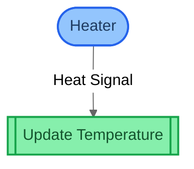
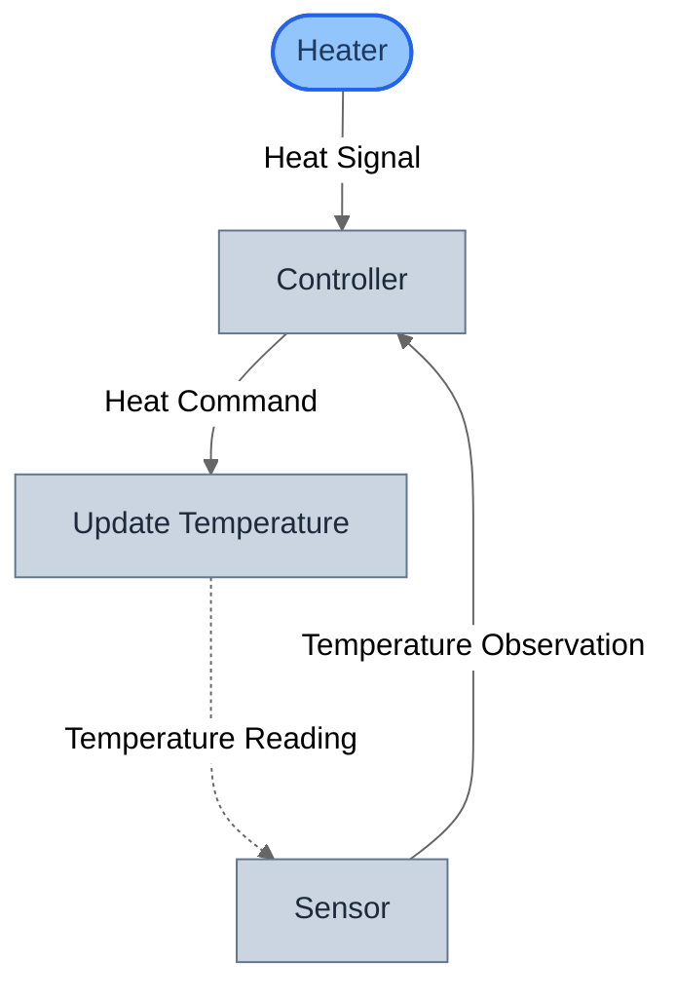
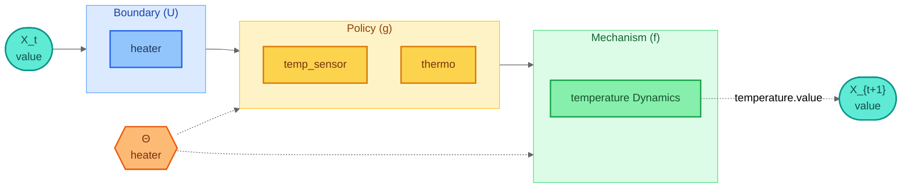

# Getting Started: Build Your First Model

A progressive 5-stage tutorial that teaches GDS fundamentals using a **thermostat control system** as the running example. Each stage builds on the previous one, introducing new concepts incrementally.

## Prerequisites

- Python 3.12+
- `gds-framework`, `gds-viz`, and `gds-control` installed (`uv sync --all-packages` from the repo root)

## Learning Path

| Stage | Concepts |
|-------|----------|
| 1. Minimal Model | Entity, BoundaryAction, Mechanism, `>>` composition, GDSSpec |
| 2. Feedback | Policy, `.loop()` temporal composition, parameters |
| 3. DSL Shortcut | gds-control DSL: ControlModel, compile_model, compile_to_system |
| 4. Verification & Viz | Generic checks (G-001..G-006), semantic checks, Mermaid visualization |
| 5. Query API | SpecQuery: parameter influence, entity updates, causal chains |

---

## Stage 1 -- Minimal Model

The simplest possible GDS model: a **heater** (BoundaryAction) warms a **room** (Entity with one state variable). Two blocks composed with `>>`.

- **BoundaryAction**: exogenous input -- no `forward_in` ports
- **Mechanism**: state update -- writes to entity variables, no backward ports
- **`>>`**: sequential composition via token-matched port wiring

### Types and Entity

```python
from gds.types.typedef import TypeDef
from gds.state import Entity, StateVariable

Temperature = TypeDef(
    name="Temperature",
    python_type=float,
    description="Temperature in degrees Celsius",
)

HeatRate = TypeDef(
    name="HeatRate",
    python_type=float,
    constraint=lambda x: x >= 0,
    description="Heat input rate (watts)",
)

room = Entity(
    name="Room",
    variables={
        "temperature": StateVariable(
            name="temperature",
            typedef=Temperature,
            symbol="T",
            description="Current room temperature",
        ),
    },
    description="The room being heated",
)
```

### Blocks and Composition

```python
from gds.blocks.roles import BoundaryAction, Mechanism
from gds.types.interface import Interface, port

# BoundaryAction: exogenous heat input
heater = BoundaryAction(
    name="Heater",
    interface=Interface(
        forward_out=(port("Heat Signal"),),
    ),
)

# Mechanism: state update
update_temperature = Mechanism(
    name="Update Temperature",
    interface=Interface(
        forward_in=(port("Heat Signal"),),
    ),
    updates=[("Room", "temperature")],
)

# Sequential composition -- tokens "heat" and "signal" overlap
pipeline = heater >> update_temperature
```

### Structural Diagram



---

## Stage 2 -- Adding Feedback

Extend the minimal model with **observation and control**:

- A **Sensor** (Policy) reads the room temperature
- A **Controller** (Policy) decides the heat command using a `setpoint` parameter
- A **TemporalLoop** (`.loop()`) feeds updated temperature back to the sensor across timesteps

New operators: `|` (parallel composition) and `.loop()` (temporal feedback).

### Blocks

```python
from gds.blocks.roles import BoundaryAction, Mechanism, Policy
from gds.types.interface import Interface, port

sensor = Policy(
    name="Sensor",
    interface=Interface(
        forward_in=(port("Temperature Reading"),),
        forward_out=(port("Temperature Observation"),),
    ),
)

controller = Policy(
    name="Controller",
    interface=Interface(
        forward_in=(
            port("Temperature Observation"),
            port("Heat Signal"),
        ),
        forward_out=(port("Heat Command"),),
    ),
    params_used=["setpoint"],
)

update_temperature = Mechanism(
    name="Update Temperature",
    interface=Interface(
        forward_in=(port("Heat Command"),),
        forward_out=(port("Temperature Reading"),),
    ),
    updates=[("Room", "temperature")],
)
```

### Composition with Temporal Loop

```python
from gds.blocks.composition import Wiring
from gds.ir.models import FlowDirection

input_tier = heater | sensor
forward_pipeline = input_tier >> controller >> update_temperature

system_with_loop = forward_pipeline.loop(
    [
        Wiring(
            source_block="Update Temperature",
            source_port="Temperature Reading",
            target_block="Sensor",
            target_port="Temperature Reading",
            direction=FlowDirection.COVARIANT,
        )
    ],
)
```

### Structural Diagram



Note the dashed arrow from Update Temperature back to Sensor -- this is the temporal loop (`.loop()`), indicating cross-timestep feedback.

---

## Stage 3 -- DSL Shortcut

Rebuild the same thermostat using the **gds-control** DSL. Declare states, inputs, sensors, and controllers -- the compiler generates all types, spaces, entities, blocks, wirings, and the temporal loop automatically.

**~15 lines of DSL vs ~60 lines of manual GDS construction.**

### ControlModel Declaration

```python
from gds_control.dsl.compile import compile_model, compile_to_system
from gds_control.dsl.elements import Controller, Input, Sensor, State
from gds_control.dsl.model import ControlModel

model = ControlModel(
    name="Thermostat DSL",
    states=[
        State(name="temperature", initial=20.0),
    ],
    inputs=[
        Input(name="heater"),
    ],
    sensors=[
        Sensor(name="temp_sensor", observes=["temperature"]),
    ],
    controllers=[
        Controller(
            name="thermo",
            reads=["temp_sensor", "heater"],
            drives=["temperature"],
        ),
    ],
    description="Thermostat built with the gds-control DSL",
)

spec = compile_model(model)       # -> GDSSpec
system = compile_to_system(model)  # -> SystemIR
```

### DSL Element to GDS Role Mapping

| DSL Element | GDS Role |
|-------------|----------|
| `State("temperature")` | Mechanism + Entity |
| `Input("heater")` | BoundaryAction |
| `Sensor("temp_sensor")` | Policy (observer) |
| `Controller("thermo")` | Policy (decision logic) |

### Canonical Decomposition

The canonical projection separates the system into the formal `h = f . g` form:



---

## Stage 4 -- Verification & Visualization

GDS provides two layers of verification:

1. **Generic checks (G-001..G-006)** on `SystemIR` -- structural topology
2. **Semantic checks (SC-001..SC-007)** on `GDSSpec` -- domain properties

Plus three Mermaid diagram views of the compiled system.

### Running Verification

```python
from gds.verification.engine import verify
from gds.verification.generic_checks import (
    check_g001_domain_codomain_matching,
    check_g003_direction_consistency,
    check_g004_dangling_wirings,
    check_g005_sequential_type_compatibility,
    check_g006_covariant_acyclicity,
)

report = verify(system, checks=[
    check_g001_domain_codomain_matching,
    check_g003_direction_consistency,
    check_g004_dangling_wirings,
    check_g005_sequential_type_compatibility,
    check_g006_covariant_acyclicity,
])

for finding in report.findings:
    status = "PASS" if finding.passed else "FAIL"
    print(f"[{finding.check_id}] {status}: {finding.message}")
```

### Three Visualization Views

=== "Structural"

    The compiled block graph showing blocks as nodes and wirings as arrows.

    ```mermaid
    %%{init:{"theme":"neutral"}}%%
    flowchart TD
        classDef boundary fill:#93c5fd,stroke:#2563eb,stroke-width:2px,color:#1e3a5f
        classDef generic fill:#cbd5e1,stroke:#64748b,stroke-width:1px,color:#1e293b
        heater([heater]):::boundary
        temp_sensor[temp_sensor]:::generic
        thermo[thermo]:::generic
        temperature_Dynamics[temperature Dynamics]:::generic
        heater --heater Reference--> thermo
        temp_sensor --temp_sensor Measurement--> thermo
        thermo --thermo Control--> temperature_Dynamics
        temperature_Dynamics -.temperature State..-> temp_sensor
    ```

=== "Architecture"

    Blocks grouped by GDS role: Boundary (U), Policy (g), Mechanism (f).

    ```mermaid
    %%{init:{"theme":"neutral"}}%%
    flowchart TD
        classDef boundary fill:#93c5fd,stroke:#2563eb,stroke-width:2px,color:#1e3a5f
        classDef policy fill:#fcd34d,stroke:#d97706,stroke-width:2px,color:#78350f
        classDef mechanism fill:#86efac,stroke:#16a34a,stroke-width:2px,color:#14532d
        classDef entity fill:#e2e8f0,stroke:#475569,stroke-width:2px,color:#0f172a
        subgraph boundary ["Boundary (U)"]
            heater([heater]):::boundary
        end
        subgraph policy ["Policy (g)"]
            temp_sensor[temp_sensor]:::policy
            thermo[thermo]:::policy
        end
        subgraph mechanism ["Mechanism (f)"]
            temperature_Dynamics[[temperature Dynamics]]:::mechanism
        end
        entity_temperature[("temperature<br/>value")]:::entity
        temperature_Dynamics -.-> entity_temperature
        thermo --ControlSpace--> temperature_Dynamics
        style boundary fill:#dbeafe,stroke:#60a5fa,stroke-width:1px,color:#1e40af
        style policy fill:#fef3c7,stroke:#fbbf24,stroke-width:1px,color:#92400e
        style mechanism fill:#dcfce7,stroke:#4ade80,stroke-width:1px,color:#166534
    ```

=== "Canonical"

    The formal `h = f . g` decomposition diagram (same as Stage 3 above).

---

## Stage 5 -- Query API

`SpecQuery` provides static analysis over a `GDSSpec` without running any simulation. It answers structural questions about information flow, parameter influence, and causal chains.

### Usage

```python
from gds.query import SpecQuery

query = SpecQuery(spec)

# Which blocks does each parameter affect?
query.param_to_blocks()
# -> {'heater': ['heater']}

# Which mechanisms update each entity variable?
query.entity_update_map()
# -> {'temperature': {'value': ['temperature Dynamics']}}

# Group blocks by GDS role
query.blocks_by_kind()
# -> {'boundary': ['heater'], 'policy': ['temp_sensor', 'thermo'],
#     'mechanism': ['temperature Dynamics'], ...}

# Which blocks can transitively affect temperature.value?
query.blocks_affecting("temperature", "value")
# -> ['temperature Dynamics', 'thermo', 'temp_sensor', 'heater']

# Full block-to-block dependency DAG
query.dependency_graph()
```

---

## Summary

You have built a complete GDS specification for a thermostat system, progressing through five stages:

1. **Minimal model** -- types, entity, two blocks, sequential composition
2. **Feedback** -- policies, parameters, temporal loop
3. **DSL** -- same system in 15 lines with `gds-control`
4. **Verification** -- structural and semantic checks, three diagram views
5. **Query** -- static analysis of parameter influence and causal chains

From here, explore the [example models](../examples/index.md) or the [Rosetta Stone](rosetta-stone.md) guide to see the same system through different DSL lenses.

## Running Interactively

The guide includes a [marimo notebook](https://github.com/BlockScience/gds-core/blob/main/packages/gds-examples/guides/getting_started/notebook.py) for interactive exploration:

```bash
uv run marimo run packages/gds-examples/guides/getting_started/notebook.py
```

Run the test suite:

```bash
uv run --package gds-examples pytest packages/gds-examples/guides/getting_started/ -v
```

## Source Files

| File | Purpose |
|------|---------|
| [`stage1_minimal.py`](https://github.com/BlockScience/gds-core/blob/main/packages/gds-examples/guides/getting_started/stage1_minimal.py) | Minimal heater model |
| [`stage2_feedback.py`](https://github.com/BlockScience/gds-core/blob/main/packages/gds-examples/guides/getting_started/stage2_feedback.py) | Feedback loop with policies |
| [`stage3_dsl.py`](https://github.com/BlockScience/gds-core/blob/main/packages/gds-examples/guides/getting_started/stage3_dsl.py) | gds-control DSL version |
| [`stage4_verify_viz.py`](https://github.com/BlockScience/gds-core/blob/main/packages/gds-examples/guides/getting_started/stage4_verify_viz.py) | Verification and visualization |
| [`stage5_query.py`](https://github.com/BlockScience/gds-core/blob/main/packages/gds-examples/guides/getting_started/stage5_query.py) | SpecQuery API |
| [`notebook.py`](https://github.com/BlockScience/gds-core/blob/main/packages/gds-examples/guides/getting_started/notebook.py) | Interactive marimo notebook |
