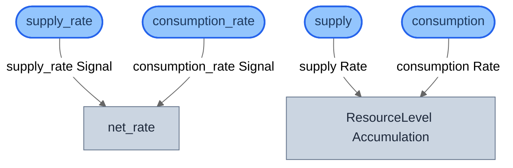
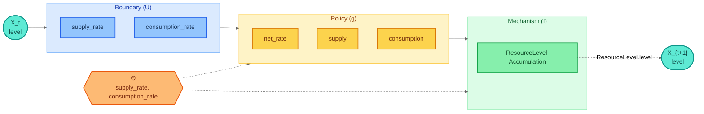
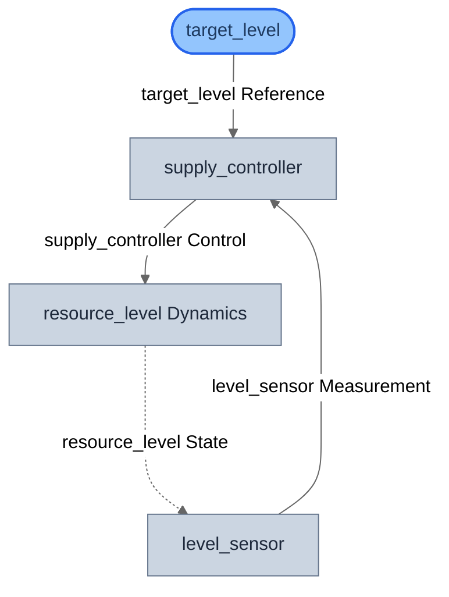
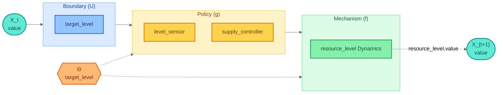
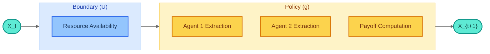

# Rosetta Stone: Cross-Domain Comparison

Three views of the same **resource pool** problem, each compiled to a GDS canonical form. This guide demonstrates the central insight of GDS: the same composition algebra underlies stock-flow dynamics, feedback control, and strategic game theory.

## The Resource Pool Scenario

A shared resource pool (water reservoir, inventory, commons) that agents interact with through supply, consumption, or extraction. The same real-world system is modeled through three different DSL lenses.

## Canonical Spectrum

All three views compile to `GDSSpec` and project to the canonical `h = f . g` decomposition:

```
View             |X|  |U|  |g|  |f|  Form                 Character
----------------------------------------------------------------------
Stock-Flow         1    2    3    1  h_theta = f . g      Dynamical
Control            1    1    2    1  h_theta = f . g      Dynamical
Game Theory        0    1    3    0  h = g                Strategic
```

Key insight: each DSL decomposes the problem differently:

- **Stock-Flow**: State X is the resource level, updated by net flow rates. Two exogenous parameters (supply rate, consumption rate) drive the dynamics.
- **Control**: State X is the resource level, regulated by a feedback controller that tracks an exogenous reference setpoint.
- **Game Theory**: No state -- pure strategic interaction. Two agents simultaneously choose extraction amounts; a payoff function determines the outcome.

---

## Stock-Flow View

Models the resource pool as a stock that accumulates via a supply inflow and depletes via a consumption outflow. An auxiliary computes the net rate from supply and consumption parameters.

**Canonical facts:** |X|=1, |U|=2, |g|=3, |f|=1, character = Dynamical

### StockFlowModel Declaration

```python
from stockflow.dsl.compile import compile_model, compile_to_system
from stockflow.dsl.elements import Auxiliary, Converter, Flow, Stock
from stockflow.dsl.model import StockFlowModel

model = StockFlowModel(
    name="Resource Pool (Stock-Flow)",
    stocks=[
        Stock(name="ResourceLevel", initial=100.0, non_negative=True),
    ],
    flows=[
        Flow(name="supply", target="ResourceLevel"),
        Flow(name="consumption", source="ResourceLevel"),
    ],
    auxiliaries=[
        Auxiliary(name="net_rate", inputs=["supply_rate", "consumption_rate"]),
    ],
    converters=[
        Converter(name="supply_rate"),
        Converter(name="consumption_rate"),
    ],
)
```

### Structural Diagram



### Canonical Diagram



---

## Control View

Models the same resource pool as a feedback control system. The resource level is a plant state, a target reference level is an exogenous input, and a controller adjusts the supply rate to track the target.

**Canonical facts:** |X|=1, |U|=1, |g|=2, |f|=1, character = Dynamical

### ControlModel Declaration

```python
from gds_control.dsl.compile import compile_model, compile_to_system
from gds_control.dsl.elements import Controller, Input, Sensor, State
from gds_control.dsl.model import ControlModel

model = ControlModel(
    name="Resource Pool (Control)",
    states=[
        State(name="resource_level", initial=100.0),
    ],
    inputs=[
        Input(name="target_level"),
    ],
    sensors=[
        Sensor(name="level_sensor", observes=["resource_level"]),
    ],
    controllers=[
        Controller(
            name="supply_controller",
            reads=["level_sensor", "target_level"],
            drives=["resource_level"],
        ),
    ],
)
```

### Structural Diagram



### Canonical Diagram



---

## Game Theory View

Models the resource pool as a two-player extraction game using the OGS (Open Games) DSL. Two agents simultaneously decide how much to extract from a shared resource. Each agent's payoff depends on how much resource remains after both extractions -- a classic common-pool resource dilemma.

This is a stateless strategic interaction: no persistent state updates, pure policy computation.

**Canonical facts:** |X|=0, |U|=1, |g|=3, |f|=0, character = Strategic

### OGS Pattern Declaration

```python
from ogs.dsl.games import CovariantFunction, DecisionGame
from ogs.dsl.pattern import Pattern, PatternInput
from ogs.dsl.types import InputType, Signature, port

resource_input = PatternInput(
    name="Resource Availability",
    input_type=InputType.RESOURCE,
    schema_hint="float >= 0",
    target_game="Agent 1 Extraction",
    flow_label="Resource Signal",
)

agent1 = DecisionGame(
    name="Agent 1 Extraction",
    signature=Signature(
        x=(port("Resource Signal"),),
        y=(port("Agent 1 Decision"),),
        r=(port("Agent 1 Payoff"),),
    ),
    logic="Choose extraction amount based on resource availability",
)

agent2 = DecisionGame(
    name="Agent 2 Extraction",
    signature=Signature(
        x=(port("Resource Signal"),),
        y=(port("Agent 2 Decision"),),
        r=(port("Agent 2 Payoff"),),
    ),
    logic="Choose extraction amount based on resource availability",
)

payoff = CovariantFunction(
    name="Payoff Computation",
    signature=Signature(
        x=(port("Agent 1 Decision"), port("Agent 2 Decision")),
        y=(port("Allocation Result"),),
    ),
    logic="Compute payoffs based on total extraction vs available resource",
)

# Compose: agents decide in parallel, then payoff computation
game_tree = (agent1 | agent2) >> payoff

pattern = Pattern(
    name="Resource Pool (Game)",
    game=game_tree,
    inputs=[resource_input],
)
```

### Canonical Diagram

Since there are no mechanisms (|f|=0), the canonical form reduces to **h = g** -- pure policy.



---

## Cross-Domain Comparison

The comparison table built programmatically by `comparison.py` reveals the unified transition calculus:

```
h_theta : X -> X    where h = f . g
```

- When |f| > 0 and |g| > 0: **Dynamical** system (stock-flow, control)
- When |f| = 0 and |g| > 0: **Strategic** system (game theory)
- When |g| = 0 and |f| > 0: **Autonomous** system (no policy)

This is the "Rosetta Stone" -- the same mathematical structure expressed in different domain languages, all grounded in GDS theory.

```python
from guides.rosetta.comparison import canonical_spectrum_table

print(canonical_spectrum_table())
```

## Running Interactively

The guide includes a [marimo notebook](https://github.com/BlockScience/gds-core/blob/main/packages/gds-examples/guides/rosetta/notebook.py) for interactive exploration with live Mermaid rendering and dropdown selectors:

```bash
uv run marimo run packages/gds-examples/guides/rosetta/notebook.py
```

Run the test suite:

```bash
uv run --package gds-examples pytest packages/gds-examples/guides/rosetta/ -v
```

## Source Files

| File | Purpose |
|------|---------|
| [`stockflow_view.py`](https://github.com/BlockScience/gds-core/blob/main/packages/gds-examples/guides/rosetta/stockflow_view.py) | Stock-flow DSL model |
| [`control_view.py`](https://github.com/BlockScience/gds-core/blob/main/packages/gds-examples/guides/rosetta/control_view.py) | Control DSL model |
| [`game_view.py`](https://github.com/BlockScience/gds-core/blob/main/packages/gds-examples/guides/rosetta/game_view.py) | Game theory DSL model |
| [`comparison.py`](https://github.com/BlockScience/gds-core/blob/main/packages/gds-examples/guides/rosetta/comparison.py) | Cross-domain canonical comparison |
| [`notebook.py`](https://github.com/BlockScience/gds-core/blob/main/packages/gds-examples/guides/rosetta/notebook.py) | Interactive marimo notebook |
