# GDS Ecosystem

**Typed compositional specifications for complex systems**, grounded in [Generalized Dynamical Systems](https://doi.org/10.57938/e8d456ea-d975-4111-ac41-052ce73cb0cc) theory (Zargham & Shorish, 2022).

GDS gives you a composition algebra for modeling complex systems — from epidemics and control loops to game theory and software architecture — with built-in verification, visualization, and a shared formal foundation.

## Where to Start

| | |
|---|---|
| **[Start Here](tutorials/getting-started.md)** | New to GDS? Follow the hands-on tutorial to build your first model in minutes. |
| **[Learning Path](examples/learning-path.md)** | Work through seven example models in recommended order, from simple to complex. |
| **[Choosing a DSL](guides/choosing-a-dsl.md)** | Compare all seven domain DSLs and pick the right one for your problem. |
| **[Rosetta Stone](guides/rosetta-stone.md)** | See the same problem modeled with stockflow, control, and game theory DSLs side by side. |

## Interactive Notebooks

Key guides include embedded [marimo](https://marimo.io) notebooks — run code, tweak parameters, and see results directly in the docs. No local setup required.

| Guide | What You'll Explore |
|-------|---------------------|
| **[Getting Started](guides/getting-started.md)** | Build a thermostat model in 5 progressive stages |
| **[Rosetta Stone](guides/rosetta-stone.md)** | Same problem modeled with three different DSLs |
| **[Verification](guides/verification.md)** | All 3 verification layers with deliberately broken models |
| **[Visualization](guides/visualization.md)** | 6 view types, 5 themes, cross-DSL rendering |
| **[Interoperability](guides/interoperability.md)** | Cross-DSL composition and data exchange |

## Packages

Install just what you need: `uv add gds-core[control,continuous]`

### Structural Specification

| Package | Import | Description |
|---|---|---|
| [`gds-framework`](framework/index.md) | `gds` | Core engine -- composition algebra, compiler, verification |
| [`gds-viz`](viz/index.md) | `gds_viz` | Mermaid diagrams + [phase portraits](viz/index.md) `[phase]` |
| [`gds-owl`](owl/index.md) | `gds_owl` | OWL/SHACL/SPARQL export for formal representability |

### Domain DSLs

| Package | Import | Description |
|---|---|---|
| [`gds-stockflow`](stockflow/index.md) | `stockflow` | Declarative stock-flow DSL |
| [`gds-control`](control/index.md) | `gds_control` | State-space control DSL |
| [`gds-games`](games/index.md) | `ogs` | Compositional game theory + [Nash equilibrium](games/equilibrium.md) `[nash]` |
| [`gds-software`](software/index.md) | `gds_software` | Software architecture DSL (DFD, SM, C4, ERD) |
| [`gds-business`](business/index.md) | `gds_business` | Business dynamics DSL (CLD, SCN, VSM) |
| [`gds-symbolic`](symbolic/index.md) | `gds_symbolic` | SymPy bridge for control models `[sympy]` |

### Simulation & Analysis

| Package | Import | Description |
|---|---|---|
| [`gds-sim`](https://pypi.org/project/gds-sim/) | `gds_sim` | Discrete-time simulation engine (standalone) |
| [`gds-continuous`](continuous/index.md) | `gds_continuous` | Continuous-time ODE engine `[scipy]` |
| [`gds-analysis`](analysis/index.md) | `gds_analysis` | GDSSpec-to-gds-sim bridge, reachability |
| [`gds-psuu`](psuu/index.md) | `gds_psuu` | Parameter sweep + Optuna optimization |

### Tutorials

| Package | Description |
|---|---|
| `gds-examples` | [Tutorial models](examples/learning-path.md) + [Homicidal Chauffeur](continuous/getting-started.md) notebook |

## Architecture

```mermaid
graph TD
    classDef core fill:#e0e7ff,stroke:#4f46e5,stroke-width:2px,color:#1e1b4b
    classDef dsl fill:#fef3c7,stroke:#d97706,stroke-width:2px,color:#78350f
    classDef sim fill:#d1fae5,stroke:#059669,stroke-width:2px,color:#064e3b
    classDef tool fill:#f3e8ff,stroke:#7c3aed,stroke-width:2px,color:#4c1d95
    classDef ext fill:#e5e7eb,stroke:#6b7280,stroke-width:1px,color:#374151

    FW["gds-framework<br/><small>core engine (pydantic only)</small>"]:::core

    VIZ["gds-viz<br/><small>Mermaid + phase portraits</small>"]:::tool
    OWL["gds-owl<br/><small>OWL / SHACL / SPARQL</small>"]:::tool

    GAMES["gds-games<br/><small>game theory DSL</small>"]:::dsl
    SF["gds-stockflow<br/><small>stock-flow DSL</small>"]:::dsl
    CTRL["gds-control<br/><small>control systems DSL</small>"]:::dsl
    SW["gds-software<br/><small>software architecture DSL</small>"]:::dsl
    BIZ["gds-business<br/><small>business dynamics DSL</small>"]:::dsl

    SYM["gds-symbolic<br/><small>SymPy + Hamiltonian</small>"]:::tool
    EX["gds-examples<br/><small>tutorials + notebooks</small>"]:::ext

    SIM["gds-sim<br/><small>discrete-time simulation</small>"]:::sim
    AN["gds-analysis<br/><small>reachability + metrics</small>"]:::sim
    PSUU["gds-psuu<br/><small>parameter sweep</small>"]:::sim

    CONT["gds-continuous<br/><small>ODE engine (scipy)</small>"]:::sim

    FW --> VIZ
    FW --> OWL
    FW --> GAMES
    FW --> SF
    FW --> CTRL
    FW --> SW
    FW --> BIZ
    CTRL --> SYM
    FW --> EX
    VIZ --> EX

    FW --> AN
    SIM --> AN
    SIM --> PSUU
    CONT --> AN
```

**Legend:** :blue_square: Core | :yellow_square: Domain DSLs | :green_square: Simulation & Analysis | :purple_square: Tooling

## License

Apache-2.0 — [BlockScience](https://block.science)
