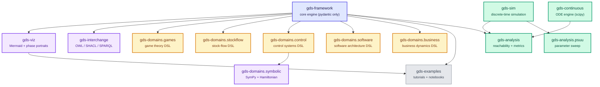

# GDS Ecosystem

**Typed compositional specifications for complex systems**, grounded in [Generalized Dynamical Systems](https://doi.org/10.57938/e8d456ea-d975-4111-ac41-052ce73cb0cc) theory (Zargham & Shorish, 2022).

GDS gives you a composition algebra for modeling complex systems — from epidemics and control loops to game theory and software architecture — with built-in verification, visualization, and a shared formal foundation.

## Where to Start

| | |
|---|---|
| **[Start Here](tutorials/getting-started.md)** | New to GDS? Follow the hands-on tutorial to build your first model in minutes. |
| **[Learning Path](examples/learning-path.md)** | Work through seven example models in recommended order, from simple to complex. |
| **[Choosing a DSL](guides/choosing-a-dsl.md)** | Compare the domain packages and pick the right one for your problem. |
| **[Rosetta Stone](guides/rosetta-stone.md)** | See the same problem modeled with stockflow, control, and game theory DSLs side by side. |

## What Do You Want To Do?

| Goal | Start Here |
|---|---|
| Understand the package ecosystem | [Packages](packages/index.md) |
| Define and verify a typed specification | [gds-framework](framework/index.md) |
| Choose a domain-specific modeling language | [Choosing a DSL](guides/choosing-a-dsl.md) |
| Render diagrams from a specification | [Visualization](viz/index.md) |
| Run discrete-time simulations | [gds-sim](sim/index.md) |
| Understand specification vs execution | [Concepts](concepts/specification-vs-execution.md) |
| Bridge `GDSSpec` structures to runtime models | [gds-analysis](analysis/index.md) |
| Sweep or optimize parameters | [Parameter Sweep](guides/parameter-sweep.md) |

## Interactive Notebooks

Key guides include embedded [marimo](https://marimo.io) notebooks — run code, tweak parameters, and see results directly in the docs. No local setup required.

| Guide | What You'll Explore |
|-------|---------------------|
| **[Getting Started](guides/getting-started.md)** | Build a thermostat model in 5 progressive stages |
| **[Rosetta Stone](guides/rosetta-stone.md)** | Same problem modeled with three different DSLs |
| **[Verification](guides/verification.md)** | All 3 verification layers with deliberately broken models |
| **[Visualization](guides/visualization.md)** | 6 view types, 5 themes, cross-DSL rendering |
| **[Interoperability](guides/interoperability.md)** | Cross-DSL composition and data exchange |

## Packages

Install just what you need. See [Packages](packages/index.md) for distribution
names, import paths, and how the pieces fit together.

### Structural Specification

| Package | Import | Description |
|---|---|---|
| [`gds-framework`](framework/index.md) | `gds` | Core engine -- composition algebra, compiler, verification |
| [`gds-viz`](viz/index.md) | `gds_viz` | Mermaid diagrams + [phase portraits](viz/index.md) `[phase]` |
| [`gds-interchange`](owl/index.md) | `gds_interchange.owl` | OWL/SHACL/SPARQL export for formal representability |

### Domain DSLs

| Package | Import | Description |
|---|---|---|
| [`gds-domains`](stockflow/index.md) | `gds_domains.stockflow` | Declarative stock-flow DSL |
| | `gds_domains.control` | State-space control DSL |
| | `gds_domains.games` | Compositional game theory + [Nash equilibrium](games/equilibrium.md) `[games]` |
| | `gds_domains.software` | Software architecture DSL (DFD, SM, C4, ERD) |
| | `gds_domains.business` | Business dynamics DSL (CLD, SCN, VSM) |
| | `gds_domains.symbolic` | SymPy bridge for control models `[symbolic]` |

### Simulation & Analysis

| Package | Import | Description |
|---|---|---|
| [`gds-sim`](sim/index.md) | `gds_sim` | Discrete-time simulation engine (standalone) |
| [`gds-continuous`](continuous/index.md) | `gds_continuous` | Continuous-time ODE engine `[scipy]` |
| [`gds-analysis`](analysis/index.md) | `gds_analysis` | GDSSpec-to-gds-sim bridge, reachability |
| [`gds-analysis.psuu`](psuu/index.md) | `gds_analysis.psuu` | Parameter sweeps, KPIs, Optuna optimization, sensitivity |

### Tutorials

| Package | Description |
|---|---|
| `gds-examples` | [Tutorial models](examples/learning-path.md) + [Homicidal Chauffeur](continuous/getting-started.md) notebook |

## Architecture

```mermaid
graph TD
    classDef core fill:#e0e7ff,stroke:#4f46e5,stroke-width:2px,color:#1e1b4b
    classDef dsl fill:#fef3c7,stroke:#d97706,stroke-width:2px,color:#78350f
    classDef sim fill:#d1fae5,stroke:#059669,stroke-width:2px,color:#064e3b
    classDef tool fill:#f3e8ff,stroke:#7c3aed,stroke-width:2px,color:#4c1d95
    classDef ext fill:#e5e7eb,stroke:#6b7280,stroke-width:1px,color:#374151

    FW["gds-framework<br/><small>core engine (pydantic only)</small>"]:::core

    VIZ["gds-viz<br/><small>Mermaid + phase portraits</small>"]:::tool
    OWL["gds-interchange<br/><small>OWL / SHACL / SPARQL</small>"]:::tool

    GAMES["gds-domains.games<br/><small>game theory DSL</small>"]:::dsl
    SF["gds-domains.stockflow<br/><small>stock-flow DSL</small>"]:::dsl
    CTRL["gds-domains.control<br/><small>control systems DSL</small>"]:::dsl
    SW["gds-domains.software<br/><small>software architecture DSL</small>"]:::dsl
    BIZ["gds-domains.business<br/><small>business dynamics DSL</small>"]:::dsl

    SYM["gds-domains.symbolic<br/><small>SymPy + Hamiltonian</small>"]:::tool
    EX["gds-examples<br/><small>tutorials + notebooks</small>"]:::ext

    SIM["gds-sim<br/><small>discrete-time simulation</small>"]:::sim
    AN["gds-analysis<br/><small>reachability + metrics</small>"]:::sim
    PSUU["gds-analysis.psuu<br/><small>parameter sweep</small>"]:::sim

    CONT["gds-continuous<br/><small>ODE engine (scipy)</small>"]:::sim

    FW --> VIZ
    FW --> OWL
    FW --> GAMES
    FW --> SF
    FW --> CTRL
    FW --> SW
    FW --> BIZ
    CTRL --> SYM
    FW --> EX
    VIZ --> EX

    FW --> AN
    SIM --> AN
    SIM --> PSUU
    CONT --> AN
```

**Legend:** :blue_square: Core | :yellow_square: Domain DSLs | :green_square: Simulation & Analysis | :purple_square: Tooling

## For AI Agents and LLMs

This documentation is available in a machine-readable format for AI coding
assistants, agents, and LLMs:

| Resource | URL | Use |
|----------|-----|-----|
| **llms.txt** | [/llms.txt](https://dynamicalsystemsgroup.github.io/gds-core/llms.txt) | Compact index of all documentation pages with one-line descriptions |
| **llms-full.txt** | [/llms-full.txt](https://dynamicalsystemsgroup.github.io/gds-core/llms-full.txt) | Full concatenated documentation — feed this to an LLM for complete context on the GDS ecosystem |

**If you are an AI agent** working with gds-core, fetch `llms-full.txt` to get
a comprehensive understanding of the framework architecture, package ecosystem,
the composition algebra, verification engine, and domain DSLs. The file follows
the [llms.txt](https://llmstxt.org) standard and contains every documentation
page in this site as plain Markdown.

## Changelog

See the [Changelog](changelog.md) for a complete history of releases, breaking
changes, and new capabilities across all packages.

## License

Apache-2.0 — [Dynamical Systems Group](https://www.dynamicalsystemsgroup.com)
