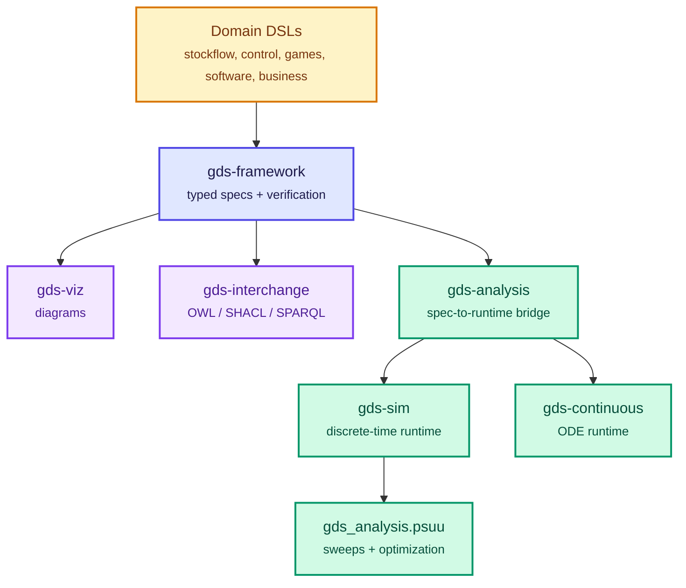

# Packages

The GDS ecosystem is a set of packages for defining, verifying, visualizing,
simulating, and analyzing complex systems. The packages share a modeling
vocabulary, but they are intentionally split by role so you can install only the
pieces you need.

## Package Layers

## What Do You Want To Do?

| Goal | Start Here | Package |
|---|---|---|
| Define a typed system specification | [gds-framework](../framework/index.md) | `gds-framework` |
| Use a domain vocabulary | [Choosing a DSL](../guides/choosing-a-dsl.md) | `gds-domains.*` |
| Render diagrams | [Visualization](../viz/index.md) | `gds-viz` |
| Export OWL, SHACL, or SPARQL | [OWL](../owl/index.md) | `gds-interchange` |
| Run discrete-time simulations | [Simulation](../sim/index.md) | `gds-sim` |
| Run ODE simulations | [Continuous-Time](../continuous/index.md) | `gds-continuous` |
| Bridge `GDSSpec` to simulation | [Analysis](../analysis/index.md) | `gds-analysis` |
| Sweep and optimize parameters | [PSUU](../psuu/index.md) | `gds_analysis.psuu` |

## Foundation

| Distribution | Import | Role |
|---|---|---|
| [`gds-framework`](../framework/index.md) | `gds` | Core specification, composition, compilation, and structural verification |
| [`gds-viz`](../viz/index.md) | `gds_viz` | Mermaid diagrams and visual projections of GDS specifications |
| [`gds-interchange`](../owl/index.md) | `gds_interchange.owl` | OWL, SHACL, SPARQL, and semantic-web interchange |
| [`gds-proof`](../proof/index.md) | `gds_proof` | Deterministic model identity and symbolic invariant proof checks |

## Domain DSLs

Domain packages provide compact vocabulary for common modeling families. They
compile into GDS specifications so they can reuse the same verification and
visualization stack.

| Distribution | Import | Role |
|---|---|---|
| [`gds-domains`](../stockflow/index.md) | `gds_domains.stockflow` | Stocks, flows, auxiliaries, and system dynamics models |
| [`gds-domains`](../control/index.md) | `gds_domains.control` | State-space control systems, sensors, controllers, and plants |
| [`gds-domains`](../games/index.md) | `gds_domains.games` | Compositional game theory and open-game patterns |
| [`gds-domains`](../software/index.md) | `gds_domains.software` | DFD, state machine, C4, ERD, component, and dependency diagrams |
| [`gds-domains`](../business/index.md) | `gds_domains.business` | CLD, supply chain, and value stream modeling |
| [`gds-domains`](../symbolic/index.md) | `gds_domains.symbolic` | SymPy bridge for control models and symbolic equations |

## Simulation And Analysis

These packages move from structural specifications to executable trajectories,
metrics, parameter search, and sensitivity analysis.

| Distribution | Import | Role |
|---|---|---|
| [`gds-sim`](../sim/index.md) | `gds_sim` | Standalone discrete-time simulation runtime |
| [`gds-continuous`](../continuous/index.md) | `gds_continuous` | Continuous-time ODE simulation runtime |
| [`gds-analysis`](../analysis/index.md) | `gds_analysis` | Bridge from `GDSSpec` structures to simulation workflows and reachability analysis |
| [`gds-analysis`](../psuu/index.md) | `gds_analysis.psuu` | Parameter sweeps, KPI scoring, optimization, and sensitivity analysis |
| [`gds-psuu`](../psuu/index.md) | `gds_psuu` | Deprecated compatibility import path for `gds_analysis.psuu` |

!!! note "PSUU package naming"
    New code should install `gds-analysis` and import from `gds_analysis.psuu`.
    The `gds-psuu` distribution remains only as a compatibility layer for older
    code that imports `gds_psuu`.

## Examples

| Package | Role |
|---|---|
| [`gds-examples`](../examples/index.md) | Tutorial models and notebooks that demonstrate the packages together |

## Next Steps

- New to GDS: start with the [hands-on tutorial](../tutorials/getting-started.md).
- Choosing a modeling vocabulary: use [Choosing a DSL](../guides/choosing-a-dsl.md).
- Moving from specs to trajectories: read [Simulation & Analysis](simulation-analysis.md).
- Looking for generated module docs: use the package API reference pages under the Reference nav.
