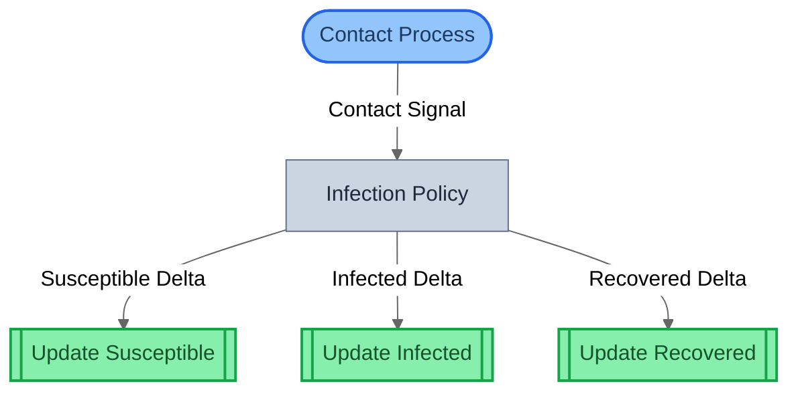

# Getting Started

## Installation

```bash
pip install gds-viz
```

Or with [uv](https://docs.astral.sh/uv/):

```bash
uv add gds-viz
```

gds-viz imports as `gds_viz`:

```python
from gds_viz import system_to_mermaid, canonical_to_mermaid, spec_to_mermaid
```

## Requirements

- Python 3.12 or later
- [gds-framework](https://pypi.org/project/gds-framework/) >= 0.2.3 (installed automatically)

## How It Works

gds-viz takes GDS objects (`SystemIR`, `GDSSpec`, `CanonicalGDS`) and returns **Mermaid markdown strings**. It does not render images directly -- you paste the output into any Mermaid-compatible renderer.

```python
from gds_viz import system_to_mermaid

mermaid_str = system_to_mermaid(system)
print(mermaid_str)  # paste into GitHub markdown, mermaid.live, etc.
```

## Quick Start: SIR Epidemic Model

This example uses the SIR epidemic model from `gds-examples` to demonstrate all six views. The model has three entities (Susceptible, Infected, Recovered), one boundary action, one policy, and three mechanisms.

### Step 1: Build the Model

```python
from sir_epidemic.model import build_spec, build_system
from gds.canonical import project_canonical

spec = build_spec()
system = build_system()
canonical = project_canonical(spec)
```

### Step 2: Generate Views

```python
from gds_viz import (
    system_to_mermaid,
    canonical_to_mermaid,
    spec_to_mermaid,
    params_to_mermaid,
    trace_to_mermaid,
)

# View 1: Structural -- compiled block topology
print(system_to_mermaid(system))

# View 2: Canonical -- h = f . g decomposition
print(canonical_to_mermaid(canonical))

# View 3: Architecture by role -- blocks grouped by GDS role
print(spec_to_mermaid(spec))

# View 5: Parameter influence -- Theta -> blocks -> entities
print(params_to_mermaid(spec))

# View 6: Traceability -- what affects Susceptible.count?
print(trace_to_mermaid(spec, "Susceptible", "count"))
```

### Step 3: Render

Paste the Mermaid output into any compatible renderer:

- **GitHub / GitLab** -- native Mermaid support in markdown files
- **VS Code** -- with a Mermaid extension
- **Obsidian** -- built-in support
- **[mermaid.live](https://mermaid.live)** -- online editor
- **MkDocs** -- with `pymdownx.superfences` Mermaid fence (used by this documentation)
- **marimo** -- `mo.mermaid(mermaid_str)` for interactive notebooks

## Rendered Output

Here is the actual output from the SIR epidemic model, rendered inline.

### View 1: Structural

The compiled block graph from `SystemIR`. Shows composition topology with role-based shapes and wiring types.



### View 2: Canonical GDS

The mathematical decomposition: X_t --> U --> g --> f --> X_{t+1}. Shows the abstract dynamical system with state (X), input (U), policy (g), mechanism (f), and parameter space (Theta).


### View 3: Architecture by Role

Blocks grouped by GDS role. Entity cylinders show which state variables each mechanism writes.


## Where Visualization Fits

Visualization is a **post-compilation** concern. It operates on the same compiled artifacts that verification uses:

```
Define model → build_spec() / build_system()
                        ↓
              Compile → GDSSpec, SystemIR, CanonicalGDS
                        ↓
              ┌─────────┴──────────┐
              ↓                    ↓
        Verify (gds)        Visualize (gds-viz)
```

The six views are different projections of the same specification -- they never modify it, only read it. You can generate views at any point after compilation.

## Next Steps

- **[Views Guide](guide/views.md)** -- detailed gallery of all six view types with rendered output
- **[Theming Guide](guide/theming.md)** -- customizing diagram appearance with 5 built-in themes
- **[API Reference](api/init.md)** -- full function signatures and options
- **[Visualization Guide](../guides/visualization.md)** -- cross-DSL examples and interactive notebooks
