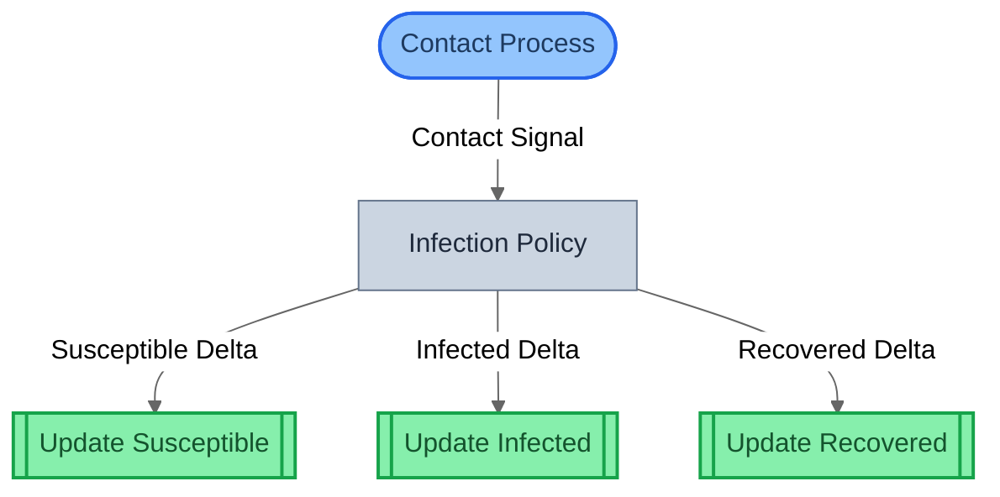
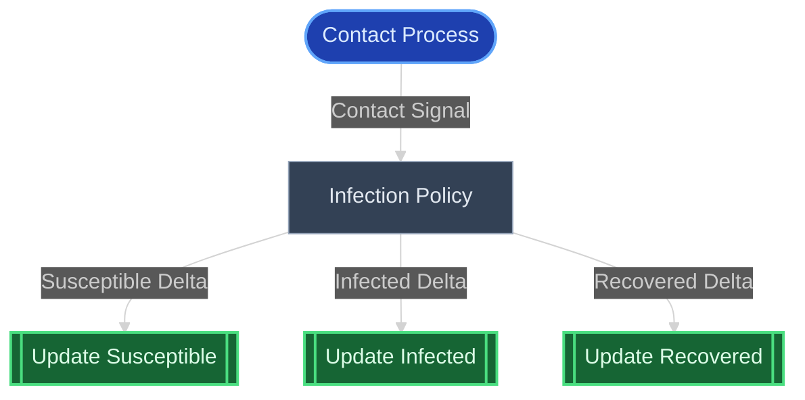
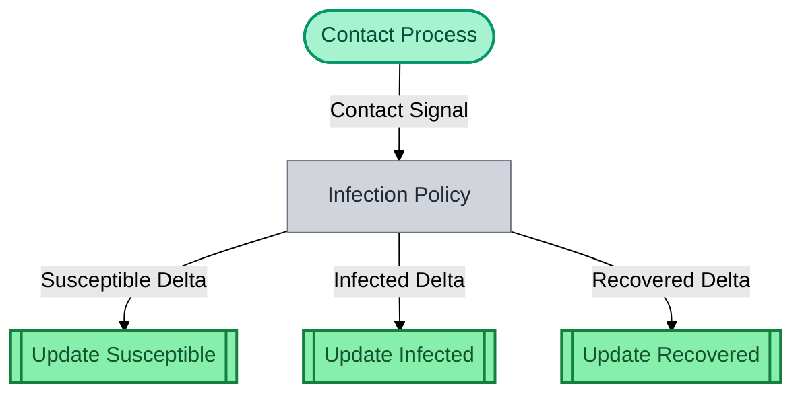

# Theming

All gds-viz functions accept an optional `theme` parameter to control diagram appearance. The `MermaidTheme` type restricts values to Mermaid's five built-in themes.

## Usage

```python
from gds_viz import system_to_mermaid, MermaidTheme

# Pass any theme name
mermaid = system_to_mermaid(system, theme="dark")

# Type-safe with MermaidTheme literal
theme: MermaidTheme = "forest"
mermaid = system_to_mermaid(system, theme=theme)
```

All view functions support theming:

```python
from gds_viz import (
    system_to_mermaid,
    canonical_to_mermaid,
    spec_to_mermaid,
    block_to_mermaid,
    params_to_mermaid,
    trace_to_mermaid,
)

system_to_mermaid(system, theme="neutral")
canonical_to_mermaid(canonical, theme="dark")
spec_to_mermaid(spec, theme="forest")
block_to_mermaid(block, theme="neutral")
params_to_mermaid(spec, theme="base")
trace_to_mermaid(spec, "Entity", "var", theme="default")
```

## Available Themes

| Theme | Best For | Canvas |
|-------|----------|--------|
| `neutral` | Light backgrounds (GitHub, docs) | Muted gray -- **default** |
| `default` | Mermaid's built-in Material style | Blue-toned |
| `dark` | Dark-mode renderers | Dark canvas, light text |
| `forest` | Nature-inspired presentations | Green-tinted |
| `base` | Minimal chrome, very light fills | Near-white |

## Theme Comparison

The same SIR epidemic structural diagram rendered with different themes.

### Neutral (default)



### Dark



### Forest



## Color Scheme

gds-viz uses a consistent color scheme across all views. Each role and element type has a dedicated palette that adapts to the selected theme.

### Neutral Theme Palette

| Element | Fill | Stroke | CSS Class |
|---------|------|--------|-----------|
| BoundaryAction | `#93c5fd` (light blue) | `#2563eb` | `boundary` |
| Policy | `#fcd34d` (yellow) | `#d97706` | `policy` |
| Mechanism | `#86efac` (green) | `#16a34a` | `mechanism` |
| ControlAction | `#d8b4fe` (purple) | `#9333ea` | `control` |
| Generic | `#cbd5e1` (gray) | `#64748b` | `generic` |
| Entity | `#e2e8f0` (light gray) | `#475569` | `entity` |
| Parameter | `#fdba74` (orange) | `#ea580c` | `param` |
| State (X_t) | `#5eead4` (teal) | `#0d9488` | `state` |
| Target | `#fca5a5` (red) | `#dc2626` | `target` |

## Rendering Targets

Output is standard Mermaid markdown. It renders in:

- **GitHub / GitLab** -- native Mermaid support in markdown files and issues
- **VS Code** -- with a Mermaid extension
- **Obsidian** -- built-in support
- **[mermaid.live](https://mermaid.live)** -- online editor and playground
- **MkDocs** -- with `pymdownx.superfences` Mermaid fence (used by this documentation)
- **marimo** -- `mo.mermaid(mermaid_str)` for interactive notebooks
