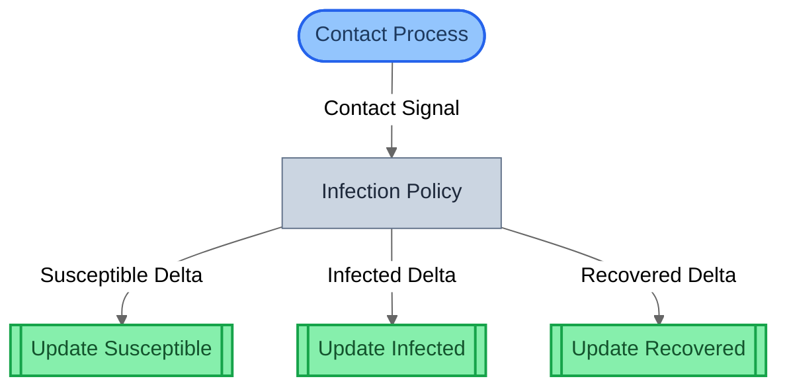
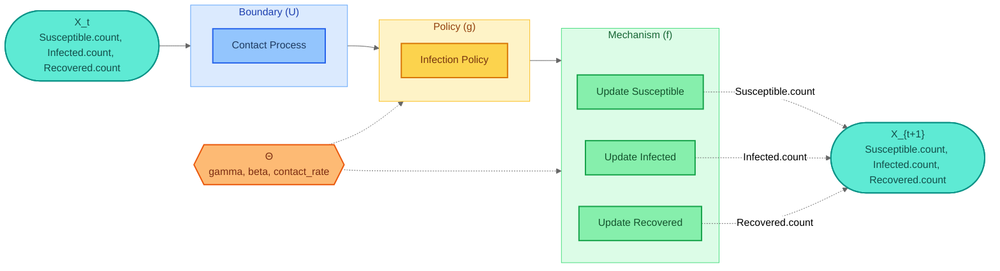
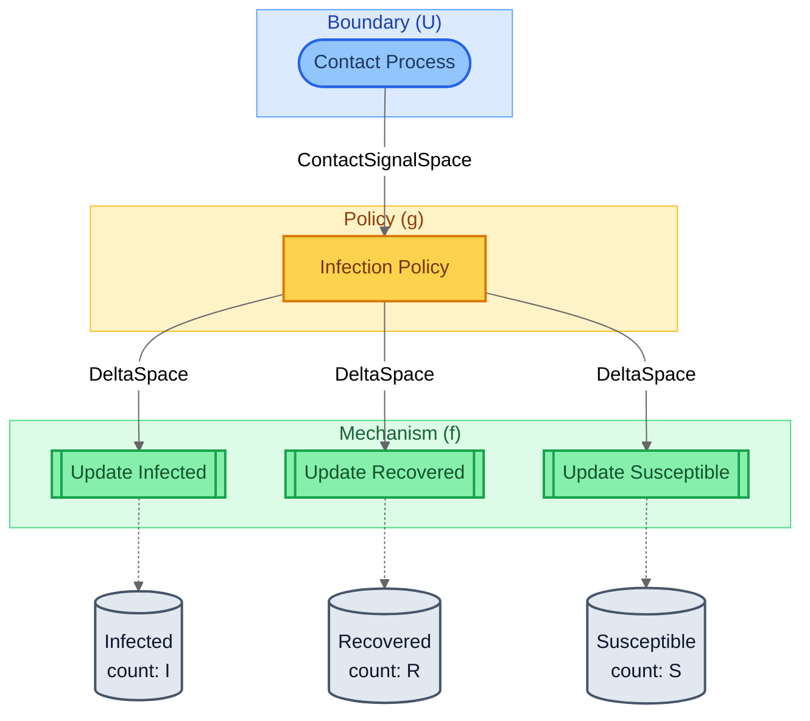
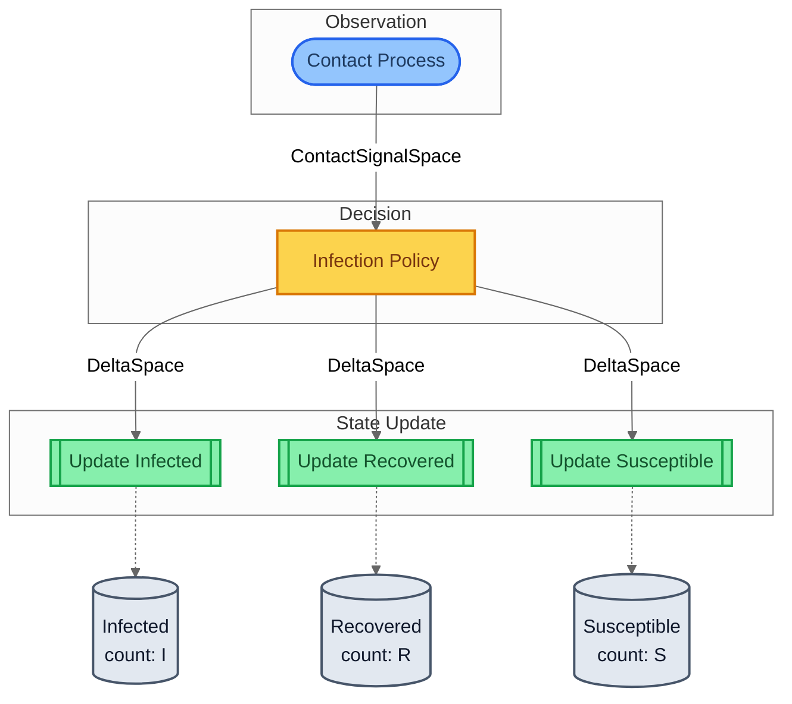
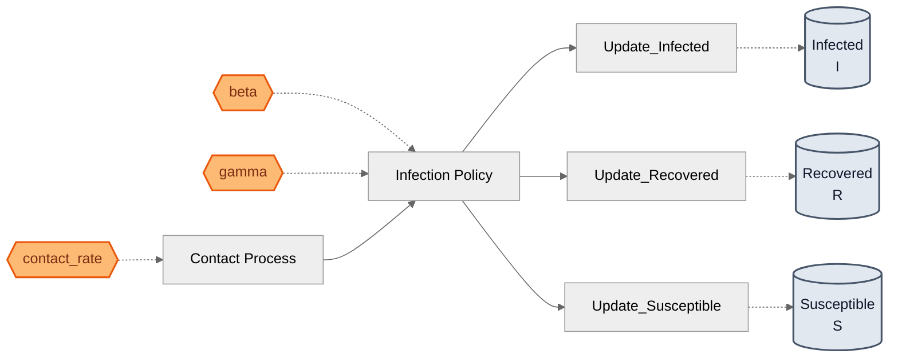
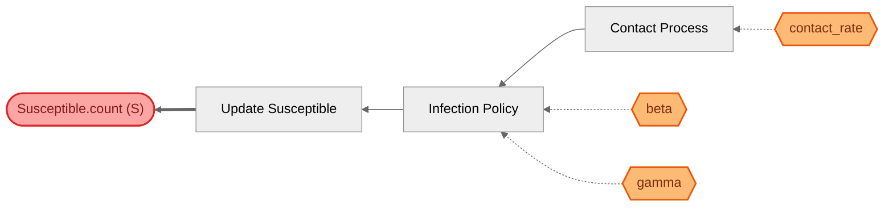

# Views Gallery

gds-viz provides six complementary views of a GDS specification. Each view is a different projection of the same compiled artifacts, answering a different question about the system.

All examples on this page use the **SIR epidemic model** from `gds-examples`.

## View 1: Structural

The compiled block graph from `SystemIR`. Shows composition topology -- sequential, parallel, feedback, temporal -- with role-based shapes and wiring types.

```python
from gds_viz import system_to_mermaid
mermaid = system_to_mermaid(system)
```

**Shape conventions:**

| Shape | Meaning | Role |
|-------|---------|------|
| Stadium `([...])` | Exogenous input (no forward_in) | BoundaryAction |
| Double-bracket `[[...]]` | State sink (no forward_out) | Terminal Mechanism |
| Rectangle `[...]` | Has both inputs and outputs | Policy / other |

**Arrow conventions:**

| Arrow | Meaning |
|-------|---------|
| Solid `-->` | Covariant forward flow |
| Thick `==>` | Contravariant feedback (within-timestep) |
| Dashed `-.->` | Temporal loop (cross-timestep) |

### Rendered Output



**Reading this diagram:** The Contact Process boundary action (stadium shape) feeds into the Infection Policy, which fans out to three terminal mechanisms (double-bracket shapes). Arrow labels show the port names used for auto-wiring.

### Options

| Parameter | Type | Default | Description |
|-----------|------|---------|-------------|
| `system` | `SystemIR` | required | The compiled system to visualize |
| `show_hierarchy` | `bool` | `False` | If True, uses subgraphs for composition tree structure |
| `theme` | `MermaidTheme` | `None` | Mermaid theme (`"neutral"`, `"dark"`, etc.) |

---

## View 2: Canonical GDS

The mathematical decomposition: X_t --> U --> g --> f --> X_{t+1}. Derives from `CanonicalGDS` via `project_canonical()`.

```python
from gds.canonical import project_canonical
from gds_viz import canonical_to_mermaid

canonical = project_canonical(spec)
mermaid = canonical_to_mermaid(canonical)
```

Shows:

- **X_t / X_{t+1}** -- state variable nodes listing all entity variables
- **U** -- boundary subgraph (exogenous inputs)
- **g** -- policy subgraph (decision logic)
- **f** -- mechanism subgraph (state dynamics)
- **Theta** -- parameter space (hexagon) with dashed edges to g and f
- **Update edges** -- labeled dashed arrows from mechanisms to X_{t+1}

### Rendered Output



**Reading this diagram:** Left-to-right flow from state X_t through boundary inputs (U), decision logic (g), and state dynamics (f) to the next state X_{t+1}. The Theta hexagon shows parameters feeding into g and f. Dashed arrows from mechanisms to X_{t+1} are labeled with the specific entity.variable they update.

### Options

| Parameter | Type | Default | Description |
|-----------|------|---------|-------------|
| `canonical` | `CanonicalGDS` | required | The canonical projection to visualize |
| `show_updates` | `bool` | `True` | Label mechanism-to-X edges with entity.variable |
| `show_parameters` | `bool` | `True` | Show Theta node when parameters exist |
| `theme` | `MermaidTheme` | `None` | Mermaid theme |

---

## View 3: Architecture by Role

Blocks grouped by GDS role: Boundary (U), Policy (g), Mechanism (f). Entity cylinders show state variables and which mechanisms write to them.

```python
from gds_viz import spec_to_mermaid
mermaid = spec_to_mermaid(spec)
```

### Rendered Output



**Reading this diagram:** Blocks are organized into role subgraphs. Wire labels show the Space used for communication (e.g., `ContactSignalSpace`, `DeltaSpace`). Entity cylinders at the bottom show which state variables exist and which mechanisms write to them.

---

## View 4: Architecture by Domain

Blocks grouped by a tag key instead of GDS role. Useful for showing organizational ownership -- which team or subsystem owns each block.

```python
from gds_viz import spec_to_mermaid
mermaid = spec_to_mermaid(spec, group_by="domain")
```

### Rendered Output



**Reading this diagram:** Same blocks and wires as View 3, but grouped by the `"domain"` tag set on each block at definition time. The subgraph labels ("Observation", "Decision", "State Update") come from tag values, not GDS roles.

!!! tip "Setting domain tags"
    Tags are set when defining blocks:
    ```python
    sensor = BoundaryAction(
        name="Contact Process",
        ...,
        tags={"domain": "Observation"},
    )
    ```

---

## View 5: Parameter Influence

Shows the causal map from parameters (Theta) through blocks to entities. Answers: "if I change parameter X, which state variables are affected?"

```python
from gds_viz import params_to_mermaid
mermaid = params_to_mermaid(spec)
```

### Rendered Output



**Reading this diagram:** Parameter hexagons (orange) on the left feed into blocks via dashed arrows. Blocks flow through the dependency graph (solid arrows) to mechanisms, which update entity cylinders on the right. For example, `beta` feeds `Infection Policy`, which drives all three update mechanisms.

---

## View 6: Traceability

For a single entity variable, traces every block that can transitively affect it and every parameter feeding those blocks. Right-to-left layout.

```python
from gds_viz import trace_to_mermaid
mermaid = trace_to_mermaid(spec, "Susceptible", "count")
```

### Rendered Output



**Reading this diagram:** The red target node on the right is the variable being traced (`Susceptible.count`). Thick arrows (`==>`) show direct updates from mechanisms. Normal arrows show transitive dependencies. Dashed arrows show parameter influences. Reading right-to-left: `Susceptible.count` is directly updated by `Update Susceptible`, which depends on `Infection Policy`, which depends on `Contact Process` and parameters `beta`, `gamma`, and `contact_rate`.

### Options

| Parameter | Type | Default | Description |
|-----------|------|---------|-------------|
| `spec` | `GDSSpec` | required | The GDS specification |
| `entity` | `str` | required | Entity name (e.g., `"Susceptible"`) |
| `variable` | `str` | required | Variable name (e.g., `"count"`) |
| `theme` | `MermaidTheme` | `None` | Mermaid theme |

---

## View Summary

| # | View | Function | Input | Layout | Question |
|:-:|------|----------|-------|--------|----------|
| 1 | Structural | `system_to_mermaid()` | `SystemIR` | Top-down | What blocks exist and how are they wired? |
| 2 | Canonical | `canonical_to_mermaid()` | `CanonicalGDS` | Left-right | What is the formal h = f . g decomposition? |
| 3 | Architecture (role) | `spec_to_mermaid()` | `GDSSpec` | Top-down | How do blocks group by GDS role? |
| 4 | Architecture (domain) | `spec_to_mermaid(group_by=...)` | `GDSSpec` | Top-down | How do blocks group by domain/agent? |
| 5 | Parameter influence | `params_to_mermaid()` | `GDSSpec` | Left-right | What does each parameter control? |
| 6 | Traceability | `trace_to_mermaid()` | `GDSSpec` | Right-left | What can affect a specific state variable? |

## Cross-DSL Compatibility

All view functions operate on `GDSSpec` and `SystemIR`, which every compilation path produces. The same functions work unchanged regardless of whether the model was built with raw GDS blocks, stockflow DSL, control DSL, or games DSL.

```python
# All of these produce the same types -- gds-viz works with all of them:
from stockflow.dsl.compile import compile_model, compile_to_system
from gds_control.dsl.compile import compile_model, compile_to_system
from ogs.dsl.spec_bridge import compile_pattern_to_spec
```
