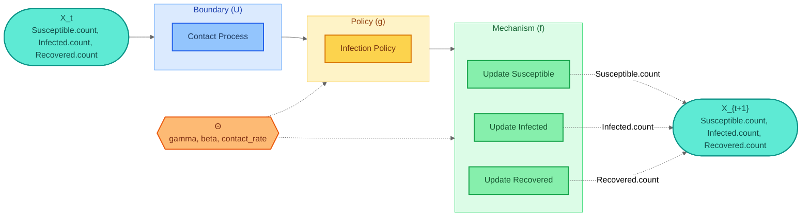

# gds-viz

[](https://pypi.org/project/gds-viz/)
[](https://pypi.org/project/gds-viz/)
[](https://github.com/BlockScience/gds-viz/blob/main/LICENSE)

**Mermaid diagram renderers** for [gds-framework](https://blockscience.github.io/gds-framework) specifications.

## Six Views

gds-viz provides six views — each a different projection of the GDS specification `{h, X}`:

| View | Function | Input | Answers |
|---|---|---|---|
| 1. Structural | `system_to_mermaid()` | `SystemIR` | What blocks exist and how are they wired? |
| 2. Canonical GDS | `canonical_to_mermaid()` | `CanonicalGDS` | What is the formal decomposition h = f ∘ g? |
| 3. Architecture (role) | `spec_to_mermaid()` | `GDSSpec` | How do blocks group by GDS role? |
| 4. Architecture (domain) | `spec_to_mermaid(group_by=...)` | `GDSSpec` | How do blocks group by domain/agent? |
| 5. Parameter influence | `params_to_mermaid()` | `GDSSpec` | What does each parameter control? |
| 6. Traceability | `trace_to_mermaid()` | `GDSSpec` | What can affect a specific state variable? |

## Quick Start

```bash
uv add gds-viz
# or: pip install gds-viz
```

```python
from gds_viz import system_to_mermaid, canonical_to_mermaid, spec_to_mermaid

# View 1: Structural
mermaid = system_to_mermaid(system_ir)

# View 2: Canonical
from gds.canonical import project_canonical
mermaid = canonical_to_mermaid(project_canonical(spec))

# View 3: Architecture by role
mermaid = spec_to_mermaid(spec)
```

## Sample Output

Here is a canonical GDS diagram generated from the SIR epidemic model -- `canonical_to_mermaid(project_canonical(spec))`:



See all six views in the [Views Gallery](guide/views.md).

## What gds-viz Does NOT Cover

The six views exhaust what is **derivable from the GDS specification** `{h, X}`. Two views are deliberately excluded:

- **State Machine View** — requires discrete states and transition guards. GDS defines a continuous state space X, not a finite set of named states.
- **Simulation / Execution Order View** — requires operational semantics. GDS specifies structure, not runtime.

## Credits

**Author:** [Rohan Mehta](https://github.com/rororowyourboat) — [BlockScience](https://block.science/)

**Theoretical foundation:** [Dr. Michael Zargham](https://github.com/mzargham) and [Dr. Jamsheed Shorish](https://github.com/jshorish)

**Lineage:** Part of the [cadCAD](https://github.com/cadCAD-org/cadCAD) ecosystem for Complex Adaptive Dynamics.
