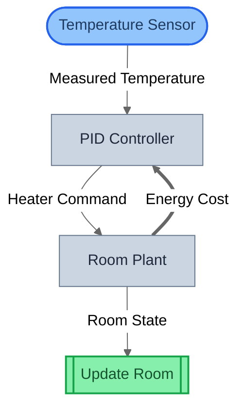

# gds-control

[](https://pypi.org/project/gds-control/)
[](https://pypi.org/project/gds-control/)
[](LICENSE)

State-space control DSL over GDS semantics — control theory with formal guarantees.

## Table of Contents

- [Quick Start](#quick-start)
- [What is this?](#what-is-this)
- [Architecture](#architecture)
- [Elements](#elements)
- [Semantic Type System](#semantic-type-system)
- [Verification](#verification)
- [Examples](#examples)
- [Status](#status)
- [Credits & Attribution](#credits--attribution)

## Quick Start

```bash
pip install gds-control
```

```python
from gds_control import (
    State, Input, Sensor, Controller,
    ControlModel, compile_model, compile_to_system, verify,
)

# Declare a thermostat control system
model = ControlModel(
    name="Thermostat",
    states=[State(name="temperature", initial=20.0)],
    inputs=[Input(name="setpoint")],
    sensors=[Sensor(name="thermometer", observes=["temperature"])],
    controllers=[
        Controller(
            name="PID",
            reads=["thermometer", "setpoint"],
            drives=["temperature"],
        )
    ],
)

# Compile to GDS — produces a real GDSSpec with role blocks, entities, wirings
spec = compile_model(model)
ir = compile_to_system(model)
print(f"{len(ir.blocks)} blocks, {len(ir.wirings)} wirings")

# Verify — domain checks + optional GDS structural checks
report = verify(model, include_gds_checks=True)
print(f"{report.checks_passed}/{report.checks_total} checks passed")
```

## What is this?

`gds-control` is a **domain DSL** that compiles state-space control systems to [GDS](https://github.com/BlockScience/gds-core) specifications. You declare states, inputs, sensors, and controllers as plain data models — the compiler handles the mapping to GDS role blocks, entities, composition trees, and wirings.

```
Your declaration                    What the compiler produces
────────────────                    ─────────────────────────
State("temperature")         →     Mechanism + Entity (state update f + state X)
Input("setpoint")            →     BoundaryAction (exogenous input U)
Sensor("thermometer")        →     Policy (observation g)
Controller("PID")            →     Policy (decision logic g)
ControlModel(...)            →     GDSSpec + SystemIR (full GDS specification)
```

This maps directly to the standard state-space representation:

```
ẋ = Ax + Bu    (state dynamics → Mechanism)
y = Cx + Du    (sensor output → Policy)
u = K(y, r)    (control law  → Policy)
r              (reference    → BoundaryAction)
```

Once compiled, all downstream GDS tooling works immediately — canonical projection (`h = f ∘ g`), semantic checks, SpecQuery dependency analysis, JSON serialization, and [gds-viz](https://github.com/BlockScience/gds-core/tree/main/packages/gds-viz) diagram generation.

## Architecture

### DSL over GDS

```
ControlModel (user-facing declarations)
       │
       ▼  compile_model()
GDSSpec (entities, blocks, wirings, parameters)
       │
       ▼  compile_to_system()
SystemIR (flat IR for verification + visualization)
```

No parallel IR stack. The compiler produces a real `GDSSpec` with real GDS role blocks. This means control models are first-class GDS citizens — they compose with other GDS models, share the same verification engine, and render with the same visualization tools.

### Composition Tree

The compiler builds a tiered composition tree:

```
(inputs | sensors) >> (controllers) >> (state dynamics)
    .loop([state dynamics forward_out → sensor forward_in])
```

- **Within each tier:** parallel composition (`|`) — independent inputs and sensors run side-by-side
- **Across tiers:** sequential composition (`>>`) — sensors feed controllers, controllers feed state dynamics
- **Temporal recurrence:** `.loop()` — state outputs at timestep *t* feed back to sensors at timestep *t+1*

**Design decision:** All non-state-updating blocks use `Policy`. `ControlAction` is deliberately not used — it sits outside the canonical *g* partition, which would break the clean `(A, B, C, D) ↔ (X, U, g, f)` mapping.

## Elements

Four declaration types, each mapping to a specific GDS role:

### State

```python
State(name="temperature", initial=20.0)
```

**GDS mapping:** `Mechanism` (state update *f*) + `Entity` (state *X*)

A state variable in the plant. Each state becomes a GDS entity with a `value` state variable, and a dynamics block that applies incoming control signals. States emit a `State` port for temporal feedback.

| Field | Type | Default | Description |
|-------|------|---------|-------------|
| `name` | str | required | State name (becomes entity name) |
| `initial` | float \| None | None | Initial value |

### Input

```python
Input(name="setpoint")
```

**GDS mapping:** `BoundaryAction` (exogenous input *U*)

An exogenous reference signal or disturbance entering the system from outside. Inputs have no internal sources — they represent the boundary between the system and its environment.

| Field | Type | Default | Description |
|-------|------|---------|-------------|
| `name` | str | required | Input name |

### Sensor

```python
Sensor(name="thermometer", observes=["temperature"])
```

**GDS mapping:** `Policy` (observation *g*)

A sensor reads state variables and emits a measurement signal. The `observes` list declares which states the sensor can read — validated at model construction time.

| Field | Type | Default | Description |
|-------|------|---------|-------------|
| `name` | str | required | Sensor name |
| `observes` | list[str] | [] | Names of states this sensor reads |

### Controller

```python
Controller(name="PID", reads=["thermometer", "setpoint"], drives=["temperature"])
```

**GDS mapping:** `Policy` (decision logic *g*)

A controller reads sensor measurements and/or reference inputs, then emits control signals to drive state variables. The `reads` list references sensors or inputs; the `drives` list references states.

| Field | Type | Default | Description |
|-------|------|---------|-------------|
| `name` | str | required | Controller name |
| `reads` | list[str] | [] | Names of sensors/inputs this controller reads |
| `drives` | list[str] | [] | Names of states this controller drives |

## Semantic Type System

Four distinct semantic spaces, all `float`-backed but structurally separate — this prevents accidentally wiring a measurement where a control signal is expected:

| Type | Space | Used By | Description |
|------|-------|---------|-------------|
| `StateType` | `StateSpace` | States | Plant state variables |
| `ReferenceType` | `ReferenceSpace` | Inputs | Exogenous reference/disturbance signals |
| `MeasurementType` | `MeasurementSpace` | Sensors | Sensor output measurements |
| `ControlType` | `ControlSpace` | Controllers | Controller output signals |

## Verification

Six domain-specific checks validate the control model structure before compilation:

| ID | Name | Severity | What It Checks |
|----|------|----------|---------------|
| CS-001 | Undriven states | WARNING | Every state driven by ≥ 1 controller |
| CS-002 | Unobserved states | WARNING | Every state observed by ≥ 1 sensor |
| CS-003 | Unused inputs | WARNING | Every input read by ≥ 1 controller |
| CS-004 | Controller read validity | ERROR | Controller `reads` reference declared sensors/inputs |
| CS-005 | Controller drive validity | ERROR | Controller `drives` reference declared states |
| CS-006 | Sensor observe validity | ERROR | Sensor `observes` reference declared states |

```python
from gds_control import verify

# Domain checks only
report = verify(model)

# Domain checks + GDS structural checks (G-001..G-006)
report = verify(model, include_gds_checks=True)
```

## Examples

One tutorial example in [`gds-examples`](https://github.com/BlockScience/gds-core/tree/main/packages/gds-examples) demonstrates control system modeling using the GDS framework primitives:

| Example | Domain | What It Teaches |
|---------|--------|-----------------|
| [Thermostat PID](https://github.com/BlockScience/gds-core/tree/main/packages/gds-examples/control/thermostat) | Control theory | `.feedback()` composition, CONTRAVARIANT backward flow, ControlAction role, multi-variable entities |

<details>
<summary><strong>Thermostat structural view</strong> — feedback arrow shows CONTRAVARIANT energy cost flow</summary>



</details>

## Status

**v0.1.0 — Alpha.** Complete DSL with 6 verification checks and full GDS compilation. 117 tests.

## License

Apache-2.0

---
Built with [Claude Code](https://claude.ai/code). All code is test-driven and human-reviewed.

## Credits & Attribution

**Author:** [Rohan Mehta](https://github.com/rororowyourboat) — [BlockScience](https://block.science/)

**Theoretical foundation:** [Dr. Michael Zargham](https://github.com/mzargham) and [Dr. Jamsheed Shorish](https://github.com/jshorish) — [Generalized Dynamical Systems, Part I: Foundations](https://blog.block.science/generalized-dynamical-systems-part-i-foundations-2/) (2021).

**Architectural inspiration:** [Sean McOwen](https://github.com/SeanMcOwen) — [MSML](https://github.com/BlockScience/MSML) and [bdp-lib](https://github.com/BlockScience/bdp-lib).

**Contributors:**
* [Michael Zargham](https://github.com/mzargham) — Project direction, GDS theory guidance, and technical review (BlockScience).
* [Peter Hacker](https://github.com/phacker3) — Code auditing and review (BlockScience).

**Lineage:** Part of the [cadCAD](https://github.com/cadCAD-org/cadCAD) ecosystem for Complex Adaptive Dynamics.
