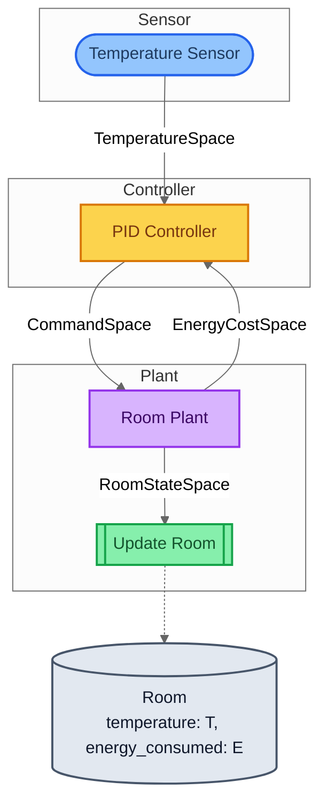
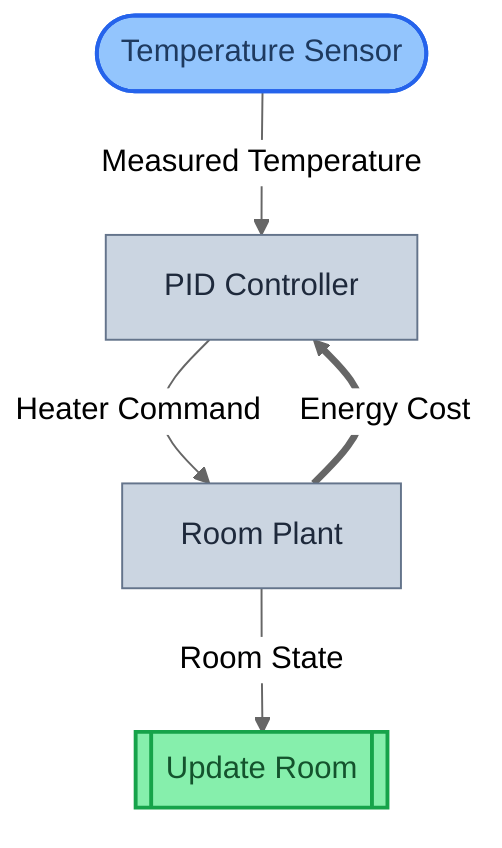
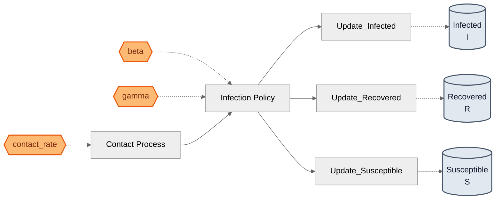

# GDS Framework Examples

[](https://pypi.org/project/gds-examples/)
[](https://pypi.org/project/gds-examples/)
[](LICENSE)

Six complete domain models demonstrating every [gds-framework](https://github.com/BlockScience/gds-core/tree/main/packages/gds-framework) feature. Each `model.py` is written as a tutorial chapter with inline GDS theory commentary — read them in order.

Examples are organized by domain and built using the GDS framework primitives directly. For higher-level domain DSLs that compile to GDS automatically, see the individual packages:

| Domain | DSL Package | Examples Here |
|--------|-------------|---------------|
| System dynamics | [gds-stockflow](https://github.com/BlockScience/gds-core/tree/main/packages/gds-stockflow) | SIR Epidemic, Lotka-Volterra |
| Control theory | [gds-control](https://github.com/BlockScience/gds-core/tree/main/packages/gds-control) | Thermostat PID |
| Game theory | [gds-games](https://github.com/BlockScience/gds-core/tree/main/packages/gds-games) | Prisoner's Dilemma, Insurance, Crosswalk |

## Table of Contents

- [Learning Path](#learning-path)
- [Quick Start](#quick-start)
- [Examples](#examples)
- [Visualization Views](#visualization-views)
- [Feature Coverage Matrix](#feature-coverage-matrix)
- [Building New Examples](#building-new-examples)
- [Credits & Attribution](#credits--attribution)

## Learning Path

Start with SIR Epidemic and work down. Each example introduces one new concept.

| # | Example | Domain | New Concept | Composition | Roles |
|:-:|---------|--------|-------------|-------------|-------|
| 1 | [SIR Epidemic](#sir-epidemic) | Stock-flow | Fundamentals — TypeDef, Entity, Space, blocks | `>>` `\|` | BA, P, M |
| 2 | [Thermostat PID](#thermostat-pid) | Control | `.feedback()`, CONTRAVARIANT backward flow | `>>` `.feedback()` | BA, P, CA, M |
| 3 | [Lotka-Volterra](#lotka-volterra) | Stock-flow | `.loop()`, COVARIANT temporal iteration | `>>` `\|` `.loop()` | BA, P, M |
| 4 | [Prisoner's Dilemma](#prisoners-dilemma) | Games | Nested `\|`, multi-entity X, complex trees | `\|` `>>` `.loop()` | BA, P, M |
| 5 | [Insurance Contract](#insurance-contract) | Games | ControlAction role, complete 4-role taxonomy | `>>` | BA, P, CA, M |
| 6 | [Crosswalk Problem](#crosswalk-problem) | Games | Mechanism design, discrete Markov transitions | `>>` | BA, P, CA, M |

**Roles:** BA = BoundaryAction, P = Policy, CA = ControlAction, M = Mechanism

## Quick Start

```bash
# Run all example tests (168 tests)
uv run --package gds-examples pytest packages/gds-examples -v

# Run a specific example
uv run --package gds-examples pytest packages/gds-examples/stockflow/sir_epidemic/ -v

# Generate all structural diagrams
uv run python packages/gds-examples/visualize_examples.py

# Generate all 6 views for one example
uv run python packages/gds-examples/stockflow/sir_epidemic/generate_views.py          # print to stdout
uv run python packages/gds-examples/stockflow/sir_epidemic/generate_views.py --save   # write VIEWS.md
```

## File Structure

Examples are organized by domain, each following the same layout:

```
packages/gds-examples/
├── stockflow/
│   ├── sir_epidemic/           # Epidemiology — basic roles + composition
│   └── lotka_volterra/         # Population dynamics — temporal loops
├── control/
│   └── thermostat/             # Control theory — feedback composition
├── games/
│   ├── prisoners_dilemma/      # Game theory — nested parallel + loops
│   ├── insurance/              # Finance — 4-role taxonomy
│   └── crosswalk/              # Mechanism design — Markov transitions
└── visualize_examples.py       # Generate structural diagrams for all
```

Each example contains:

```
sir_epidemic/
├── __init__.py          # empty
├── model.py             # types, entities, spaces, blocks, build_spec(), build_system()
├── test_model.py        # comprehensive tests for every layer
├── generate_views.py    # generates all 6 visualization views with commentary
└── VIEWS.md             # generated output — 6 Mermaid diagrams with explanations
```

## Examples

### SIR Epidemic

**Start here.** 3 compartments (Susceptible, Infected, Recovered) with contact-driven infection dynamics. Models the core stock-flow pattern: accumulation levels change via rate flows.

```
X = (S, I, R)    U = contact_rate    g = infection_policy    f = (update_s, update_i, update_r)    Θ = {beta, gamma, contact_rate}
```
```python
contact >> infection_policy >> (update_s | update_i | update_r)
```

<details>
<summary>What you'll learn</summary>

- TypeDef with runtime constraints (non-negative counts, positive rates)
- Entity and StateVariable for defining state space X
- Space for typed inter-block communication channels
- BoundaryAction (exogenous input), Policy (decision logic), Mechanism (state update)
- `>>` sequential composition with token-based auto-wiring
- `|` parallel composition for independent mechanisms
- GDSSpec registration and SpecWiring
- compile_system() to produce SystemIR

</details>

**Domain:** Stock-flow — see [gds-stockflow](https://github.com/BlockScience/gds-core/tree/main/packages/gds-stockflow) for the declarative DSL

**Files:** [model.py](stockflow/sir_epidemic/model.py) · [tests](stockflow/sir_epidemic/test_model.py) · [views](stockflow/sir_epidemic/VIEWS.md)

---

### Thermostat PID

**Adds feedback** — backward information flow within a single timestep. Models a classic sensor → controller → plant control loop with energy cost feedback.

```
X = (T, E)    U = measured_temp    g = pid_controller    f = update_room    Θ = {setpoint, Kp, Ki, Kd}
```
```python
(sensor >> controller >> plant >> update).feedback([Energy Cost: plant -> controller CONTRAVARIANT])
```

<details>
<summary>What you'll learn</summary>

- `.feedback()` composition for within-timestep backward flow
- CONTRAVARIANT flow direction (backward_out → backward_in)
- ControlAction role — reads state and emits control signals (vs Mechanism which writes state)
- backward_in / backward_out ports on block interfaces
- Multi-variable Entity (Room has both temperature and energy_consumed)

**Key distinction:** Room Plant is ControlAction (not Mechanism) because it has `backward_out`. Mechanisms cannot have backward ports.

</details>

**Domain:** Control — see [gds-control](https://github.com/BlockScience/gds-core/tree/main/packages/gds-control) for the declarative DSL

**Files:** [model.py](control/thermostat/model.py) · [tests](control/thermostat/test_model.py) · [views](control/thermostat/VIEWS.md)

---

### Lotka-Volterra

**Adds temporal loops** — forward iteration across timesteps. Predator-prey dynamics where population levels at timestep *t* feed rate computations at *t+1*.

```
X = (x, y)    U = population_signal    g = compute_rates    f = (update_prey, update_predator)    Θ = {prey_birth_rate, ...}
```
```python
(observe >> compute >> (update_prey | update_pred)).loop([Population Signal -> Compute Rates COVARIANT])
```

<details>
<summary>What you'll learn</summary>

- `.loop()` composition for cross-timestep temporal feedback
- COVARIANT flow direction — mandatory for `.loop()` (CONTRAVARIANT raises GDSTypeError)
- Mechanism with forward_out — emitting signals after state update
- exit_condition parameter for loop termination
- Contrast with `.feedback()`: within-timestep (thermostat) vs across-timestep (here)

**Key distinction:** Temporal wirings must be COVARIANT — `.loop()` enforces this at construction time.

</details>

**Domain:** Stock-flow — see [gds-stockflow](https://github.com/BlockScience/gds-core/tree/main/packages/gds-stockflow) for the declarative DSL

**Files:** [model.py](stockflow/lotka_volterra/model.py) · [tests](stockflow/lotka_volterra/test_model.py) · [views](stockflow/lotka_volterra/VIEWS.md)

---

### Prisoner's Dilemma

**Most complex composition** — nested parallel + sequential + temporal loop. Two agents independently choose strategies, receive payoffs, and update their world models across rounds.

```
X = (s_A, U_A, s_B, U_B, t)    U = game_config    g = (alice, bob)    f = (payoff, world_models)    Θ = {}
```
```python
pipeline = (payoff_setting | (alice | bob)) >> payoff_realization >> (alice_world | bob_world)
system = pipeline.loop([world models -> decisions])
```

<details>
<summary>What you'll learn</summary>

- Nested parallel composition: `(A | B) | C` for logical grouping
- Multi-entity state space X with 3 entities (5 state variables total)
- Mechanism with forward_out for temporal feedback
- Complex composition tree combining all operators except `.feedback()`
- Design choice: parameter vs exogenous input (payoff matrix is U, not Θ)

</details>

**Domain:** Game theory — see [gds-games](https://github.com/BlockScience/gds-core/tree/main/packages/gds-games) for the OGS DSL with compositional game patterns

**Files:** [model.py](games/prisoners_dilemma/model.py) · [tests](games/prisoners_dilemma/test_model.py) · [views](games/prisoners_dilemma/VIEWS.md) · [architecture viz](games/prisoners_dilemma/visualize.py)

---

### Insurance Contract

**Completes the role taxonomy** — the only example using all 4 block roles. Models claim events flowing through risk assessment, premium calculation, and reserve updates.

```
X = (R, P, C, H)    U = claim_event    g = risk_assessment    d = premium_calculation    f = (claim_payout, reserve_update)    Θ = {base_premium_rate, deductible, coverage_limit}
```
```python
claim >> risk >> premium >> payout >> reserve_update
```

<details>
<summary>What you'll learn</summary>

- ControlAction role — the 4th block role, for admissibility/control decisions
- Complete 4-role taxonomy: BoundaryAction → Policy → ControlAction → Mechanism
- ControlAction vs Policy: Policy is core decision logic (g), ControlAction constrains the action space (d)
- params_used on ControlAction — parameterized admissibility rules

**Key distinction:** Premium Calculation is ControlAction because it enforces admissibility constraints — it decides what's allowed, not what to do.

</details>

**Domain:** Game theory / finance — see [gds-games](https://github.com/BlockScience/gds-core/tree/main/packages/gds-games) for the OGS DSL

**Files:** [model.py](games/insurance/model.py) · [tests](games/insurance/test_model.py) · [views](games/insurance/VIEWS.md)

---

### Crosswalk Problem

**Mechanism design** — the canonical GDS example from BlockScience. A pedestrian decides whether to cross a one-way street while traffic evolves as a discrete Markov chain. A governance body chooses crosswalk placement to minimize accident probability.

```
X = traffic_state ∈ {-1, 0, +1}    U = (luck, crossing_position)    g = pedestrian_decision    d = safety_check    f = traffic_transition    Θ = {crosswalk_location}
```
```python
observe >> decide >> check >> transition
```

<details>
<summary>What you'll learn</summary>

- Discrete Markov state transitions as GDS
- Mechanism design: governance parameter (crosswalk location) constraining agent behavior
- ControlAction for admissibility enforcement (safety check)
- Complete 4-role taxonomy in a minimal model
- Design parameter Θ as a governance lever

</details>

**Domain:** Game theory / mechanism design — see [gds-games](https://github.com/BlockScience/gds-core/tree/main/packages/gds-games) for the OGS DSL

**Files:** [model.py](games/crosswalk/model.py) · [tests](games/crosswalk/test_model.py) · [views](games/crosswalk/VIEWS.md) · [README](games/crosswalk/README.md)

## Visualization Views

Each example includes a `generate_views.py` script that produces 6 complementary views via [`gds-viz`](https://github.com/BlockScience/gds-core/tree/main/packages/gds-viz):

| View | Input | What It Shows |
|------|-------|--------------|
| 1. Structural | SystemIR | Compiled block graph — role shapes, wiring arrows |
| 2. Canonical GDS | CanonicalGDS | Mathematical decomposition: X_t → U → g → f → X_{t+1} |
| 3. Architecture by Role | GDSSpec | Blocks grouped by GDS role |
| 4. Architecture by Domain | GDSSpec | Blocks grouped by domain tag |
| 5. Parameter Influence | GDSSpec | Θ → blocks → entities causal map |
| 6. Traceability | GDSSpec | Backwards trace from one state variable to all influencing blocks |

<details>
<summary><strong>Sample diagrams</strong></summary>

**Architecture by domain** (Thermostat PID) — blocks grouped by physical subsystem:



**Structural view** (Thermostat PID) — thick feedback arrow (`==>`) shows CONTRAVARIANT flow:



**Parameter influence** (SIR Epidemic) — Θ → blocks → entities causal map:



</details>

Each example's [VIEWS.md](stockflow/sir_epidemic/VIEWS.md) contains all 6 views with commentary. Output is Mermaid markdown — renders in GitHub, GitLab, VS Code, Obsidian, and [mermaid.live](https://mermaid.live).

```bash
# Generate views for one example
uv run python packages/gds-examples/stockflow/sir_epidemic/generate_views.py --save

# Generate views for all examples
for d in stockflow/sir_epidemic stockflow/lotka_volterra control/thermostat games/prisoners_dilemma games/insurance games/crosswalk; do
    uv run python packages/gds-examples/$d/generate_views.py --save
done
```

## Feature Coverage Matrix

| Feature | SIR | Thermostat | Lotka-V | Prisoner's D | Insurance | Crosswalk |
|---|:---:|:---:|:---:|:---:|:---:|:---:|
| BoundaryAction | ✓ | ✓ | ✓ | ✓ | ✓ | ✓ |
| Policy | ✓ | ✓ | ✓ | ✓ | ✓ | ✓ |
| Mechanism | ✓ | ✓ | ✓ | ✓ | ✓ | ✓ |
| ControlAction | | ✓ | | | ✓ | ✓ |
| `>>` (sequential) | ✓ | ✓ | ✓ | ✓ | ✓ | ✓ |
| `\|` (parallel) | ✓ | | ✓ | ✓ | | |
| `.feedback()` | | ✓ | | | | |
| `.loop()` | | | ✓ | ✓ | | |
| CONTRAVARIANT wiring | | ✓ | | | | |
| Temporal wiring | | | ✓ | ✓ | | |
| Multi-variable Entity | | ✓ | | ✓ | ✓ | |
| Multiple entities | ✓ | | ✓ | ✓ | ✓ | |
| Parameters (Θ) | ✓ | ✓ | ✓ | | ✓ | ✓ |

## Building New Examples

See [CLAUDE.md](CLAUDE.md) for a detailed guide covering:
- Step-by-step model creation (types → entities → spaces → blocks → spec → system)
- Role constraint rules (what each role enforces on its interface)
- Composition operator reference with pitfalls
- Common mistakes at construction, registration, and validation time
- Test patterns to follow
- Design decisions (state vs signal, parameter vs exogenous input, ControlAction vs Policy)

## License

Apache-2.0

---
Built with [Claude Code](https://claude.ai/code). All code is test-driven and human-reviewed.

## Credits & Attribution

**Author:** [Rohan Mehta](https://github.com/rororowyourboat) — [BlockScience](https://block.science/)

**Theoretical foundation:** [Dr. Michael Zargham](https://github.com/mzargham) and [Dr. Jamsheed Shorish](https://github.com/jshorish) — [Generalized Dynamical Systems, Part I: Foundations](https://blog.block.science/generalized-dynamical-systems-part-i-foundations-2/) (2021).

**Architectural inspiration:** [Sean McOwen](https://github.com/SeanMcOwen) — [MSML](https://github.com/BlockScience/MSML) and [bdp-lib](https://github.com/BlockScience/bdp-lib).

**Contributors:**
* [Michael Zargham](https://github.com/mzargham) — Project direction, GDS theory guidance, and technical review (BlockScience).
* [Peter Hacker](https://github.com/phacker3) — Code auditing and review (BlockScience).

**Lineage:** Part of the [cadCAD](https://github.com/cadCAD-org/cadCAD) ecosystem for Complex Adaptive Dynamics.
