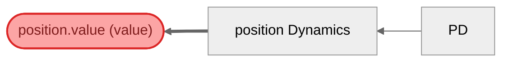

# Double Integrator — Visualization Views

Six complementary views of the same model, compiled from the
gds-control DSL. Classical state-space (A,B,C,D) maps to GDS
(X,U,g,f) — sensors are C (observation), controller is K (control law),
dynamics mechanisms are A (state transition).

## View 1: Structural
Compiled block graph from SystemIR. Note the temporal loops from
position/velocity Dynamics back to their respective sensors — state
at timestep t feeds observation at timestep t+1.

## View 2: Canonical GDS Decomposition
Mathematical decomposition: X_t → U → g → f → X_{t+1}.
g contains 3 policies (2 sensors + PD controller), f contains
2 mechanisms (position/velocity Dynamics). No ControlAction blocks.

## View 3: Architecture by Role
Blocks grouped by GDS role. Only 3 roles used: BoundaryAction (force),
Policy (sensors + controller), Mechanism (dynamics). ControlAction
is intentionally unused — it would break the (A,B,C,D) mapping.

## View 4: Architecture by Domain
Blocks grouped by domain tag assigned by the gds-control compiler.

## View 5: Parameter Influence
Θ → blocks → entities causal map. This model has no explicit
parameters — the DSL focuses on structural topology, not gains.

## View 6: Traceability — position.value (x)
Traces position.value backwards through the block graph.
Reveals the causal chain: force reference + sensor measurements
→ PD controller → position Dynamics → position state.

