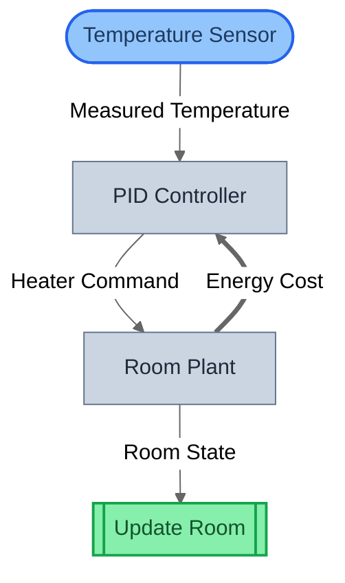
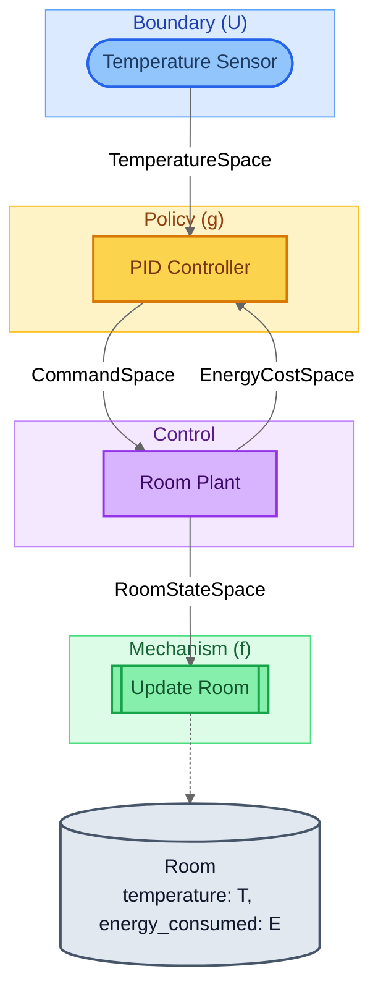
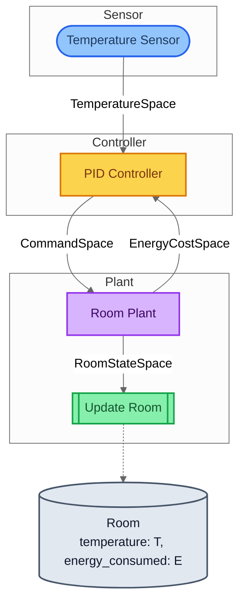
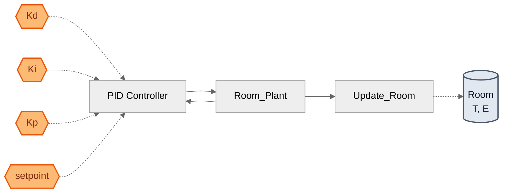
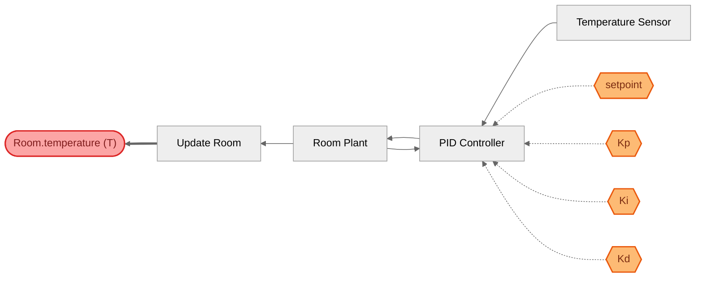

# Thermostat PID — Visualization Views

Six complementary views of the same model, from compiled topology
to mathematical decomposition to parameter traceability.
Key feature: .feedback() creates CONTRAVARIANT (backward) wiring
visible as thick arrows in the structural view.

## View 1: Structural
Compiled block graph from SystemIR. The **thick arrow** from Room Plant
back to PID Controller shows the .feedback() CONTRAVARIANT wiring —
energy cost flows backward within the same timestep.

## View 2: Canonical GDS Decomposition
Mathematical decomposition: X_t → U → g → f → X_{t+1}.
The ControlAction (Room Plant) maps to the control/decision layer,
distinct from the policy (PID Controller) and mechanism (Update Room).

```mermaid
%%{init:{"theme":"neutral"}}%%
flowchart LR
    classDef boundary fill:#93c5fd,stroke:#2563eb,stroke-width:2px,color:#1e3a5f
    classDef policy fill:#fcd34d,stroke:#d97706,stroke-width:2px,color:#78350f
    classDef mechanism fill:#86efac,stroke:#16a34a,stroke-width:2px,color:#14532d
    classDef control fill:#d8b4fe,stroke:#9333ea,stroke-width:2px,color:#3b0764
    classDef generic fill:#cbd5e1,stroke:#64748b,stroke-width:1px,color:#1e293b
    classDef entity fill:#e2e8f0,stroke:#475569,stroke-width:2px,color:#0f172a
    classDef param fill:#fdba74,stroke:#ea580c,stroke-width:2px,color:#7c2d12
    classDef state fill:#5eead4,stroke:#0d9488,stroke-width:2px,color:#134e4a
    classDef target fill:#fca5a5,stroke:#dc2626,stroke-width:2px,color:#7f1d1d
    classDef empty fill:#e2e8f0,stroke:#94a3b8,stroke-width:1px,color:#475569
    X_t(["X_t<br/>temperature, energy_consumed"]):::state
    X_next(["X_{t+1}<br/>temperature, energy_consumed"]):::state
    Theta{{"Θ<br/>Ki, setpoint, Kd, Kp"}}:::param
    subgraph U ["Boundary (U)"]
        Temperature_Sensor[Temperature Sensor]:::boundary
    end
    subgraph g ["Policy (g)"]
        PID_Controller[PID Controller]:::policy
    end
    subgraph f ["Mechanism (f)"]
        Update_Room[Update Room]:::mechanism
    end
    subgraph ctrl ["Control"]
        Room_Plant[Room Plant]:::control
    end
    X_t --> U
    U --> g
    g --> f
    Update_Room -.-> |Room.temperature| X_next
    Update_Room -.-> |Room.energy_consumed| X_next
    f -.-> Room_Plant
    Room_Plant -.-> g
    Theta -.-> g
    Theta -.-> f
    style U fill:#dbeafe,stroke:#60a5fa,stroke-width:1px,color:#1e40af
    style g fill:#fef3c7,stroke:#fbbf24,stroke-width:1px,color:#92400e
    style f fill:#dcfce7,stroke:#4ade80,stroke-width:1px,color:#166534
    style ctrl fill:#f3e8ff,stroke:#c084fc,stroke-width:1px,color:#581c87
```

## View 3: Architecture by Role
Blocks grouped by GDS role. This model uses 4 roles:
BoundaryAction (sensor), Policy (PID), ControlAction (plant),
Mechanism (update). Entity cylinders show the Room's two state variables.

## View 4: Architecture by Domain
Blocks grouped by domain tag. Maps to physical subsystems:
Sensor (temperature measurement), Controller (PID logic),
Plant (room + heater dynamics).

## View 5: Parameter Influence
Θ → blocks → entities causal map. All parameters (setpoint, Kp, Ki, Kd)
flow through the PID Controller — confirming a single control point.

## View 6: Traceability — Room.temperature (T)
Traces Room.temperature backwards through the block graph.
Reveals the full causal chain from sensor reading through PID control
to state update, including which parameters influence the outcome.

