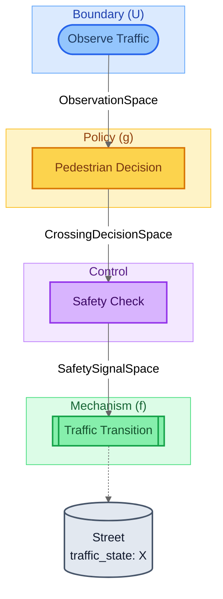

# Crosswalk Problem — Visualization Views

Six complementary views of the same model, from compiled topology
to mathematical decomposition to parameter traceability.
Key feature: discrete Markov state transitions with a single
design parameter (crosswalk location) demonstrating mechanism design.

## View 1: Structural
Compiled block graph from SystemIR. A pure linear pipeline with
no feedback or temporal wiring — 4 blocks in sequence.
All arrows are solid forward (covariant) flow.

## View 2: Canonical GDS Decomposition
Mathematical decomposition: X_t -> U -> g -> d -> f -> X_{t+1}.
The ControlAction (Safety Check) populates the decision (d)
layer with crosswalk_location as the design parameter.

## View 3: Architecture by Role
Blocks grouped by GDS role — all 4 roles present:
- **BoundaryAction**: Observe Traffic (exogenous input)
- **Policy**: Pedestrian Decision (observation -> action)
- **ControlAction**: Safety Check (admissibility constraint)
- **Mechanism**: Traffic Transition (Markov state update)

## View 4: Architecture by Domain
Blocks grouped by domain tag. Three domains:
Environment (observe + transition), Pedestrian (decision),
Infrastructure (safety check with crosswalk parameter).

## View 5: Parameter Influence
Theta -> blocks -> entities causal map. The single parameter
(crosswalk_location) flows through Safety Check only —
demonstrating that mechanism design operates at the
admissibility layer, not at the policy or mechanism level.

## View 6: Traceability — Street.traffic_state (X)
Traces Street.traffic_state backwards through the block graph.
Reveals the full causal chain from observation through pedestrian
decision, safety check (with crosswalk_location parameter), to
the traffic state transition.

