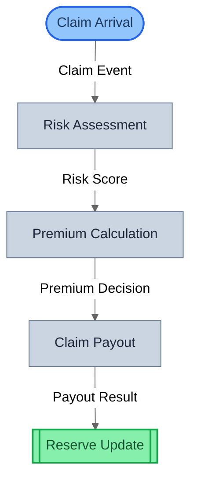
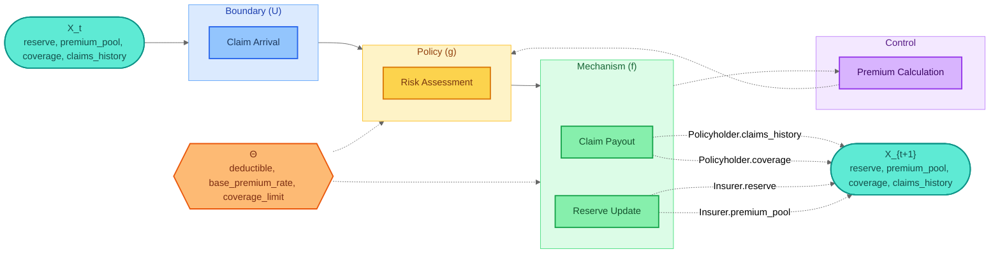
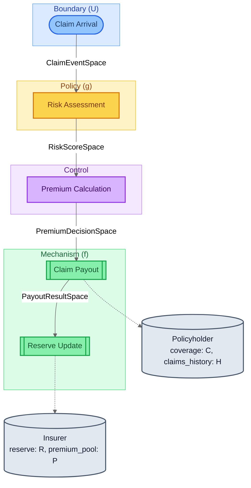
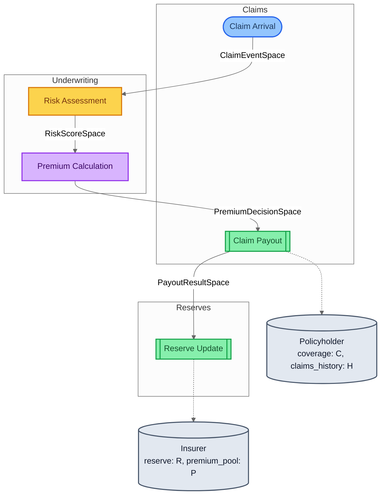
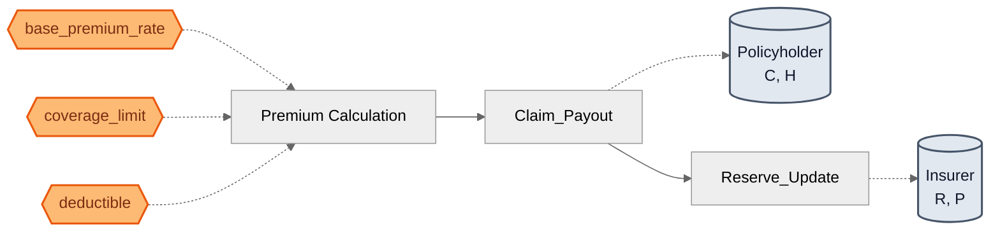
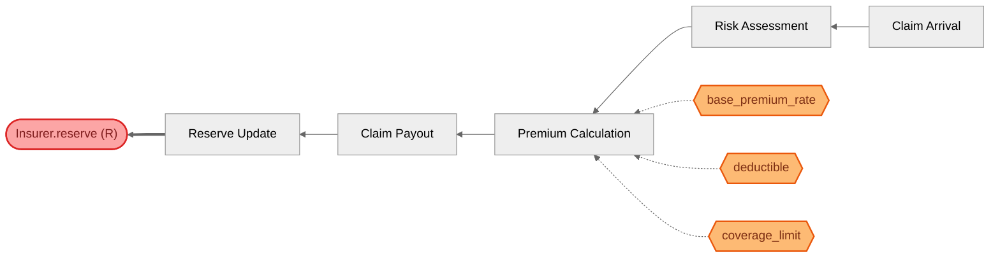

# Insurance Contract — Visualization Views

Six complementary views of the same model, from compiled topology
to mathematical decomposition to parameter traceability.
Key feature: the ControlAction role (Premium Calculation) completes
the 4-role GDS taxonomy — the only example to use all 4 roles.

## View 1: Structural
Compiled block graph from SystemIR. A pure linear pipeline with
no feedback or temporal wiring — the simplest topology alongside
SIR Epidemic. All arrows are solid forward (covariant) flow.

## View 2: Canonical GDS Decomposition
Mathematical decomposition: X_t → U → g → d → f → X_{t+1}.
The ControlAction (Premium Calculation) populates the decision (d)
layer — distinct from policy (g) and mechanism (f). This is the
only example where all canonical layers are populated.

## View 3: Architecture by Role
Blocks grouped by GDS role — all 4 roles present:
- **BoundaryAction**: Claim Arrival (exogenous input)
- **Policy**: Risk Assessment (observation → assessment)
- **ControlAction**: Premium Calculation (admissibility control)
- **Mechanism**: Claim Payout + Reserve Update (state transitions)

## View 4: Architecture by Domain
Blocks grouped by domain tag. Maps to insurance business units:
Claims (arrival + payout), Underwriting (risk + premium),
Reserves (financial accounting). Note that Underwriting owns
both the Policy and ControlAction roles.

## View 5: Parameter Influence
Θ → blocks → entities causal map. All parameters flow through
Premium Calculation (ControlAction) only — risk assessment and
state updates are parameter-free. This confirms clean separation:
tuning Θ only changes the admissibility decision.

## View 6: Traceability — Insurer.reserve (R)
Traces Insurer.reserve backwards through the block graph.
Reveals the full causal chain from claim arrival through risk assessment,
premium calculation (with all 3 Θ parameters), payout, to reserve update.
The complete audit trail for the insurer's financial position.

