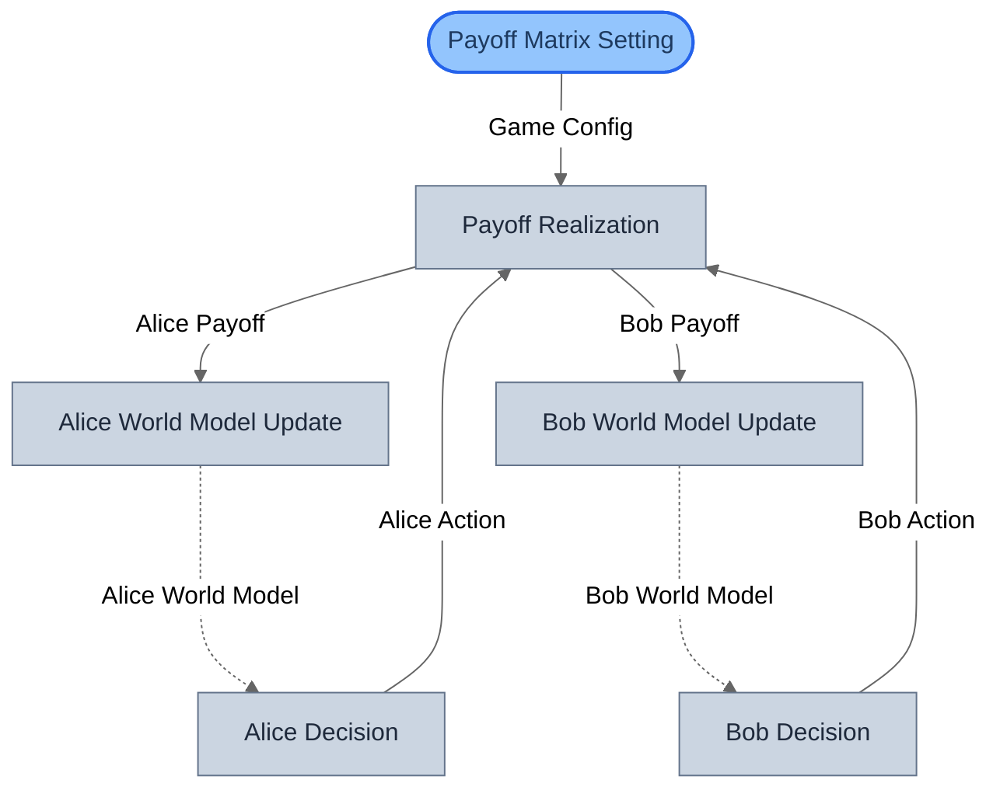
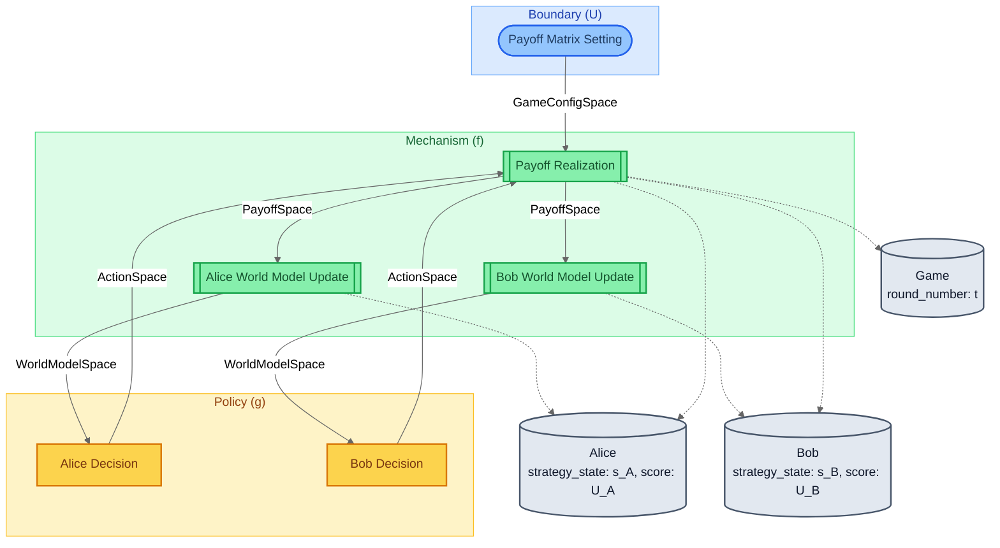
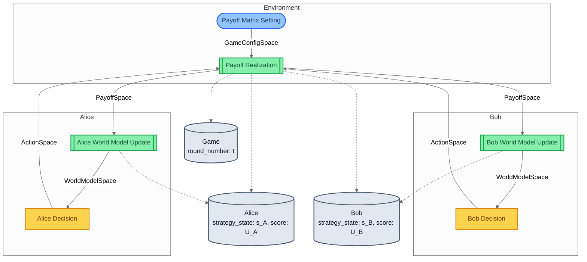
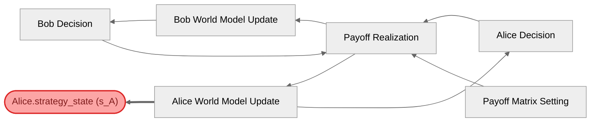

# Iterated Prisoner's Dilemma — Visualization Views

Six complementary views of the same model, from compiled topology
to mathematical decomposition to parameter traceability.
Key feature: nested parallel composition (| within |) plus .loop()
creates the most complex composition tree in the examples.

## View 1: Structural
Compiled block graph from SystemIR — the most complex topology in the
examples. **Dashed arrows** show temporal learning loops (world model →
decision at next round). Parallel branches for Alice and Bob are
flattened by the compiler but visible in the wiring pattern.

## View 2: Canonical GDS Decomposition
Mathematical decomposition: X_t → U → g → f → X_{t+1}.
Two independent policies (Alice, Bob) in the g layer, three
mechanisms in the f layer. No Θ parameters — the payoff matrix
is modeled as exogenous input (U), not configuration.

```mermaid
%%{init:{"theme":"neutral"}}%%
flowchart LR
    classDef boundary fill:#93c5fd,stroke:#2563eb,stroke-width:2px,color:#1e3a5f
    classDef policy fill:#fcd34d,stroke:#d97706,stroke-width:2px,color:#78350f
    classDef mechanism fill:#86efac,stroke:#16a34a,stroke-width:2px,color:#14532d
    classDef control fill:#d8b4fe,stroke:#9333ea,stroke-width:2px,color:#3b0764
    classDef generic fill:#cbd5e1,stroke:#64748b,stroke-width:1px,color:#1e293b
    classDef entity fill:#e2e8f0,stroke:#475569,stroke-width:2px,color:#0f172a
    classDef param fill:#fdba74,stroke:#ea580c,stroke-width:2px,color:#7c2d12
    classDef state fill:#5eead4,stroke:#0d9488,stroke-width:2px,color:#134e4a
    classDef target fill:#fca5a5,stroke:#dc2626,stroke-width:2px,color:#7f1d1d
    classDef empty fill:#e2e8f0,stroke:#94a3b8,stroke-width:1px,color:#475569
    X_t(["X_t<br/>Alice.strategy_state, Alice.score, Bob.strategy_state, Bob.score, Game.round_number"]):::state
    X_next(["X_{t+1}<br/>Alice.strategy_state, Alice.score, Bob.strategy_state, Bob.score, Game.round_number"]):::state
    subgraph U ["Boundary (U)"]
        Payoff_Matrix_Setting[Payoff Matrix Setting]:::boundary
    end
    subgraph g ["Policy (g)"]
        Alice_Decision[Alice Decision]:::policy
        Bob_Decision[Bob Decision]:::policy
    end
    subgraph f ["Mechanism (f)"]
        Payoff_Realization[Payoff Realization]:::mechanism
        Alice_World_Model_Update[Alice World Model Update]:::mechanism
        Bob_World_Model_Update[Bob World Model Update]:::mechanism
    end
    X_t --> U
    U --> g
    g --> f
    Payoff_Realization -.-> |Alice.score| X_next
    Payoff_Realization -.-> |Bob.score| X_next
    Payoff_Realization -.-> |Game.round_number| X_next
    Alice_World_Model_Update -.-> |Alice.strategy_state| X_next
    Bob_World_Model_Update -.-> |Bob.strategy_state| X_next
    style U fill:#dbeafe,stroke:#60a5fa,stroke-width:1px,color:#1e40af
    style g fill:#fef3c7,stroke:#fbbf24,stroke-width:1px,color:#92400e
    style f fill:#dcfce7,stroke:#4ade80,stroke-width:1px,color:#166534
```

## View 3: Architecture by Role
Blocks grouped by GDS role. Shows the symmetric agent structure:
two Policy blocks (decisions) and two Mechanism blocks (world models)
mirror each other. Payoff Realization updates 3 variables across
2 entities — the most complex mechanism in the examples.

## View 4: Architecture by Domain
Blocks grouped by domain tag. Reveals agent boundaries:
Alice's blocks, Bob's blocks, and the shared Environment.
This view highlights information asymmetry — each agent only
sees its own world model and payoff, not the other's.

## View 5: Parameter Influence
Θ → blocks → entities causal map. This model has no registered
parameters (Θ = {}) — the payoff matrix is exogenous input, not
configuration. All behavioral variation comes from initial state
and the learning dynamics.

```mermaid
%%{init:{"theme":"neutral"}}%%
flowchart LR
    classDef boundary fill:#93c5fd,stroke:#2563eb,stroke-width:2px,color:#1e3a5f
    classDef policy fill:#fcd34d,stroke:#d97706,stroke-width:2px,color:#78350f
    classDef mechanism fill:#86efac,stroke:#16a34a,stroke-width:2px,color:#14532d
    classDef control fill:#d8b4fe,stroke:#9333ea,stroke-width:2px,color:#3b0764
    classDef generic fill:#cbd5e1,stroke:#64748b,stroke-width:1px,color:#1e293b
    classDef entity fill:#e2e8f0,stroke:#475569,stroke-width:2px,color:#0f172a
    classDef param fill:#fdba74,stroke:#ea580c,stroke-width:2px,color:#7c2d12
    classDef state fill:#5eead4,stroke:#0d9488,stroke-width:2px,color:#134e4a
    classDef target fill:#fca5a5,stroke:#dc2626,stroke-width:2px,color:#7f1d1d
    classDef empty fill:#e2e8f0,stroke:#94a3b8,stroke-width:1px,color:#475569
    no_params[No parameters defined]:::empty
```

## View 6: Traceability — Alice.strategy_state (s_A)
Traces Alice.strategy_state backwards through the block graph.
Reveals the full learning loop: Alice's strategy depends on her payoff,
which depends on BOTH players' actions — showing the strategic coupling
even though each agent's decision is independent.

