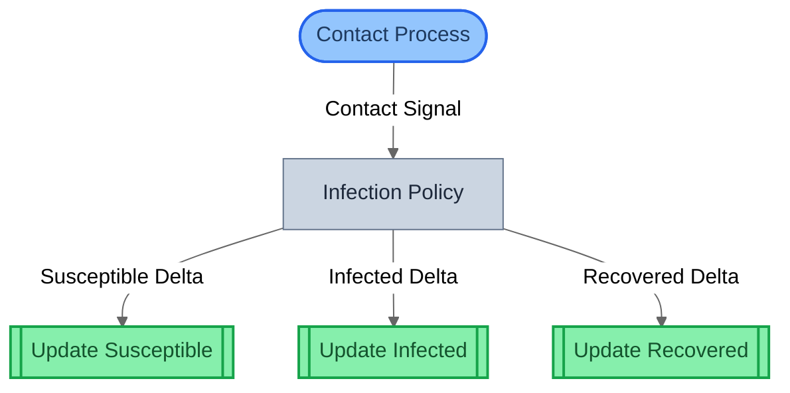
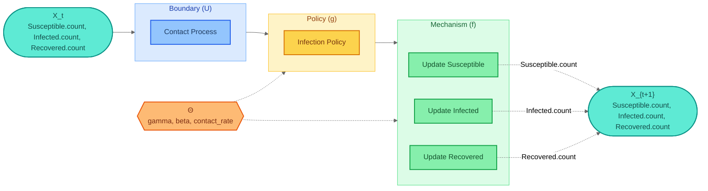
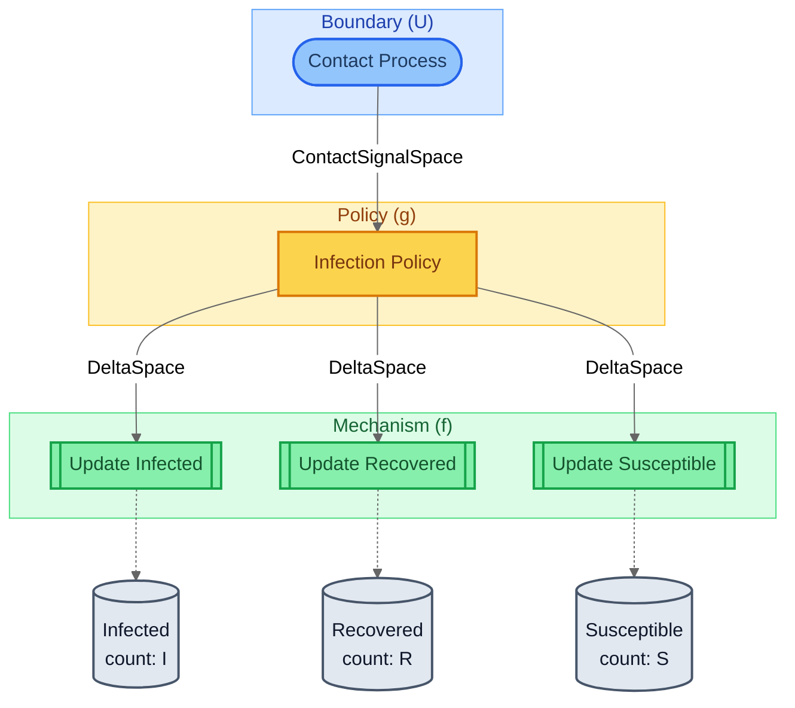
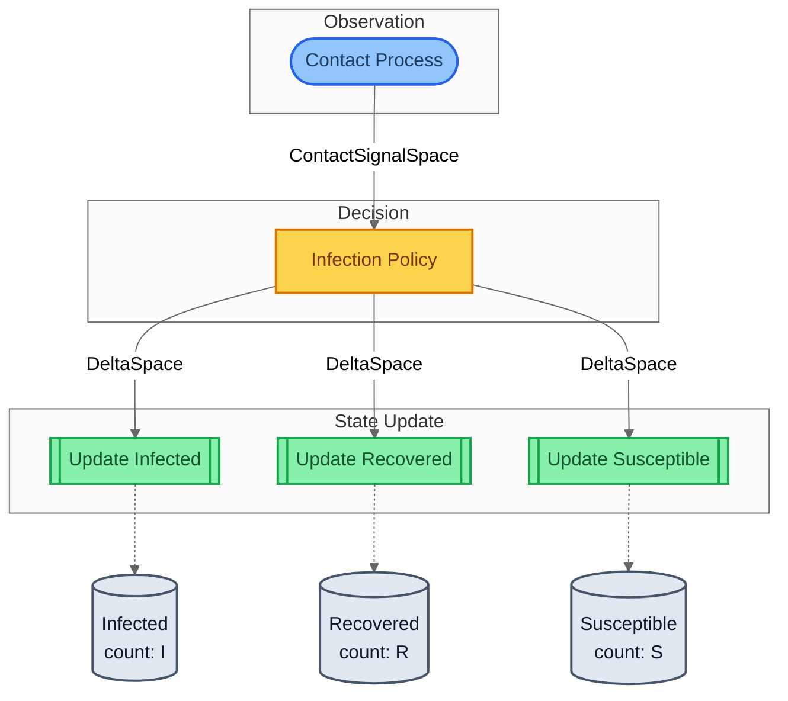
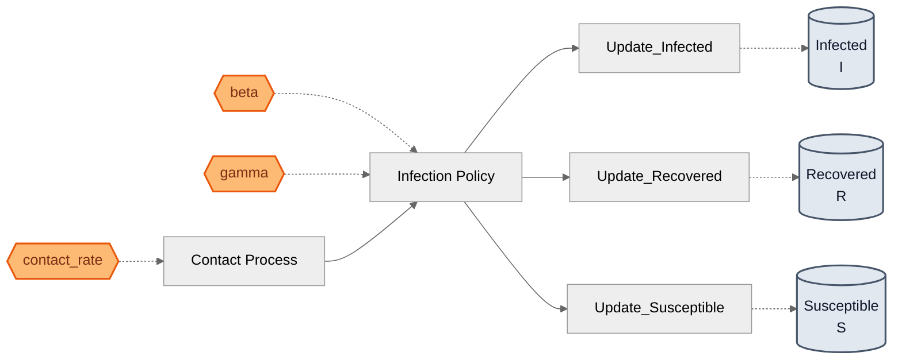
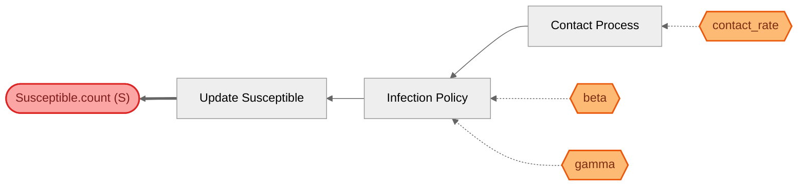

# SIR Epidemic — Visualization Views

Six complementary views of the same model, from compiled topology
to mathematical decomposition to parameter traceability.

## View 1: Structural
Compiled block graph from SystemIR. Shows composition topology with role-based shapes and wiring types.
- **Stadium shape** `([...])` = BoundaryAction (exogenous input)
- **Double-bracket** `[[...]]` = terminal Mechanism (state sink)
- **Solid arrow** = forward covariant flow

## View 2: Canonical GDS Decomposition
Mathematical decomposition: X_t → U → g → f → X_{t+1}.
Shows the abstract dynamical system with state (X), input (U),
policy (g), mechanism (f), and parameter space (Θ).

## View 3: Architecture by Role
Blocks grouped by GDS role. Reveals the layered structure:
boundary (observation) → policy (decision) → mechanism (state update).
Entity cylinders show which state variables each mechanism writes.

## View 4: Architecture by Domain
Blocks grouped by domain tag. Shows organizational ownership:
which subsystem or team is responsible for each block.

## View 5: Parameter Influence
Θ → blocks → entities causal map. Answers: "if I change parameter X,
which state variables are affected?" Essential for sensitivity analysis.

## View 6: Traceability — Susceptible.count (S)
Traces Susceptible.count backwards through the block graph.
Answers: "what blocks and parameters influence this state variable?"
Useful for debugging unexpected behavior or planning targeted tests.

