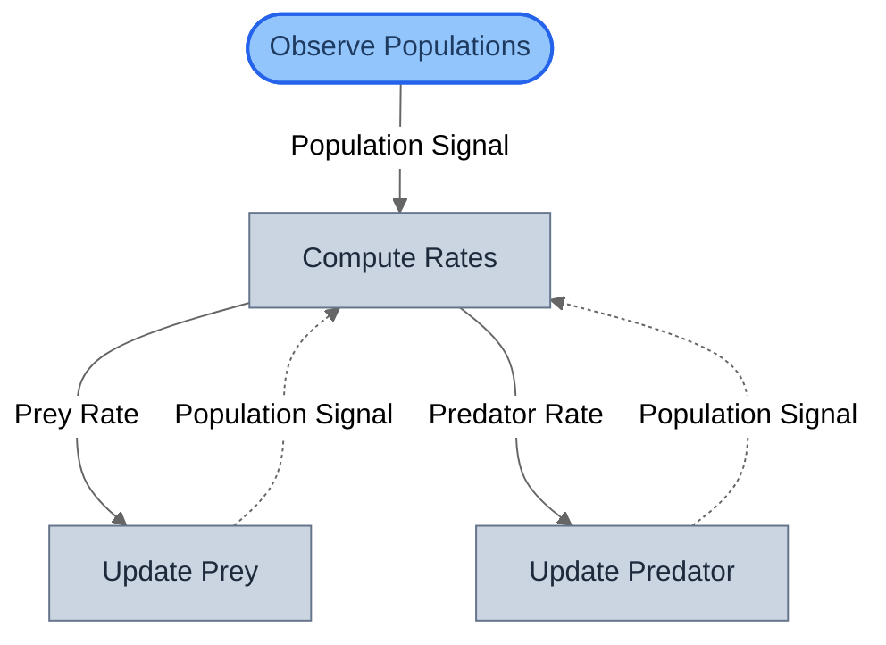
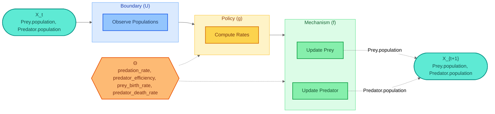
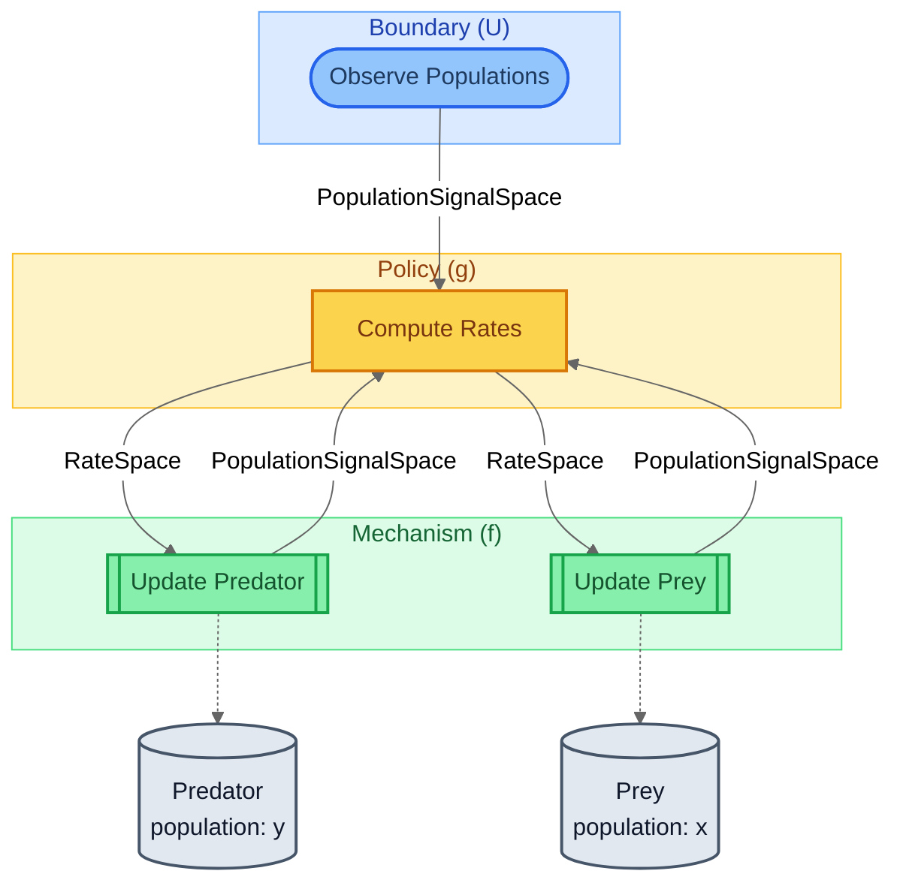
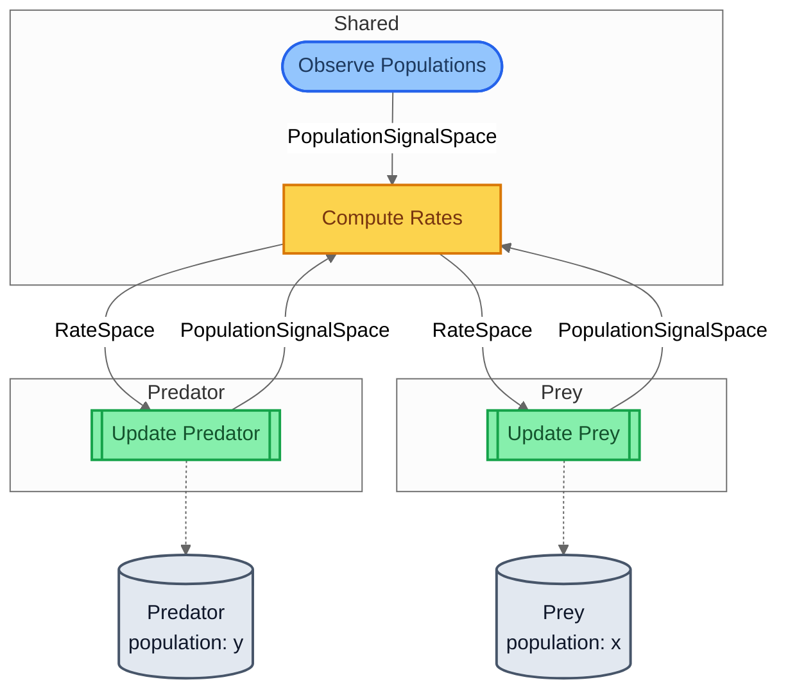
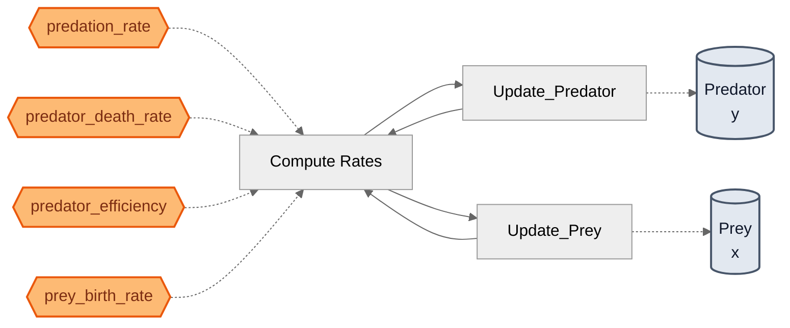
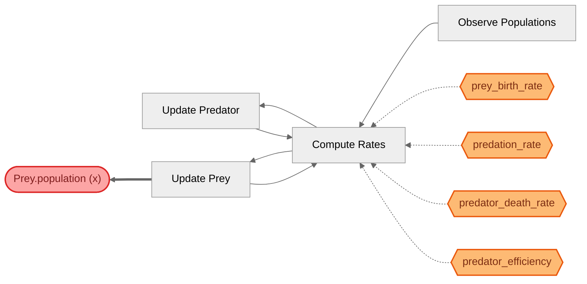

# Lotka-Volterra Predator-Prey — Visualization Views

Six complementary views of the same model, from compiled topology
to mathematical decomposition to parameter traceability.
Key feature: .loop() creates COVARIANT temporal wiring visible
as dashed arrows in the structural view.

## View 1: Structural
Compiled block graph from SystemIR. **Dashed arrows** show .loop()
temporal wiring — population signals flow from mechanisms back to
the policy at the NEXT timestep (contrast with thermostat's thick
feedback arrows which are within-timestep).

## View 2: Canonical GDS Decomposition
Mathematical decomposition: X_t → U → g → f → X_{t+1}.
The temporal loop is implicit in the X_t → X_{t+1} structure —
mechanisms produce the next state which becomes the next input.

## View 3: Architecture by Role
Blocks grouped by GDS role. Note the mechanisms here have
forward_out ports (unlike SIR's terminal mechanisms), which
is what enables the .loop() temporal feedback.

## View 4: Architecture by Domain
Blocks grouped by domain tag. Shows species-specific vs. shared
blocks: Observe Populations and Compute Rates are 'Shared' because
they depend on both prey and predator populations.

## View 5: Parameter Influence
Θ → blocks → entities causal map. All 4 rate parameters flow
through Compute Rates — each parameter indirectly affects BOTH
species because the Lotka-Volterra equations couple them.

## View 6: Traceability — Prey.population (x)
Traces Prey.population backwards through the block graph.
Reveals all parameters affecting prey dynamics — including predation_rate
which couples the predator population into the prey update.

