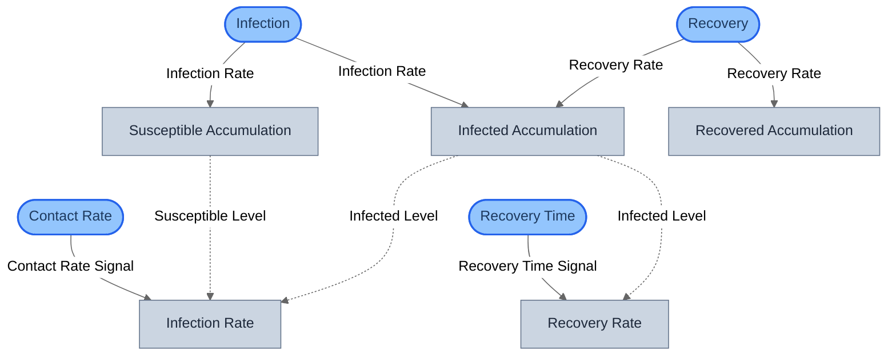
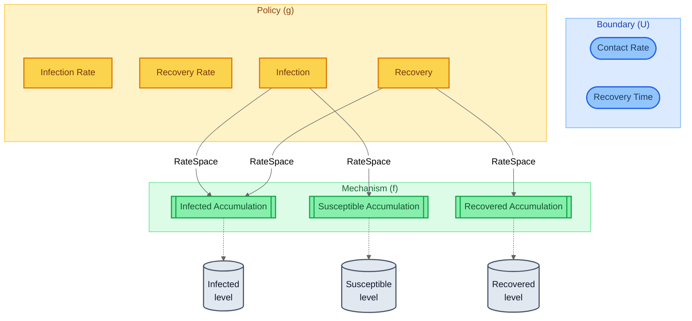
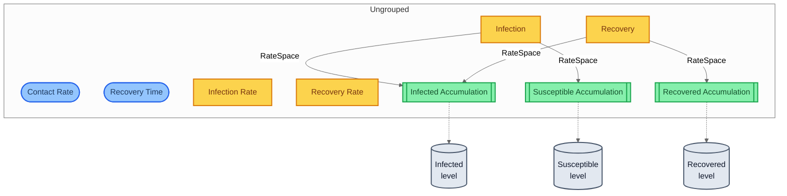

# SIR Epidemic (StockFlow DSL) — Visualization Views

Six complementary views of the same model, compiled from the
gds-stockflow DSL. Stock-flow elements (Stock, Flow, Auxiliary,
Converter) map to GDS roles — Converters become BoundaryActions,
Auxiliaries and Flows become Policies, Stocks become Mechanisms
with Entities.

## View 1: Structural
Compiled block graph from SystemIR. Note the temporal loops from
stock accumulation mechanisms back to auxiliaries — stock levels
at timestep t feed rate computations at timestep t+1.

## View 2: Canonical GDS Decomposition
Mathematical decomposition: X_t -> U -> g -> f -> X_{t+1}.
g contains 4 policies (2 auxiliaries + 2 flows), f contains
3 mechanisms (stock accumulations). No ControlAction blocks.

```mermaid
%%{init:{"theme":"neutral"}}%%
flowchart LR
    classDef boundary fill:#93c5fd,stroke:#2563eb,stroke-width:2px,color:#1e3a5f
    classDef policy fill:#fcd34d,stroke:#d97706,stroke-width:2px,color:#78350f
    classDef mechanism fill:#86efac,stroke:#16a34a,stroke-width:2px,color:#14532d
    classDef control fill:#d8b4fe,stroke:#9333ea,stroke-width:2px,color:#3b0764
    classDef generic fill:#cbd5e1,stroke:#64748b,stroke-width:1px,color:#1e293b
    classDef entity fill:#e2e8f0,stroke:#475569,stroke-width:2px,color:#0f172a
    classDef param fill:#fdba74,stroke:#ea580c,stroke-width:2px,color:#7c2d12
    classDef state fill:#5eead4,stroke:#0d9488,stroke-width:2px,color:#134e4a
    classDef target fill:#fca5a5,stroke:#dc2626,stroke-width:2px,color:#7f1d1d
    classDef empty fill:#e2e8f0,stroke:#94a3b8,stroke-width:1px,color:#475569
    X_t(["X_t<br/>Susceptible.level, Infected.level, Recovered.level"]):::state
    X_next(["X_{t+1}<br/>Susceptible.level, Infected.level, Recovered.level"]):::state
    Theta{{"Θ<br/>Recovery Time, Contact Rate"}}:::param
    subgraph U ["Boundary (U)"]
        Contact_Rate[Contact Rate]:::boundary
        Recovery_Time[Recovery Time]:::boundary
    end
    subgraph g ["Policy (g)"]
        Infection_Rate[Infection Rate]:::policy
        Recovery_Rate[Recovery Rate]:::policy
        Infection[Infection]:::policy
        Recovery[Recovery]:::policy
    end
    subgraph f ["Mechanism (f)"]
        Susceptible_Accumulation[Susceptible Accumulation]:::mechanism
        Infected_Accumulation[Infected Accumulation]:::mechanism
        Recovered_Accumulation[Recovered Accumulation]:::mechanism
    end
    X_t --> U
    U --> g
    g --> f
    Susceptible_Accumulation -.-> |Susceptible.level| X_next
    Infected_Accumulation -.-> |Infected.level| X_next
    Recovered_Accumulation -.-> |Recovered.level| X_next
    Theta -.-> g
    Theta -.-> f
    style U fill:#dbeafe,stroke:#60a5fa,stroke-width:1px,color:#1e40af
    style g fill:#fef3c7,stroke:#fbbf24,stroke-width:1px,color:#92400e
    style f fill:#dcfce7,stroke:#4ade80,stroke-width:1px,color:#166534
```

## View 3: Architecture by Role
Blocks grouped by GDS role. Only 3 roles used: BoundaryAction
(converters), Policy (auxiliaries + flows), Mechanism (stock
accumulations). ControlAction is unused.

## View 4: Architecture by Domain
Blocks grouped by domain tag assigned by the gds-stockflow compiler.

## View 5: Parameter Influence
Parameter -> blocks -> entities causal map. Contact Rate and
Recovery Time converters are registered as parameters, feeding
their respective auxiliaries which drive the stock accumulations.

## View 6: Traceability — Susceptible.level (S)
Traces Susceptible.level backwards through the block graph.
Reveals the causal chain: Contact Rate converter -> Infection Rate
auxiliary -> Infection flow -> Susceptible Accumulation -> Susceptible state.

```mermaid
%%{init:{"theme":"neutral"}}%%
flowchart RL
    classDef boundary fill:#93c5fd,stroke:#2563eb,stroke-width:2px,color:#1e3a5f
    classDef policy fill:#fcd34d,stroke:#d97706,stroke-width:2px,color:#78350f
    classDef mechanism fill:#86efac,stroke:#16a34a,stroke-width:2px,color:#14532d
    classDef control fill:#d8b4fe,stroke:#9333ea,stroke-width:2px,color:#3b0764
    classDef generic fill:#cbd5e1,stroke:#64748b,stroke-width:1px,color:#1e293b
    classDef entity fill:#e2e8f0,stroke:#475569,stroke-width:2px,color:#0f172a
    classDef param fill:#fdba74,stroke:#ea580c,stroke-width:2px,color:#7c2d12
    classDef state fill:#5eead4,stroke:#0d9488,stroke-width:2px,color:#134e4a
    classDef target fill:#fca5a5,stroke:#dc2626,stroke-width:2px,color:#7f1d1d
    classDef empty fill:#e2e8f0,stroke:#94a3b8,stroke-width:1px,color:#475569
    target(["Susceptible.level (level)"]):::target
    Infection[Infection]
    Susceptible_Accumulation[Susceptible Accumulation]
    Susceptible_Accumulation ==> target
    Infection --> Susceptible_Accumulation
```

