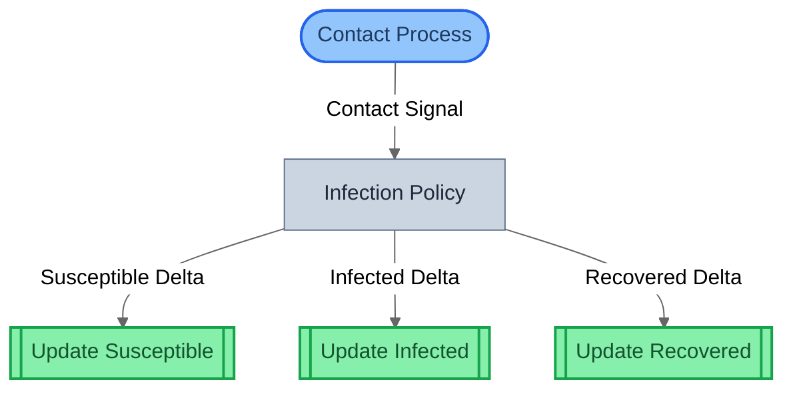
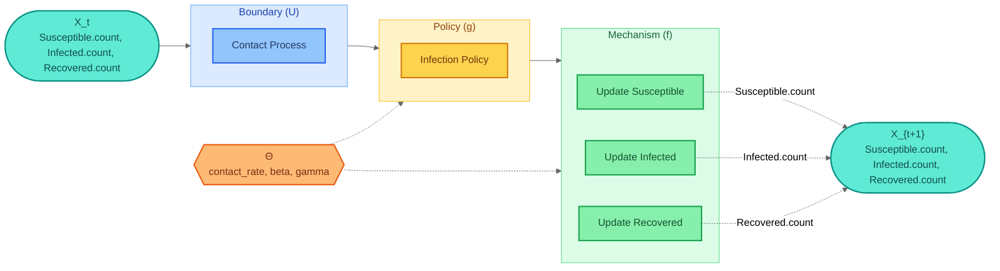
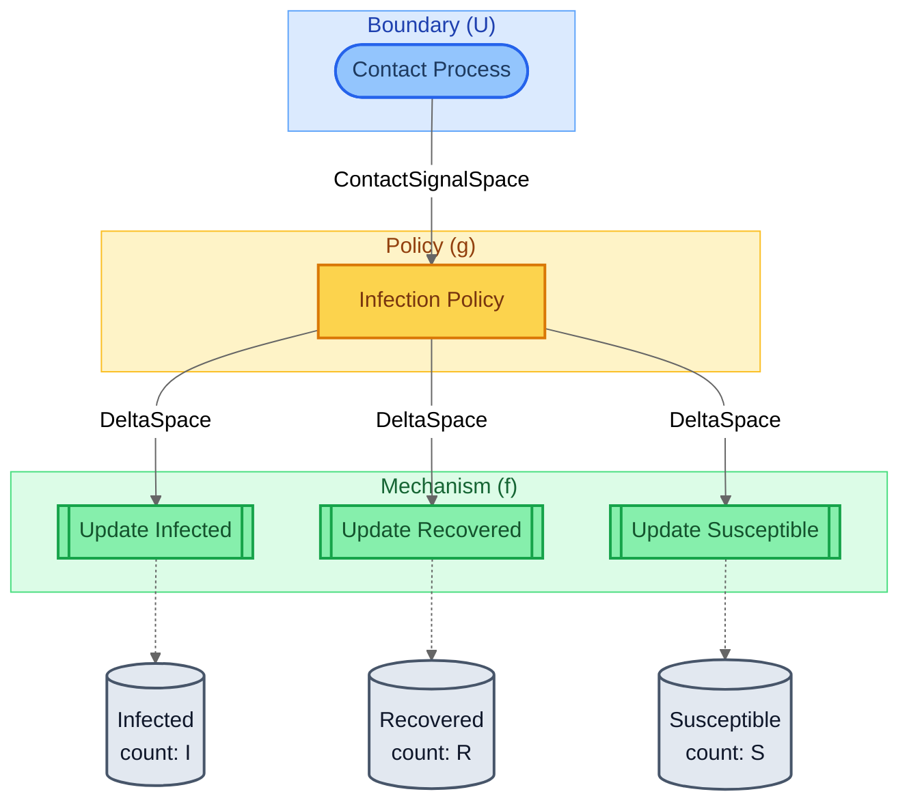
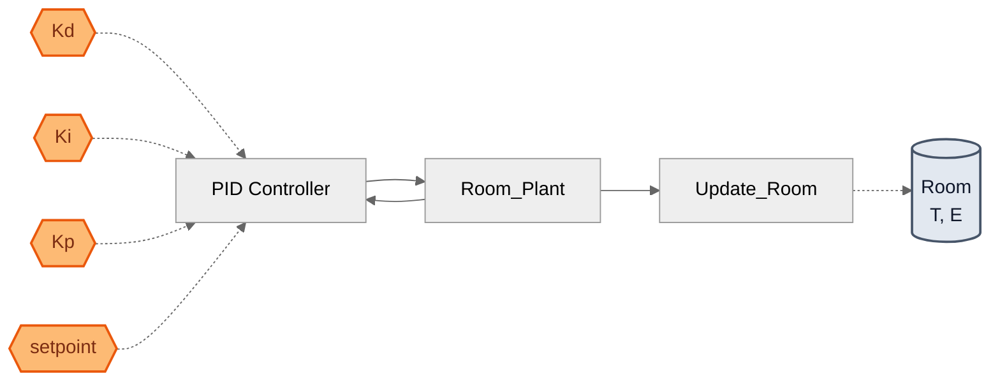

# gds-framework

[](https://pypi.org/project/gds-framework/)
[](https://pypi.org/project/gds-framework/)
[](LICENSE)
[](https://github.com/BlockScience/gds-framework/actions/workflows/ci.yml)

Typed compositional specifications for complex systems, grounded in [Generalized Dynamical Systems](https://doi.org/10.57938/e8d456ea-d975-4111-ac41-052ce73cb0cc) theory (Zargham & Shorish, 2022).

## Table of Contents

- [Quick Start](#quick-start)
- [What is this?](#what-is-this)
- [Architecture](#architecture-foundation--domain-packages)
- [Examples](#examples)
- [What's Included](#whats-included)
- [Glossary](#glossary)
- [Intellectual Lineage](#intellectual-lineage)
- [Status](#status)
- [Credits & Attribution](#credits--attribution)

## Quick Start

```bash
pip install gds-framework
```

```python
from gds import (
    BoundaryAction, Policy, ControlAction,
    interface, Wiring,
    compile_system, verify,
)
from gds.ir.models import FlowDirection

# Define blocks with GDS roles and typed interfaces
sensor = BoundaryAction(
    name="Temperature Sensor",
    interface=interface(forward_out=["Temperature"]),
)
controller = Policy(
    name="PID Controller",
    interface=interface(
        forward_in=["Temperature", "Setpoint"],
        forward_out=["Heater Command"],
        backward_in=["Energy Cost"],
    ),
)
plant = ControlAction(
    name="Room",
    interface=interface(
        forward_in=["Heater Command"],
        forward_out=["Temperature"],
        backward_out=["Energy Cost"],
    ),
)

# Compose with operators — types checked at construction time
system = (sensor >> controller >> plant).feedback([
    Wiring(
        source_block="Room", source_port="Energy Cost",
        target_block="PID Controller", target_port="Energy Cost",
        direction=FlowDirection.CONTRAVARIANT,
    )
])

# Compile to flat IR and verify
ir = compile_system("Thermostat", system)
report = verify(ir)
print(f"{len(ir.blocks)} blocks, {len(ir.wirings)} wirings")
# 3 blocks, 3 wirings
print(f"{report.checks_passed}/{report.checks_total} checks passed")
# 13/14 checks passed (G-002 flags BoundaryAction for having no inputs — expected)
```

## What is this?

`gds-framework` is a **foundation layer** for specifying dynamical systems as compositions of typed blocks. It provides the domain-neutral primitives — you bring the domain knowledge.

```
gds-framework                          Your domain package
─────────────────                       ──────────────────
Block, Interface, Port                  PredatorBlock, PreyBlock
>> | .feedback() .loop()                predator >> prey >> environment
TypeDef, Space, Entity                  Population(int, ≥0), EcosystemState
GDSSpec, verify()                       check_conservation(), check_stability()
compile_system() → SystemIR             visualize(), simulate()
```

A [Generalized Dynamical System](https://doi.org/10.57938/e8d456ea-d975-4111-ac41-052ce73cb0cc) is a pair **{h, X}** where **X** is a state space (any data structure) and **h: X → X** is a state transition map. The GDS canonical form decomposes **h** into a pipeline of typed blocks — observations, decisions, and state updates — that compose via wiring:

| GDS concept | Paper notation | gds-framework |
|---|---|---|
| State Space | X | `Entity` with `StateVariable`s |
| Exogenous observation | g(·) | `BoundaryAction` |
| Decision / policy | g: X → U_x | `Policy` |
| State update | f: X × U_x → X | `Mechanism` |
| Admissible input constraint | U: X → ℘(U) | `ControlAction` |
| Transition map | h = f\|_x ∘ g | Composed wiring (`>>`) |
| Trajectory | x₀, x₁, ... | Temporal loop (`.loop()`) |

This decomposition is the same regardless of whether you're modeling a biological ecosystem, a control system, a financial market, or a game-theoretic interaction. `gds-framework` provides the decomposition machinery; domain packages provide the semantics.

## Architecture: foundation + domain packages

```
gds-framework (pip install gds-framework)
│
│  Domain-neutral composition algebra, typed spaces,
│  state model, verification engine, flat IR compiler.
│  No domain-specific concepts. No simulation. No rendering.
│
├── Domain: Ecology
│   └── Predator-prey dynamics, population models, SIR epidemiology
│
├── Domain: Control Systems
│   └── Controllers, plants, sensors, stability/controllability checks
│
├── Domain: Financial Systems
│   └── Insurance contracts, market mechanisms, conservation of flows
│
├── Domain: Game Theory
│   └── Iterated games, strategy adaptation, equilibrium analysis
│
└── Domain: Multi-Agent Systems
    └── Agent policies, environment dynamics, coordination protocols
```

Each domain package is a thin layer. The heavy lifting — composition, compilation, verification, querying — lives in `gds-framework`.

<details>
<summary><strong>Example: what lives where</strong></summary>

Consider modeling a **Lotka-Volterra predator-prey system** as a GDS. The state space is (prey_population, predator_population). Each timestep: the environment is observed, growth/predation rates are computed, populations are updated.

**gds-framework provides** (domain-neutral):
- `TypeDef(name="Population", python_type=int, constraint=lambda x: x >= 0)` — constrained types
- `Entity(name="Prey", variables={"population": ...})` — state containers
- `BoundaryAction`, `Policy`, `Mechanism` — block roles with interface constraints
- `>>` composition with type checking, `.loop()` for temporal iteration
- `verify()` — are all state variables updated? any write conflicts? all blocks reachable?

**A domain package would add** (ecology-specific):
- Concrete block implementations with actual dynamics (Lotka-Volterra equations)
- Domain-specific verification (population conservation, extinction checks)
- Simulation execution (running trajectories from initial conditions)
- Visualization (phase plots, time series)

The same split applies to any domain. An **iterated prisoner's dilemma** model would use `BoundaryAction` for observing the opponent's last move, `Policy` for strategy selection (tit-for-tat, always-defect, etc.), `Mechanism` for payoff calculation and score update, and `.loop()` for repeated rounds — all composed from the same primitives.

A **thermostat control system** would use `BoundaryAction` for the temperature sensor, `Policy` for the PID controller, `Mechanism` for the room's thermal dynamics, and `.feedback()` for the energy cost signal flowing backward.

</details>

## Examples

Five tutorial examples in [`gds-examples`](https://github.com/BlockScience/gds-examples) demonstrate every framework feature. Each `model.py` reads like a tutorial chapter with inline GDS theory commentary.

| # | Example | What It Teaches | Composition |
|:-:|---------|-----------------|-------------|
| 1 | SIR Epidemic | Fundamentals — TypeDef, Entity, Space, 3 block roles | `>>` `\|` |
| 2 | Thermostat PID | `.feedback()`, CONTRAVARIANT, backward ports | `>>` `.feedback()` |
| 3 | Lotka-Volterra | `.loop()`, COVARIANT temporal iteration | `>>` `\|` `.loop()` |
| 4 | Prisoner's Dilemma | Nested `\|`, multi-entity state, complex trees | `\|` `>>` `.loop()` |
| 5 | Insurance Contract | ControlAction role, complete 4-role taxonomy | `>>` |

Start with SIR Epidemic and work down — each introduces one new concept.

Each model generates **6 views** automatically via [`gds-viz`](https://github.com/BlockScience/gds-viz). Here are sample views for the SIR Epidemic:

<details>
<summary><strong>Structural view</strong> — compiled block graph with role-based shapes and typed wiring labels</summary>



</details>

<details>
<summary><strong>Canonical GDS view</strong> — mathematical decomposition: X_t → U → g → f → X_{t+1}</summary>



</details>

<details>
<summary><strong>Architecture by role</strong> — blocks grouped by GDS role with entity state cylinders</summary>



</details>

<details>
<summary><strong>Parameter influence</strong> — Θ → blocks → entities causal map (Thermostat PID example)</summary>



</details>

The remaining 2 views (architecture by domain, traceability) are in each example's `VIEWS.md`. See [`gds-examples`](https://github.com/BlockScience/gds-examples) for the full guide.

## What's Included

**Layer 1 — Composition Algebra:**
Blocks with bidirectional typed interfaces, composed via four operators (`>>`, `|`, `.feedback()`, `.loop()`). A 3-stage compiler flattens composition trees into flat IR. Six generic verification checks validate structural properties.

**Layer 2 — Specification Layer:**
`TypeDef` with runtime constraints, typed `Space`s, `Entity` with `StateVariable`s, block roles (`BoundaryAction`, `Policy`, `Mechanism`, `ControlAction`), `GDSSpec` registry, `ParameterSchema` for configuration space Θ, `CanonicalGDS` projection deriving the formal h = f ∘ g decomposition, `Tagged` mixin for inert semantic annotations, semantic verification (completeness, determinism, reachability, type safety, parameter references, canonical wellformedness), `SpecQuery` for dependency analysis, and JSON serialization.

## Glossary

<details>
<summary>GDS terminology mapped to framework concepts</summary>

| Term | Definition | In the framework |
|---|---|---|
| **State** (x) | The current configuration of the system — a point in the state space | A value held by `StateVariable`s inside an `Entity` |
| **State Space** (X) | All possible configurations; can be any data structure, not just ℝⁿ | Product of all `Entity` variables, each typed by `TypeDef` |
| **Input** (u) | An external or agent-chosen action that influences the next state | A signal flowing through `Port`s on a block's `Interface` |
| **Admissible Input Space** (U_x) | The set of inputs available *given* the current state x | Constraints encoded in `ControlAction` blocks |
| **Input Map** (g) | Selects an input u from the admissible set — may be a decision-maker or stochastic process | `BoundaryAction` (exogenous) or `Policy` (endogenous) |
| **State Update Map** (f) | Takes current state and chosen input, produces the next state: f(x, u) → x⁺ | `Mechanism` blocks — the only blocks that write to state |
| **State Transition Map** (h) | The composed pipeline h = f\|_x ∘ g — one full step of the system | The wiring produced by `>>` composition |
| **Trajectory** (x₀, x₁, ...) | A sequence of states produced by repeatedly applying h | Temporal iteration via `.loop()` |
| **Reachability** | Can the system reach state y from state x through some sequence of inputs? | `check_reachability()` in the verification engine |
| **Controllability** | Can the system be steered to a target state from any nearby initial condition? | Formal property checked at the spec level |
| **Configuration Space** | The subset of X where every point is reachable from some initial condition | Characterized by transitive closure over the wiring graph |

</details>

## Intellectual Lineage

- **GDS formalism** (Roxin 1960s; [Zargham & Shorish 2022](https://doi.org/10.57938/e8d456ea-d975-4111-ac41-052ce73cb0cc)) — state transitions composed over arbitrary data structures, with formal notions of reachability, controllability, and admissibility
- **MSML** (BlockScience) — block roles, parameter tracking, typed transmission channels
- **BDP-lib** (Block Diagram Protocol) — abstract/concrete separation, structural validation
- **Categorical cybernetics** (Ghani, Hedges et al.) — bidirectional composition with contravariant feedback

See [`docs/gds_deepdive.md`](docs/gds_deepdive.md) for the full analysis.

## Status

**v0.2.0 — Alpha.** Both layers are implemented and tested (347 tests, 99% coverage). v0.2 adds parameter typing (Θ), canonical projection (h = f ∘ g derivation), tagged metadata, and 6 Mermaid visualization views via [`gds-viz`](https://github.com/BlockScience/gds-viz). The composition algebra and specification layer are stable. Domain packages and simulation execution are not yet built — `gds-framework` is the foundation they will build on.

## License

Apache-2.0

---
Built with [Claude Code](https://claude.ai/code). All code is test-driven and human-reviewed.

## Credits & Attribution

**Author:** [Rohan Mehta](https://github.com/rororowyourboat) — [BlockScience](https://block.science/)

**Theoretical foundation:** [Dr. Michael Zargham](https://github.com/mzargham) and [Dr. Jamsheed Shorish](https://github.com/jshorish) — [Generalized Dynamical Systems, Part I: Foundations](https://blog.block.science/generalized-dynamical-systems-part-i-foundations-2/) (2021).

**Architectural inspiration:** [Sean McOwen](https://github.com/SeanMcOwen) — [MSML](https://github.com/BlockScience/MSML) and [bdp-lib](https://github.com/BlockScience/bdp-lib).

**Contributors:**
* [Michael Zargham](https://github.com/mzargham) — Project direction, GDS theory guidance, and technical review (BlockScience).
* [Peter Hacker](https://github.com/phacker3) — Code auditing and review (BlockScience).

**Lineage:** Part of the [cadCAD](https://github.com/cadCAD-org/cadCAD) ecosystem for Complex Adaptive Dynamics.
